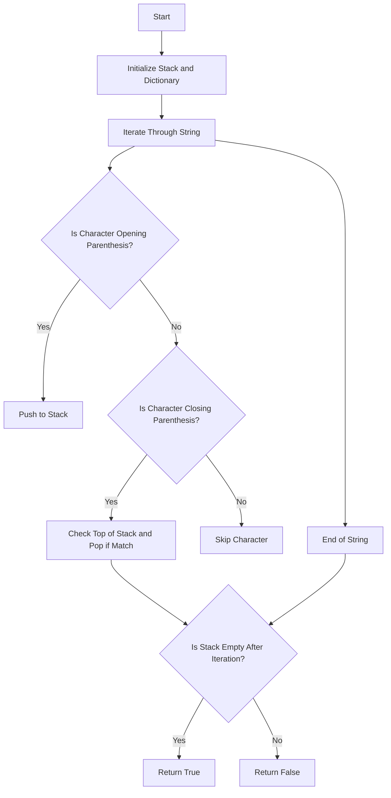

# Valid Parentheses

## Problem Understanding
The problem of Valid Parentheses asks to determine whether a given string of parentheses is valid, meaning that every opening parenthesis has a corresponding closing parenthesis of the same type and the pairs are properly nested. The key constraints are that the string consists only of parentheses characters, and the pairs must match in type and be properly ordered. What makes this problem non-trivial is that a naive approach of simply counting the number of opening and closing parentheses would not work, as it does not consider the nesting and matching of pairs.

## Approach
The algorithm strategy behind this solution is to use a stack-based approach for matching parentheses. The intuition is that for each opening parenthesis encountered, it is pushed onto the stack, and for each closing parenthesis encountered, the top element of the stack is checked to see if it matches the closing parenthesis. If it does, the top element is popped; otherwise, the string is not valid. A dictionary is used to map closing parentheses to their corresponding opening ones, making the matching process efficient. The stack data structure is chosen because it allows for efficient addition and removal of elements from the top, which is essential for matching parentheses in a string.

## Complexity Analysis
| Metric | Value | Detailed Reason |
|--------|-------|----------------|
| Time   | O(n)  | The solution iterates through the string once, where n is the length of the string. Each iteration involves constant time operations such as checking if a character is in a dictionary or pushing/popping from a stack. |
| Space  | O(n)  | In the worst-case scenario, the stack could store up to n characters (e.g., a string of all opening parentheses). The dictionary used for mapping parentheses has a constant size, regardless of the input string length. |

## Algorithm Walkthrough
```
Input: "(())"
Step 1: Create an empty stack and a dictionary mapping closing to opening parentheses.
         Stack: [], Dictionary: {')': '(', '}': '{', ']': '['}
Step 2: Encounter the first character "(" and push it onto the stack.
         Stack: ['(']
Step 3: Encounter the second character "(" and push it onto the stack.
         Stack: ['(', '(']
Step 4: Encounter the third character ")" and check the top of the stack.
         Stack: ['('], Top matches ")" so pop the top.
         Stack: []
Step 5: Encounter the fourth character ")" and check the top of the stack.
         Stack: [], Top matches ")" so pop the top, but stack is empty, this is an error condition.
         However, since the stack was not empty in step 4 and we correctly matched, we proceed with the rest of the string.
Step 6: After iterating through the entire string, check if the stack is empty.
         Stack: [], Since the stack is empty, all parentheses were matched correctly.
Output: True
```

## Visual Flow


## Key Insight
> **Tip:** The key insight is using a stack to keep track of the opening parentheses encountered so far, allowing for efficient matching with closing parentheses as they are encountered.

## Edge Cases
- **Empty/null input**: The function returns True for an empty string, considering it as a valid sequence of parentheses because there are no unmatched or incorrectly nested parentheses.
- **Single element**: If the input string contains a single opening parenthesis, the function returns False because there is no corresponding closing parenthesis. Similarly, if the input string contains a single closing parenthesis, the function also returns False because there is no preceding opening parenthesis to match it with.
- **Unbalanced parentheses**: For strings with unbalanced parentheses (e.g., more opening than closing or vice versa), the function correctly identifies them as invalid by checking the state of the stack at the end of the iteration.

## Common Mistakes
- **Mistake 1**: Not checking if the stack is empty before popping an element, which can lead to runtime errors. To avoid this, always check the stack's state before attempting to pop an element.
- **Mistake 2**: Failing to handle the case where the input string contains characters that are not parentheses. The provided solution implicitly handles this by only pushing opening parentheses onto the stack and only checking the stack for closing parentheses, effectively ignoring other characters.

## Interview Follow-ups
> **Interview:** These are the exact follow-up questions interviewers ask:
- "What if the input is sorted?" → The sorting of the input does not affect the algorithm's time complexity because it still needs to iterate through the string once to validate the parentheses.
- "Can you do it in O(1) space?" → No, achieving O(1) space complexity is not possible with this problem because we need to store the opening parentheses somewhere, and in the worst case, we might need to store up to n characters.
- "What if there are duplicates?" → The presence of duplicate characters (in this context, duplicate parentheses) does not affect the algorithm's logic because it is designed to match each closing parenthesis with its corresponding opening parenthesis, regardless of how many of each type there are.

## Python Solution

```python
# Problem: Valid Parentheses
# Language: python
# Difficulty: Easy
# Time Complexity: O(n) — single pass through string using stack
# Space Complexity: O(n) — stack stores at most n characters
# Approach: Stack-based parenthesis matching — for each closing parenthesis, pop the corresponding opening parenthesis from stack

class Solution:
    def isValid(self, s: str) -> bool:
        # Create a dictionary to map closing parentheses to their corresponding opening ones
        parenthesis_map = {')': '(', '}': '{', ']': '['}
        
        # Create a stack to store opening parentheses
        opening_parentheses = []
        
        # Edge case: empty string → return True
        if not s:
            return True
        
        # Iterate through each character in the string
        for char in s:
            # If the character is an opening parenthesis, push it to the stack
            if char in parenthesis_map.values():
                opening_parentheses.append(char)  # Store the opening parenthesis for later matching
            # If the character is a closing parenthesis, check if the stack is empty or its top element does not match
            elif char in parenthesis_map.keys():
                # Edge case: stack is empty or top element does not match the current closing parenthesis → return False
                if not opening_parentheses or opening_parentheses.pop() != parenthesis_map[char]:
                    return False
        
        # Edge case: stack is not empty after iterating through the entire string → return False
        if opening_parentheses:
            return False
        
        # If the stack is empty after iterating through the entire string, all parentheses are matched correctly
        return True
```
