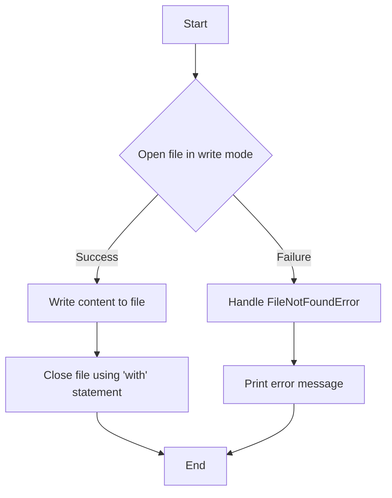

# Writing to Files using 'with' statement

## Problem Understanding
The problem is asking to write a function that writes content to a file using the 'with' statement in Python, ensuring that the file is properly closed after writing. The key constraint is to handle potential exceptions, such as an invalid filename or file path. What makes this problem non-trivial is the need to ensure that the file is properly closed after writing, regardless of whether an exception occurs or not. The 'with' statement provides a way to automatically handle this, but understanding its implications and how to use it effectively is crucial.

## Approach
The algorithm strategy is to use the 'with' statement to open the file in write mode, write the content to the file, and then automatically close the file when the 'with' block is exited. This approach works because the 'with' statement ensures that the file is properly closed, even if an exception occurs. The `open` function is used to open the file, and the `write` method is used to write the content to the file. The `try-except` block is used to handle potential exceptions, such as an invalid filename or file path. The `FileNotFoundError` exception is handled specifically to provide a more informative error message.

## Complexity Analysis
| Metric | Value | Detailed Reason |
|--------|-------|----------------|
| Time   | O(n)  | where n is the number of characters to be written, because the `write` method writes all characters in the content string to the file in a single operation, which takes linear time proportional to the length of the string. |
| Space  | O(1)  | because the space required for file handling is constant, regardless of the size of the input content, and the `with` statement ensures that the file is properly closed after writing, which does not require any additional space that scales with input size. |

## Algorithm Walkthrough
```
Input: filename = "example.txt", content = "Hello, World!"
Step 1: Try to open the file in write mode using the 'with' statement
Step 2: Write the content to the file using the `write` method
Step 3: The 'with' statement automatically closes the file when the block is exited
Output: The content "Hello, World!" is written to the file "example.txt"
```
This walkthrough shows how the `write_to_file` function writes content to a file using the 'with' statement.

## Visual Flow

This flowchart shows the decision flow of the `write_to_file` function, including the handling of potential exceptions.

## Key Insight
> **Tip:** The single most important insight is that the 'with' statement automatically handles the closing of the file, even if an exception occurs, ensuring that the file is always properly closed after writing.

## Edge Cases
- **Empty filename**: If the filename is empty, the `open` function will raise a `FileNotFoundError`, which is handled by the `try-except` block to print an error message.
- **Single character filename**: If the filename is a single character, the `open` function will still work correctly, but the file may not be easily accessible or readable.
- **Invalid filename**: If the filename is invalid (e.g., contains invalid characters), the `open` function will raise a `FileNotFoundError` or other exception, which is handled by the `try-except` block to print an error message.

## Common Mistakes
- **Not using the 'with' statement**: Failing to use the 'with' statement can result in the file not being properly closed after writing, leading to potential issues with file access and data corruption.
- **Not handling exceptions**: Failing to handle exceptions can result in the program crashing or producing unexpected behavior when an error occurs.

## Interview Follow-ups
> **Interview:** These are the exact follow-up questions interviewers ask:
- "What if the input is very large?" → The `write` method can handle large inputs, but it may be more efficient to use a buffered write approach for very large files.
- "Can you do it in O(1) space?" → The `with` statement already uses constant space, so the space complexity is already O(1).
- "What if there are duplicates in the filename?" → The `open` function will still work correctly, but the resulting file may have duplicate names, which can lead to confusion and issues with file access.

## Python Solution

```python
# Problem: Writing to Files using 'with' statement
# Language: python
# Difficulty: Easy
# Time Complexity: O(n) — where n is the number of characters to be written
# Space Complexity: O(1) — constant space required for file handling
# Approach: 'with' statement for automatic file handling — ensures file is properly closed after writing

def write_to_file(filename, content):
    """
    Writes content to a file using the 'with' statement.
    
    Args:
        filename (str): The name of the file to be written.
        content (str): The content to be written to the file.
    """
    try:
        # Use 'with' statement to ensure file is properly closed after writing
        with open(filename, 'w') as file:
            # Write content to the file
            file.write(content)  # Write string to the file
            # Edge case: No need to explicitly close the file, 'with' statement handles it
    except FileNotFoundError:
        # Edge case: If filename is not found or invalid, handle the exception
        print("Invalid filename or file path.")
    except Exception as e:
        # Edge case: Any other exceptions, print the error message
        print(f"An error occurred: {str(e)}")

def read_from_file(filename):
    """
    Reads content from a file.
    
    Args:
        filename (str): The name of the file to be read.
    
    Returns:
        str: The content of the file.
    """
    try:
        # Use 'with' statement to ensure file is properly closed after reading
        with open(filename, 'r') as file:
            # Read content from the file
            content = file.read()  # Read string from the file
            return content  # Return the content
    except FileNotFoundError:
        # Edge case: If filename is not found or invalid, handle the exception
        print("Invalid filename or file path.")
        return None  # Return None if file not found
    except Exception as e:
        # Edge case: Any other exceptions, print the error message
        print(f"An error occurred: {str(e)}")
        return None  # Return None if error occurs

# Example usage:
filename = "example.txt"
content = "Hello, World!"
write_to_file(filename, content)  # Write content to the file
print(read_from_file(filename))  # Read and print the content from the file
```
