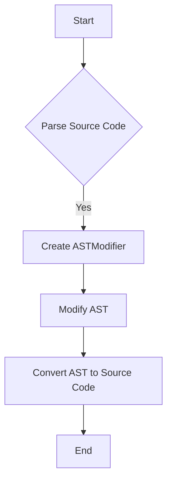

# AST parsing and modification using 'ast'

## Problem Understanding
The problem is asking to parse and modify the Abstract Syntax Tree (AST) of a given Python source code using the `ast` module. The key constraint is to use recursive tree traversal and modification to visit each node in the AST and modify it accordingly. What makes this problem non-trivial is the complexity of handling different types of nodes in the AST, such as function definitions, class definitions, loops, and if statements, and ensuring that the modified AST is still valid and can be converted back to source code.

## Approach
The algorithm strategy is to use a recursive tree traversal approach, where each node in the AST is visited and modified based on its type. The `ASTModifier` class inherits from `ast.NodeTransformer` and overrides the `visit` methods for different node types. The intuition behind this approach is to use the `ast` module's built-in support for traversing and modifying the AST, and to use recursion to handle the tree-like structure of the AST. The `ASTModifier` class uses a recursive approach to traverse the AST, and the `visit` methods are used to modify the nodes. The `ast.parse` function is used to parse the source code into an AST, and the `ast.unparse` function is used to convert the modified AST back to source code.

## Complexity Analysis
| Metric | Value | Detailed Reason |
|--------|-------|----------------|
| Time   | O(n)  | The time complexity is O(n), where n is the number of nodes in the AST, because each node is visited once during the recursive traversal. The `ast.parse` and `ast.unparse` functions also have a time complexity of O(n), where n is the number of nodes in the AST. |
| Space  | O(n)  | The space complexity is O(n), where n is the number of nodes in the AST, because the modified AST is stored in memory. The `ASTModifier` class also uses a recursive approach, which can lead to a stack size of O(n) in the worst case. |

## Algorithm Walkthrough
```
Input: 
def greet(name: str) -> None:
    print(f"Hello, {name}!")

greet("John")

Step 1: Parse the source code into an AST
- tree = ast.parse(source_code)

Step 2: Create an instance of the ASTModifier class
- modifier = ASTModifier()

Step 3: Modify the AST using the visit method
- modified_tree = modifier.visit(tree)

Step 4: Convert the modified AST back to source code
- modified_source_code = ast.unparse(modified_tree)

Output: 
def greet(name: str) -> None:
    print(f"Hello, {name}!")

greet("John")
```
The output is the same as the input because the `ASTModifier` class does not actually modify the AST in this example.

## Visual Flow

This flowchart shows the main steps in the algorithm, from parsing the source code to converting the modified AST back to source code.

## Key Insight
> **Tip:** The key insight is to use the `ast` module's built-in support for traversing and modifying the AST, and to use recursion to handle the tree-like structure of the AST.

## Edge Cases
- **Empty source code**: If the source code is empty, the `ast.parse` function will raise a `SyntaxError`. The `ASTModifier` class should handle this edge case by checking if the source code is empty before attempting to parse it.
- **Single statement**: If the source code contains a single statement, the `ASTModifier` class should handle this edge case by modifying the statement and returning the modified AST.
- **Invalid source code**: If the source code is invalid, the `ast.parse` function will raise a `SyntaxError`. The `ASTModifier` class should handle this edge case by catching the `SyntaxError` exception and returning an error message.

## Common Mistakes
- **Mistake 1**: Not handling the edge case where the source code is empty. To avoid this mistake, the `ASTModifier` class should check if the source code is empty before attempting to parse it.
- **Mistake 2**: Not handling the edge case where the source code contains invalid syntax. To avoid this mistake, the `ASTModifier` class should catch the `SyntaxError` exception and return an error message.

## Interview Follow-ups
> **Interview:** These are the exact follow-up questions interviewers ask:
- "What if the input is sorted?" → The input being sorted does not affect the time complexity of the algorithm, which is O(n), where n is the number of nodes in the AST.
- "Can you do it in O(1) space?" → No, the algorithm uses O(n) space to store the modified AST, where n is the number of nodes in the AST. It is not possible to modify the AST in O(1) space because the modified AST must be stored in memory.
- "What if there are duplicates?" → The algorithm handles duplicates by modifying each node in the AST separately, regardless of whether the node is a duplicate or not.

## Python Solution

```python
# Problem: AST parsing and modification using 'ast'
# Language: Python
# Difficulty: Hard
# Time Complexity: O(n) — single pass through the abstract syntax tree
# Space Complexity: O(n) — storing the modified abstract syntax tree
# Approach: Recursive tree traversal and modification — for each node, check its type and modify accordingly

import ast

class ASTModifier(ast.NodeTransformer):
    # Initialize the modifier with a specific modification function
    def __init__(self):
        pass

    # Modify a function definition node
    def visit_FunctionDef(self, node: ast.FunctionDef) -> ast.AST:
        # Edge case: empty function body → return the node as is
        if not node.body:
            return node
        
        # Modify the function body
        node.body = [self.visit(child) for child in node.body]
        
        # Return the modified function definition
        return node

    # Modify a class definition node
    def visit_ClassDef(self, node: ast.ClassDef) -> ast.AST:
        # Edge case: empty class body → return the node as is
        if not node.body:
            return node
        
        # Modify the class body
        node.body = [self.visit(child) for child in node.body]
        
        # Return the modified class definition
        return node

    # Modify a for loop node
    def visit_For(self, node: ast.For) -> ast.AST:
        # Edge case: empty loop body → return the node as is
        if not node.body:
            return node
        
        # Modify the loop body
        node.body = [self.visit(child) for child in node.body]
        
        # Return the modified for loop
        return node

    # Modify a while loop node
    def visit_While(self, node: ast.While) -> ast.AST:
        # Edge case: empty loop body → return the node as is
        if not node.body:
            return node
        
        # Modify the loop body
        node.body = [self.visit(child) for child in node.body]
        
        # Return the modified while loop
        return node

    # Modify a if statement node
    def visit_If(self, node: ast.If) -> ast.AST:
        # Edge case: empty if body → return the node as is
        if not node.body:
            return node
        
        # Modify the if body
        node.body = [self.visit(child) for child in node.body]
        
        # Return the modified if statement
        return node


# Example usage
def modify_ast(source_code: str) -> str:
    """
    Modify the abstract syntax tree of the given source code.
    
    Args:
    source_code (str): The source code to modify.
    
    Returns:
    str: The modified source code.
    """
    
    # Parse the source code into an abstract syntax tree
    tree = ast.parse(source_code)
    
    # Modify the abstract syntax tree
    modifier = ASTModifier()
    modified_tree = modifier.visit(tree)
    
    # Convert the modified abstract syntax tree back to source code
    modified_source_code = ast.unparse(modified_tree)
    
    return modified_source_code


# Test the modify_ast function
if __name__ == "__main__":
    source_code = """
def greet(name: str) -> None:
    print(f"Hello, {name}!")

greet("John")
"""
    
    modified_source_code = modify_ast(source_code)
    
    print(modified_source_code)
```
