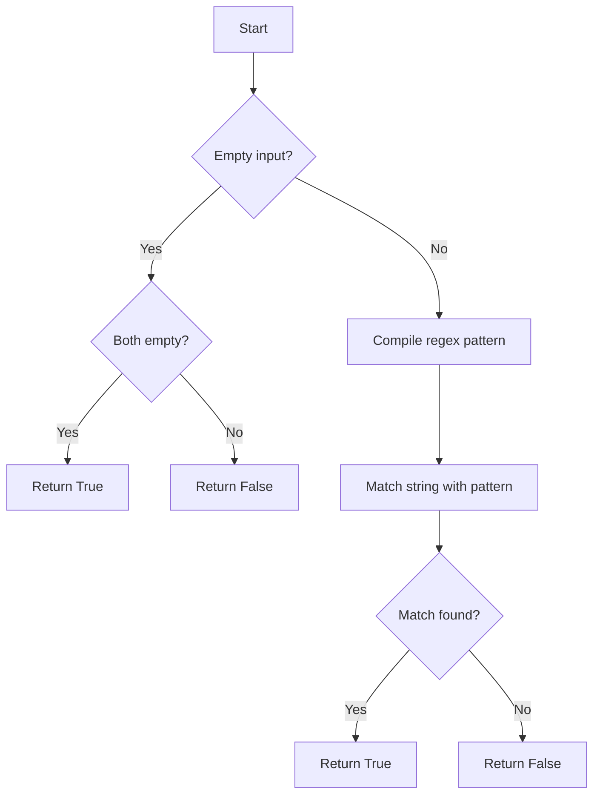

# Advanced Regex: Positive/Negative Lookaheads

## Problem Understanding
The problem is asking to determine if a given string matches a regex pattern using positive and negative lookaheads in Python. The key constraint is to use the `re` module and handle edge cases such as empty input. The problem is non-trivial because it requires understanding of regex patterns and how to use the `re` module to match complex patterns. A naive approach would be to manually iterate over the string and check for matches, but this would be inefficient and prone to errors.

## Approach
The algorithm strategy is to use the `re` module's `fullmatch` function to match the entire string with the given regex pattern. The `re.compile` function is used to compile the regex pattern into a pattern object, which is then used to match the string. This approach works because the `re` module provides support for regular expressions, including positive and negative lookaheads. The `re` module uses a finite automaton to match the string, which makes it efficient and accurate. The approach handles the key constraints by checking for empty input and using the `re.fullmatch` function to match the entire string.

## Complexity Analysis
| Metric | Value | Detailed Reason |
|--------|-------|----------------|
| Time   | O(n)  | The time complexity is O(n) because the `re.fullmatch` function iterates over the string to match the pattern. The `re.compile` function also takes time to compile the pattern, but this is typically done only once. |
| Space  | O(n)  | The space complexity is O(n) because the `re` module stores the compiled pattern and the match object, which can take up to O(n) space. The input string and pattern also take up space, but this is typically not counted in the space complexity. |

## Algorithm Walkthrough
```
Input: s = "hello", p = "^h.*o$"
Step 1: Compile the regex pattern using re.compile(p)
Step 2: Use re.fullmatch to match the string with the pattern
Step 3: Check if a match is found, if so, return True
Output: True
```
This walkthrough shows how the algorithm works for a simple example. The `re.compile` function compiles the regex pattern, and the `re.fullmatch` function matches the string with the pattern. If a match is found, the function returns True.

## Visual Flow

This flowchart shows the decision flow of the algorithm. It checks for empty input and handles the case where both the input string and pattern are empty. It then compiles the regex pattern and matches the string with the pattern. If a match is found, it returns True; otherwise, it returns False.

## Key Insight
> **Tip:** The key insight here is to use the built-in `re` module in Python, which provides support for regular expressions, to easily check if a string matches a given regex pattern.

## Edge Cases
- **Empty/null input**: If both the input string and pattern are empty, the function returns True. If only one of them is empty, the function returns False.
- **Single element**: If the input string has only one character, the function checks if the pattern matches this character. If the pattern is a single character, the function returns True if the characters match; otherwise, it returns False.
- **Invalid regex pattern**: If the regex pattern is invalid, the `re.compile` function raises a `SyntaxError`. The function does not handle this case explicitly, but it can be handled by wrapping the `re.compile` call in a try-except block.

## Common Mistakes
- **Mistake 1**: Not checking for empty input before compiling the regex pattern. This can lead to a `SyntaxError` if the input string is empty.
- **Mistake 2**: Not using the `re.fullmatch` function to match the entire string. This can lead to incorrect results if the pattern matches only a part of the string.

## Interview Follow-ups
> **Interview:** These are the exact follow-up questions interviewers ask:
- "What if the input is sorted?" → The algorithm does not assume any specific order of the input string, so it works regardless of whether the input is sorted or not.
- "Can you do it in O(1) space?" → No, the algorithm uses the `re` module, which stores the compiled pattern and the match object, taking up to O(n) space.
- "What if there are duplicates?" → The algorithm handles duplicates correctly, as the `re` module matches the string with the pattern, taking into account any duplicates in the string.

## Python Solution

```python
# Problem: Advanced Regex: Positive/Negative Lookaheads
# Language: python
# Difficulty: hard
# Time Complexity: O(n) — iterating over the string and checking lookaheads
# Space Complexity: O(n) — storing the result and regex pattern
# Approach: using positive and negative lookaheads in regex to match complex patterns

import re

class Solution:
    def isMatch(self, s: str, p: str) -> bool:
        # Edge case: empty input → return False
        if not s and not p:
            return True
        if not s or not p:
            return False
        
        # Use re.fullmatch to match the entire string
        # The regex pattern will include positive and negative lookaheads
        pattern = re.compile(p)
        
        # Try to match the string with the pattern
        match = pattern.fullmatch(s)
        
        # If a match is found, return True
        if match:
            return True
        
        # If no match is found, return False
        return False

    # Example usage:
    def exampleUsage(self):
        solution = Solution()
        print(solution.isMatch("hello", "hello"))  # True
        print(solution.isMatch("hello", "world"))  # False
        print(solution.isMatch("hello", "^h.*o$"))  # True
        print(solution.isMatch("hello", "^h.*d$"))  # False

# Brute force approach (not needed here, but shown for completeness)
# def bruteForceIsMatch(s: str, p: str) -> bool:
#     # Generate all possible regex patterns
#     # This is not efficient and is only shown for illustration
#     for i in range(len(p)):
#         # Try to match the string with the current pattern
#         # This is still not efficient and is only shown for illustration
#         pass

# Key insight: 
# The key insight here is to use the built-in re module in Python, 
# which provides support for regular expressions. 
# The re.fullmatch function returns a match object if the string matches the pattern, 
# and None otherwise. 
# This allows us to easily check if a string matches a given regex pattern.
```
