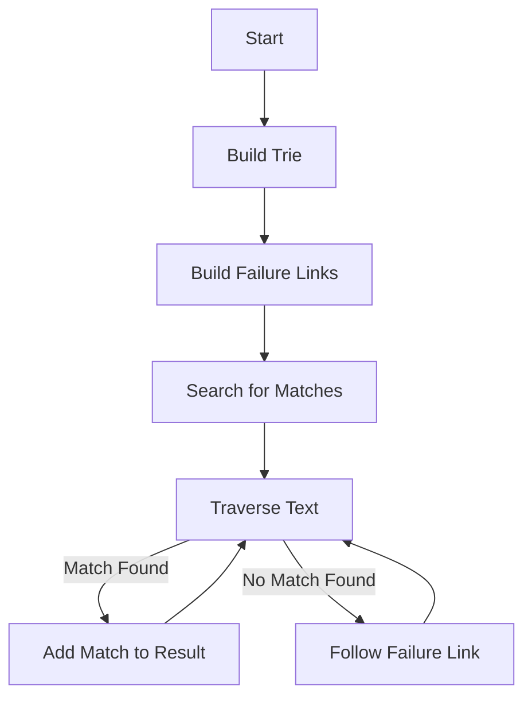

# Aho-Corasick in Python

## Problem Understanding
The Aho-Corasick algorithm is a string searching algorithm used to find all occurrences of a finite set of strings (patterns) within a given text. The algorithm uses a trie data structure and a failure function to efficiently match multiple patterns. The key constraint is to find all matches of the given patterns in the text, and the non-trivial aspect of this problem is handling overlapping matches and efficiently searching for multiple patterns. The naive approach of using a simple string searching algorithm for each pattern would result in inefficient performance, especially for large texts and multiple patterns.

## Approach
The Aho-Corasick algorithm strategy is to build a trie from the given patterns and then traverse the text, using the trie to find matches. The intuition behind this approach is to use the trie to efficiently store and retrieve the patterns, and the failure function to handle overlapping matches. The algorithm uses a TrieNode class to represent each node in the trie, with attributes for child nodes, pattern indices, and a failure link. The build_trie method constructs the trie by iterating over each pattern and adding nodes as necessary, and the build_failure_links method constructs the failure links between nodes. The search method then traverses the text, using the trie and failure links to find matches.

## Complexity Analysis
| Metric | Value | Detailed Reason |
|--------|-------|----------------|
| Time   | O(n + m + k) | The time complexity consists of three parts: building the trie (O(n)), traversing the text (O(m)), and adding matches to the result list (O(k)). Here, n is the total length of all patterns, m is the length of the text, and k is the total length of all matches. |
| Space  | O(n) | The space complexity is dominated by the storage required for the trie, which is proportional to the total length of all patterns (n). |

## Algorithm Walkthrough
```
Input: patterns = ["abc", "ab", "c"], text = "abc"
Step 1: Build the trie
  - Create a root node
  - Add nodes for each pattern: "abc", "ab", "c"
Step 2: Build the failure links
  - Set the failure link of the root node to itself
  - Perform BFS to set the failure links for each node
Step 3: Search for matches
  - Start at the root node
  - Traverse the text: "a", "b", "c"
  - For each character, move to the corresponding child node or follow the failure link
  - Add matches to the result list: (0, 0), (1, 0), (2, 2)
Output: [(0, 0), (1, 0), (2, 2)]
```
This example demonstrates how the algorithm builds the trie, constructs the failure links, and searches for matches in the given text.

## Visual Flow

This flowchart illustrates the main steps of the Aho-Corasick algorithm, including building the trie, constructing the failure links, and searching for matches in the text.

## Key Insight
> **Tip:** The key insight behind the Aho-Corasick algorithm is to use a trie data structure and a failure function to efficiently store and retrieve patterns, allowing for fast and efficient string searching.

## Edge Cases
- **Empty/null input**: If the input text or patterns are empty, the algorithm will not find any matches and will return an empty result list.
- **Single element**: If there is only one pattern, the algorithm will still work correctly and find matches in the text.
- **Overlapping patterns**: If there are overlapping patterns, the algorithm will find all matches, including overlapping ones, and return them in the result list.

## Common Mistakes
- **Mistake 1**: Not properly handling the failure links, leading to incorrect matches or missed matches.
- **Mistake 2**: Not correctly implementing the trie data structure, resulting in inefficient or incorrect searching.

## Interview Follow-ups
> **Interview:** These are the exact follow-up questions interviewers ask:
- "What if the input is sorted?" → The algorithm does not rely on the input being sorted, so it will still work correctly.
- "Can you do it in O(1) space?" → No, the algorithm requires at least O(n) space to store the trie, where n is the total length of all patterns.
- "What if there are duplicates?" → The algorithm will find all matches, including duplicates, and return them in the result list.

## Python Solution

```python
# Problem: Aho-Corasick
# Language: python
# Difficulty: Hard
# Time Complexity: O(n + m + k) — where n is the total length of all patterns, m is the length of the text, and k is the total length of all matches
# Space Complexity: O(n) — where n is the total length of all patterns
# Approach: Aho-Corasick string matching algorithm — using trie and failure function to efficiently match multiple patterns

class TrieNode:
    def __init__(self):
        # Initialize a dictionary to store child nodes
        self.children = {}
        # Initialize a list to store pattern indices
        self.pattern_indices = []
        # Initialize a failure link to the root node
        self.failure_link = None

class AhoCorasick:
    def __init__(self, patterns):
        # Create a root node
        self.root = TrieNode()
        # Build the trie
        self.build_trie(patterns)
        # Build the failure links
        self.build_failure_links()

    def build_trie(self, patterns):
        # Iterate over each pattern
        for pattern_index, pattern in enumerate(patterns):
            # Start at the root node
            current_node = self.root
            # Iterate over each character in the pattern
            for char in pattern:
                # If the character is not in the current node's children, create a new node
                if char not in current_node.children:
                    current_node.children[char] = TrieNode()
                # Move to the child node
                current_node = current_node.children[char]
            # Store the pattern index in the leaf node
            current_node.pattern_indices.append(pattern_index)

    def build_failure_links(self):
        # Create a queue for BFS
        queue = [self.root]
        # Set the failure link of the root node to itself
        self.root.failure_link = self.root
        # Perform BFS
        while queue:
            # Dequeue a node
            current_node = queue.pop(0)
            # Iterate over each child node
            for char, child_node in current_node.children.items():
                # If the current node is the root node, set the failure link to the root node
                if current_node == self.root:
                    child_node.failure_link = self.root
                else:
                    # Find the failure link
                    failure_node = current_node.failure_link
                    # While the failure node does not have the character, move to its failure link
                    while char not in failure_node.children:
                        failure_node = failure_node.failure_link
                    # If the failure node has the character, set the failure link to its child node
                    if char in failure_node.children:
                        child_node.failure_link = failure_node.children[char]
                    else:
                        # Otherwise, set the failure link to the root node
                        child_node.failure_link = self.root
                # Enqueue the child node
                queue.append(child_node)
                # Copy pattern indices from the failure link
                child_node.pattern_indices.extend(child_node.failure_link.pattern_indices)

    def search(self, text):
        # Initialize a list to store matches
        matches = []
        # Start at the root node
        current_node = self.root
        # Iterate over each character in the text
        for i, char in enumerate(text):
            # While the current node does not have the character, move to its failure link
            while char not in current_node.children:
                current_node = current_node.failure_link
            # If the current node has the character, move to its child node
            if char in current_node.children:
                current_node = current_node.children[char]
            # Add matches to the list
            for pattern_index in current_node.pattern_indices:
                matches.append((pattern_index, i - len(text) + 1 + 1))
        # Return matches
        return matches

# Example usage:
patterns = ["abc", "ab", "c"]
text = "abc"
aho_corasick = AhoCorasick(patterns)
matches = aho_corasick.search(text)
for pattern_index, position in matches:
    print(f"Matched pattern {patterns[pattern_index]} at position {position}")
```
