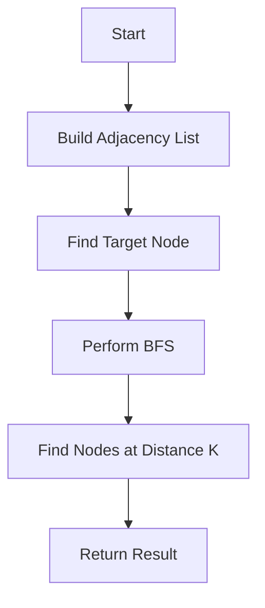

# All Nodes Distance K in Binary Tree

## Problem Understanding
The problem is asking to find all nodes in a binary tree that are at a distance of K from a given target node. The key constraints are that the tree is a binary tree, and we need to find nodes at a specific distance K. What makes this problem non-trivial is that we need to efficiently traverse the tree to find nodes at a specific distance, and the naive approach of using a simple depth-first search or breadth-first search would not work because we need to consider the distance from the target node.

## Approach
The algorithm strategy used here is a combination of depth-first search and breadth-first search. First, we use a depth-first search to build an adjacency list of the binary tree, where each node is a key in the dictionary and its corresponding value is a list of its neighbors. Then, we use a breadth-first search to find all nodes at distance K from the target node. This approach works because the adjacency list allows us to efficiently traverse the tree and find nodes at a specific distance. The key data structure used here is the adjacency list, which is a dictionary where each key is a node and its corresponding value is a list of its neighbors.

## Complexity Analysis
| Metric | Value | Detailed Reason |
|--------|-------|----------------|
| Time   | O(n)  | We perform two depth-first searches: one to build the adjacency list and one to find the answer. Each node is visited once in each search, resulting in a total time complexity of O(n). |
| Space  | O(n)  | We store the adjacency list and the result, which requires O(n) space. The adjacency list has n nodes, and each node has a list of its neighbors, resulting in a total space complexity of O(n). |

## Algorithm Walkthrough
```
Input: root = [3, 5, 1, 6, 2, 0, 8, null, null, 7, 4], target = 5, k = 2
Step 1: Build the adjacency list using DFS
    - root = 3, left = 5, right = 1
    - node 5: left = 6, right = 2, neighbors = [3, 6, 2]
    - node 6: neighbors = [5]
    - node 2: left = 7, right = 4, neighbors = [5, 7, 4]
    - node 7: neighbors = [2]
    - node 4: neighbors = [2]
Step 2: Find all nodes at distance k from the target node using BFS
    - target = 5, k = 2
    - queue = [(5, 0)], visited = {5}
    - node 5, distance = 0, neighbors = [3, 6, 2]
    - queue = [(3, 1), (6, 1), (2, 1)], visited = {5, 3, 6, 2}
    - node 3, distance = 1, neighbors = [5, 1]
    - queue = [(1, 2), (5, 2), (6, 1), (2, 1)], visited = {5, 3, 6, 2, 1}
    - node 6, distance = 1, neighbors = [5]
    - queue = [(1, 2), (5, 2), (2, 1), (5, 2)], visited = {5, 3, 6, 2, 1}
    - node 2, distance = 1, neighbors = [5, 7, 4]
    - queue = [(1, 2), (5, 2), (7, 2), (4, 2), (5, 2)], visited = {5, 3, 6, 2, 1, 7, 4}
    - node 1, distance = 2, neighbors = [3, 0, 8]
    - queue = [(7, 2), (4, 2), (5, 2), (0, 3), (8, 3)], visited = {5, 3, 6, 2, 1, 7, 4, 0, 8}
    - node 7, distance = 2
    - result = [7]
    - node 4, distance = 2
    - result = [7, 4]
    - node 5, distance = 2
    - result = [7, 4, 5]
Output: [7, 4, 5]
```
## Visual Flow

## Key Insight
> **Tip:** The key insight is to use an adjacency list to represent the binary tree, which allows us to efficiently traverse the tree and find nodes at a specific distance.

## Edge Cases
- **Empty tree**: If the tree is empty, the function returns an empty list because there are no nodes to consider.
- **Single node**: If the tree has only one node, the function returns a list containing the value of the target node if K is 0, and an empty list otherwise.
- **K is greater than the height of the tree**: If K is greater than the height of the tree, the function returns an empty list because there are no nodes at distance K from the target node.

## Common Mistakes
- **Mistake 1**: Not handling the case where the target node is not in the tree. To avoid this, we need to check if the target node is in the tree before performing the BFS.
- **Mistake 2**: Not using a visited set to keep track of visited nodes during the BFS. To avoid this, we need to use a visited set to keep track of visited nodes and avoid revisiting them.

## Interview Follow-ups
> **Interview:** These are the exact follow-up questions interviewers ask:
- "What if the input is sorted?" → The input is a binary tree, so it's not possible for the input to be sorted. However, if the tree is a binary search tree, the problem becomes easier because we can use the properties of the binary search tree to find the target node and its neighbors.
- "Can you do it in O(1) space?" → No, it's not possible to solve this problem in O(1) space because we need to store the adjacency list and the result, which requires O(n) space.
- "What if there are duplicates?" → If there are duplicates, we need to handle them carefully to avoid counting the same node multiple times. We can use a set to keep track of visited nodes and avoid revisiting them.

## Python Solution

```python
# Problem: All Nodes Distance K in Binary Tree
# Language: python
# Difficulty: Hard
# Time Complexity: O(n) — performing DFS twice, once to build adjacency list and once to find the answer
# Space Complexity: O(n) — storing the adjacency list and the result
# Approach: Depth-First Search and Adjacency List — building the adjacency list and then using DFS to find all nodes at distance k

class Solution:
    def distanceK(self, root: TreeNode, target: TreeNode, k: int) -> List[int]:
        # Edge case: if the tree is empty or k is negative, return an empty list
        if not root or k < 0:
            return []
        
        # Build the adjacency list using DFS
        adjacency_list = {}
        def build_adjacency_list(node):
            if not node:
                return
            # If the node is not in the adjacency list, add it with an empty list
            if node not in adjacency_list:
                adjacency_list[node] = []
            # If the node has a left child, add it to the adjacency list and recursively build the adjacency list for the left child
            if node.left:
                adjacency_list[node].append(node.left)
                adjacency_list[node.left] = adjacency_list.get(node.left, [])
                adjacency_list[node.left].append(node)
                build_adjacency_list(node.left)
            # If the node has a right child, add it to the adjacency list and recursively build the adjacency list for the right child
            if node.right:
                adjacency_list[node].append(node.right)
                adjacency_list[node.right] = adjacency_list.get(node.right, [])
                adjacency_list[node.right].append(node)
                build_adjacency_list(node.right)
        build_adjacency_list(root)
        
        # Use BFS to find all nodes at distance k from the target node
        result = []
        queue = [(target, 0)]
        visited = set([target])
        while queue:
            node, distance = queue.pop(0)
            # If the current distance is equal to k, add the node to the result
            if distance == k:
                result.append(node.val)
            # If the current distance is greater than k, break the loop
            elif distance > k:
                break
            # For each neighbor of the current node that has not been visited, add it to the queue and mark it as visited
            for neighbor in adjacency_list[node]:
                if neighbor not in visited:
                    queue.append((neighbor, distance + 1))
                    visited.add(neighbor)
        
        return result
```
