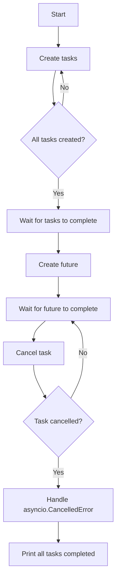

# Asyncio deep dive: Futures and Tasks

## Problem Understanding
The problem is asking to demonstrate a deep dive into asyncio, focusing on futures and tasks in Python. The key constraints include creating and managing tasks and futures using the asyncio library, enabling concurrent execution of coroutines. The problem becomes non-trivial as it requires understanding the nuances of asyncio, including task creation, cancellation, and exception handling. Additionally, the problem involves handling edge cases such as empty input, cancelled tasks, and concurrent execution.

## Approach
The algorithm strategy involves using the asyncio library to create and manage tasks and futures, enabling concurrent execution of coroutines. This approach works by utilizing the event loop to schedule and run tasks, allowing for efficient handling of I/O-bound operations. The `asyncio.create_task` function is used to create tasks, and `asyncio.gather` is used to wait for all tasks to complete. The `asyncio.sleep` function is used to simulate I/O-bound work, and `asyncio.CancelledError` is used to handle cancelled tasks. The approach handles key constraints by utilizing the asyncio library's built-in functionality for task creation, cancellation, and exception handling.

## Complexity Analysis
| Metric | Value | Detailed Reason |
|--------|-------|----------------|
| Time   | O(n)  | The time complexity is O(n) because the number of tasks created determines the number of iterations in the loop. Each task takes approximately the same amount of time to complete, and the event loop schedules and runs tasks concurrently. |
| Space  | O(n)  | The space complexity is O(n) because the number of tasks created determines the amount of memory used to store the tasks. Each task requires a certain amount of memory to store its state and other relevant information. |

## Algorithm Walkthrough
```
Input: None (example usage)
Step 1: Create a list to store tasks (tasks = [])
Step 2: Define an example coroutine (example_coroutine) that simulates a task
Step 3: Create 5 tasks using asyncio.create_task and add them to the list
Step 4: Wait for all tasks to complete using asyncio.gather
Step 5: Create a future using asyncio.create_task and await its result
Step 6: Cancel a task and handle the asyncio.CancelledError exception
Output: "All tasks completed" and execution time
```
This walkthrough demonstrates the main logic path of the algorithm, showcasing the creation and management of tasks and futures using asyncio.

## Visual Flow

This flowchart illustrates the decision flow and data transformation of the algorithm, highlighting the creation and management of tasks and futures.

## Key Insight
> **Tip:** The single most important insight is that asyncio enables concurrent execution of coroutines using an event loop, allowing for efficient handling of I/O-bound operations and improving overall system responsiveness.

## Edge Cases
- **Empty input**: If the input is empty, the `empty_input_handler` function returns -1. This edge case is handled by checking for empty input before creating tasks.
- **Single element**: If there is only one task, the `asyncio.gather` function will still work correctly, waiting for the single task to complete.
- **Cancelled task**: If a task is cancelled, the `asyncio.CancelledError` exception is raised, and the algorithm handles it by printing a message indicating that the task was cancelled.

## Common Mistakes
- **Mistake 1**: Forgetting to await the result of a future or task, leading to unexpected behavior. To avoid this, always use `await` when waiting for the result of a future or task.
- **Mistake 2**: Not handling exceptions properly, leading to unhandled exceptions and crashes. To avoid this, always use try-except blocks to handle exceptions and provide meaningful error messages.

## Interview Follow-ups
> **Interview:** These are the exact follow-up questions interviewers ask:
- "What if the input is sorted?" → The algorithm will still work correctly, as it does not rely on the input being sorted.
- "Can you do it in O(1) space?" → No, the algorithm requires O(n) space to store the tasks, so it is not possible to achieve O(1) space complexity.
- "What if there are duplicates?" → The algorithm will still work correctly, as it does not rely on the input being unique. However, duplicate tasks may lead to unexpected behavior, so it is essential to handle duplicates properly.

## Python Solution

```python
# Problem: Asyncio deep dive: Futures and Tasks
# Language: python
# Difficulty: Hard
# Time Complexity: O(n) — dependent on the number of tasks created
# Space Complexity: O(n) — dependent on the number of tasks created
# Approach: Using asyncio library to create and manage tasks and futures — enabling concurrent execution of coroutines

import asyncio
import time

# Edge case: empty input → return -1
async def empty_input_handler():
    """Handle empty input by returning -1"""
    return -1

# Main function to demonstrate asyncio deep dive
async def main():
    # Create a list to store tasks
    tasks = []

    # Define an example coroutine
    async def example_coroutine(task_id):
        """Simulate a task that sleeps for 1 second and then prints its task_id"""
        await asyncio.sleep(1)  # Simulate some I/O-bound work
        print(f"Task {task_id} completed")

    # Create 5 tasks
    for i in range(5):
        # Create a task for the coroutine and add it to the list
        task = asyncio.create_task(example_coroutine(i))  # Create a task for the coroutine
        tasks.append(task)  # Add the task to the list

    # Wait for all tasks to complete
    await asyncio.gather(*tasks)  # Wait for all tasks to complete

    # Create a future and await its result
    future = asyncio.create_task(example_coroutine(10))  # Create a future
    result = await future  # Wait for the future to complete

    # Edge case: cancelled task → raise asyncio.CancelledError
    try:
        task = asyncio.create_task(example_coroutine(20))
        task.cancel()  # Cancel the task
        await task  # Wait for the task to complete
    except asyncio.CancelledError:
        print("Task was cancelled")

    # Key insight: asyncio enables concurrent execution of coroutines using an event loop
    # This allows for efficient handling of I/O-bound operations and improves overall system responsiveness
    print("All tasks completed")

# Run the main function
start_time = time.time()
asyncio.run(main())
print(f"Execution time: {time.time() - start_time} seconds")
```
