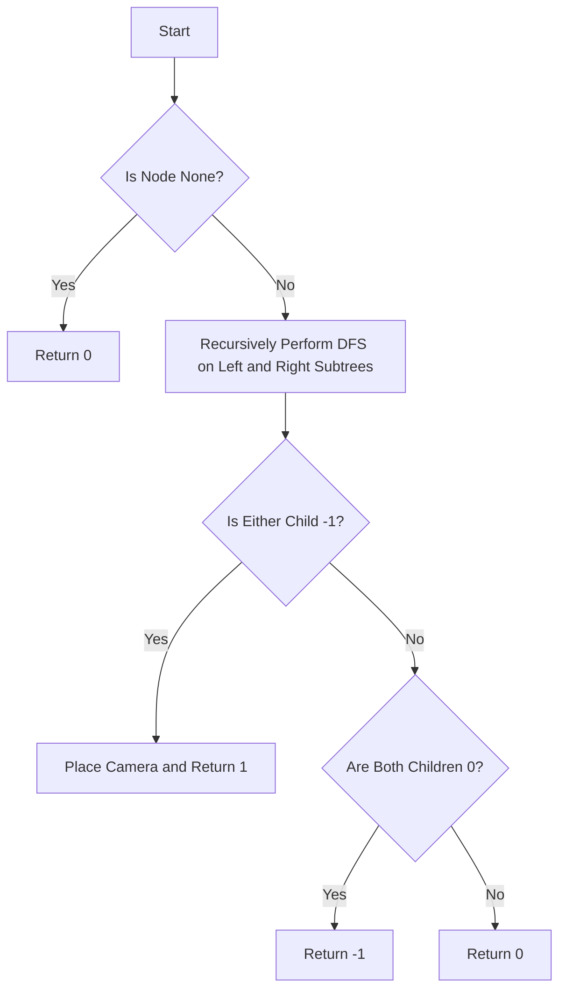

# Binary Tree Cameras Greedy

## Problem Understanding
The problem of Binary Tree Cameras involves determining the minimum number of cameras required to monitor all nodes in a binary tree. Each node in the tree can either have a camera or not, and a camera can monitor the node it is placed on as well as its children. The key constraint is that each node must be monitored by either a camera placed on the node itself or a camera placed on one of its ancestors. This problem is non-trivial because a naive approach, such as simply placing a camera on every node, would not result in the minimum number of cameras required.

## Approach
The solution approach involves using a greedy depth-first search (DFS) algorithm to traverse the binary tree and determine the minimum number of cameras required. The intuition behind this approach is to place a camera on a node only when necessary, i.e., when the node is not monitored by its children or when one of its children is not monitored. This approach works because it ensures that each node is monitored by either a camera placed on the node itself or a camera placed on one of its ancestors. The algorithm uses a recursive DFS function to traverse the tree and determine the minimum number of cameras required. The function returns a value indicating whether the current node has a camera (1), is monitored by its children (0), or is not monitored (-1).

## Complexity Analysis
| Metric | Value | Detailed Reason |
|--------|-------|----------------|
| Time   | O(n)  | The algorithm performs a single pass through the tree using DFS, where n is the number of nodes in the tree. Each node is visited once, and the time complexity is linear with respect to the number of nodes. |
| Space  | O(h)  | The space complexity is determined by the maximum recursion depth of the DFS function, which is equal to the height of the tree (h). In the worst case, the tree is skewed to one side, and the height is equal to the number of nodes (n). However, for a balanced tree, the height is logarithmic with respect to the number of nodes (log n). |

## Algorithm Walkthrough
```
Input: 
     1
   /   \
  2     3
 / \
4   5

Step 1: dfs(1)
  - left = dfs(2) = 0 (monitored by children)
  - right = dfs(3) = 0 (no children, but monitored by parent)
  - Since neither child is -1, return 0 (monitored by children)

Step 2: dfs(2)
  - left = dfs(4) = -1 (not monitored)
  - right = dfs(5) = -1 (not monitored)
  - Since left or right is -1, place a camera at node 2 and return 1

Step 3: dfs(4) and dfs(5)
  - Both return -1 since they have no children and are not monitored

Output: 1 (minimum number of cameras required)
```

## Visual Flow


## Key Insight
> **Tip:** The key insight is to place a camera on a node only when necessary, i.e., when the node is not monitored by its children or when one of its children is not monitored.

## Edge Cases
- **Empty Tree**: If the input tree is empty (i.e., the root is None), the algorithm returns 0 since no cameras are required.
- **Single Node Tree**: If the input tree consists of a single node, the algorithm places a camera on the node and returns 1.
- **Unbalanced Tree**: If the input tree is unbalanced, the algorithm still works correctly, but the recursion depth may be larger than for a balanced tree.

## Common Mistakes
- **Mistake 1**: Not considering the case where a node has no children but is not monitored by its parent. To avoid this, ensure that the algorithm handles the base case correctly and returns -1 when a node is not monitored.
- **Mistake 2**: Not using a recursive approach to traverse the tree. To avoid this, use a recursive DFS function to traverse the tree and determine the minimum number of cameras required.

## Interview Follow-ups
> **Interview:** These are the exact follow-up questions interviewers ask:
- "What if the input is a skewed tree?" → The algorithm still works correctly, but the recursion depth may be larger than for a balanced tree.
- "Can you do it in O(1) space?" → No, the algorithm requires O(h) space to store the recursion stack, where h is the height of the tree.
- "What if there are duplicate nodes in the tree?" → The algorithm still works correctly, but the result may not be optimal since duplicate nodes may not be necessary.

## Python Solution

```python
# Problem: Binary Tree Cameras Greedy
# Language: python
# Difficulty: Hard
# Time Complexity: O(n) — single pass through the tree using DFS
# Space Complexity: O(h) — recursion stack size is at most the height of the tree
# Approach: Greedy DFS — for each node, decide whether to place a camera based on its children's status

class Solution:
    def minCameraCover(self, root):
        # Initialize result variable to keep track of the total number of cameras
        self.result = 0

        # Define a helper function to perform DFS
        def dfs(node):
            # Base case: if the node is None, return 0 (no camera needed)
            if not node:
                return 0  # 0: no camera, monitored by parent or no children

            # Recursively perform DFS on the left and right subtrees
            left = dfs(node.left)
            right = dfs(node.right)

            # If either child is not monitored, place a camera at the current node
            if left == -1 or right == -1:
                # Increment the result variable to account for the new camera
                self.result += 1
                return 1  # 1: has camera

            # If neither child is monitored and the current node is not monitored, return -1
            if left == 0 and right == 0:
                return -1  # -1: not monitored

            # If the current node is monitored by its children, return 0
            return 0  # 0: monitored by children

        # Edge case: if the root node is not monitored, place a camera at the root
        if dfs(root) == -1:
            self.result += 1

        # Return the total number of cameras
        return self.result
```
