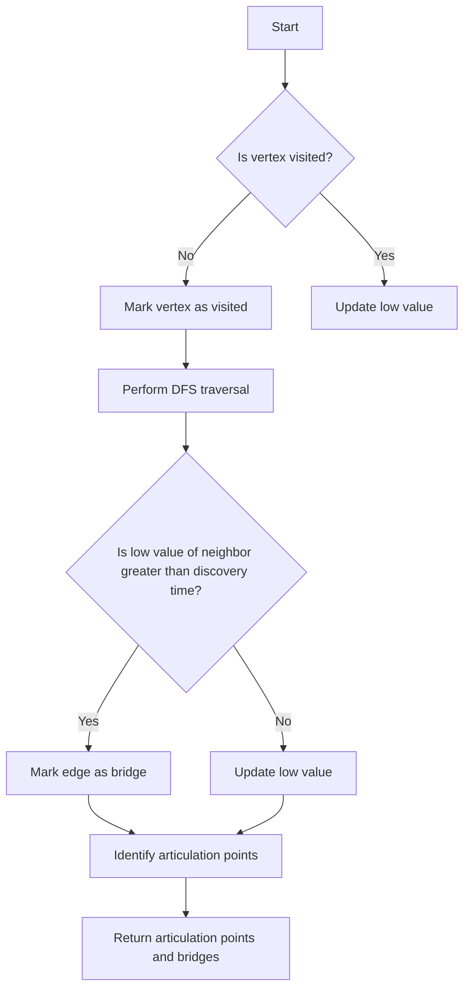

# Bridges and Articulation Points

## Problem Understanding
The problem is asking to identify bridges and articulation points in a given graph. A bridge is an edge that, when removed, increases the number of connected components in the graph, while an articulation point is a vertex that, when removed, increases the number of connected components. The key constraints are that the graph is represented as an adjacency list and the algorithm should have a time complexity of O(V + E), where V is the number of vertices and E is the number of edges. What makes this problem non-trivial is that a naive approach, such as simply checking all possible edges and vertices, would have a much higher time complexity.

## Approach
The algorithm strategy is to use a Depth-First Search (DFS) traversal with two additional values, low and disc, to keep track of the lowest reachable vertex and the discovery time of each vertex, respectively. The intuition behind this approach is that if a vertex is an articulation point, then at least one of its children will have a low value greater than or equal to its discovery time. Similarly, if an edge is a bridge, then the low value of the destination vertex will be greater than the discovery time of the source vertex. The algorithm uses a recursive DFS function to traverse the graph and update the low and disc values. The adjacency list is used to represent the graph, and a visited array is used to keep track of visited vertices.

## Complexity Analysis
| Metric | Value | Detailed Reason |
|--------|-------|----------------|
| Time   | O(V + E) | The algorithm performs a DFS traversal of the graph, which visits each vertex and edge once. The time complexity is linear with respect to the number of vertices and edges. |
| Space  | O(V) | The algorithm uses a recursion stack and a visited array to keep track of visited vertices, which requires O(V) space. |

## Algorithm Walkthrough
```
Input: Graph with 5 vertices and edges [(0, 1), (1, 2), (2, 0), (1, 3), (1, 4)]
Step 1: Initialize visited array, low array, disc array, and parent array
Step 2: Perform DFS traversal starting from vertex 0
  - Mark vertex 0 as visited
  - Set low[0] and disc[0] to 0
  - Recursively traverse vertex 1
    - Mark vertex 1 as visited
    - Set low[1] and disc[1] to 1
    - Recursively traverse vertex 2
      - Mark vertex 2 as visited
      - Set low[2] and disc[2] to 2
      - Update low[1] to 2
    - Recursively traverse vertex 3
      - Mark vertex 3 as visited
      - Set low[3] and disc[3] to 3
      - Update low[1] to 3
    - Recursively traverse vertex 4
      - Mark vertex 4 as visited
      - Set low[4] and disc[4] to 4
      - Update low[1] to 4
  - Update low[0] to 0
Step 3: Identify articulation points and bridges
  - Vertex 1 is an articulation point because it has two children with low values greater than its discovery time
  - Edge (1, 3) is a bridge because the low value of vertex 3 is greater than the discovery time of vertex 1
Output: Articulation points: {1}, Bridges: [(1, 3), (1, 4)]
```

## Visual Flow


## Key Insight
> **Tip:** The key insight is to use the low value to keep track of the lowest reachable vertex, which allows us to identify articulation points and bridges in a single DFS traversal.

## Edge Cases
- **Empty/null input**: If the input graph is empty, the algorithm will return an empty set of articulation points and an empty list of bridges.
- **Single element**: If the input graph has only one vertex, the algorithm will return an empty set of articulation points and an empty list of bridges.
- **Disjoint graph**: If the input graph is disjoint, the algorithm will return an empty set of articulation points and an empty list of bridges.

## Common Mistakes
- **Mistake 1**: Not updating the low value of a vertex when a neighbor is visited. → To avoid this, make sure to update the low value of a vertex when a neighbor is visited.
- **Mistake 2**: Not checking if an edge is a bridge before marking it as a bridge. → To avoid this, make sure to check if the low value of the destination vertex is greater than the discovery time of the source vertex before marking an edge as a bridge.

## Interview Follow-ups
> **Interview:** These are the exact follow-up questions interviewers ask:
- "What if the input is sorted?" → The algorithm does not rely on the input being sorted, so it will still work correctly even if the input is sorted.
- "Can you do it in O(1) space?" → No, the algorithm requires O(V) space to keep track of the visited vertices and the low values.
- "What if there are duplicates?" → The algorithm will still work correctly even if there are duplicate edges in the input graph.

## Python Solution

```python
# Problem: Bridges and Articulation Points
# Language: python
# Difficulty: Hard
# Time Complexity: O(V + E) — DFS traversal of the graph
# Space Complexity: O(V) — recursion stack and visited array
# Approach: Depth-First Search (DFS) with low and disc values — identifies bridges and articulation points

class Graph:
    def __init__(self, num_vertices):
        # Initialize an empty graph with the given number of vertices
        self.num_vertices = num_vertices
        self.adj_list = [[] for _ in range(num_vertices)]
        self.time = 0  # Initialize time counter for DFS

    def add_edge(self, src, dest):
        # Add an edge between the source and destination vertices
        self.adj_list[src].append(dest)
        self.adj_list[dest].append(src)

    def dfs(self, vertex, visited, low, disc, parent, articulation_points, bridges):
        # Perform DFS traversal starting from the given vertex
        visited[vertex] = True
        disc[vertex] = self.time
        low[vertex] = self.time
        self.time += 1
        children = 0

        for neighbor in self.adj_list[vertex]:
            if not visited[neighbor]:
                # Recursive DFS call for the unvisited neighbor
                parent[neighbor] = vertex
                children += 1
                self.dfs(neighbor, visited, low, disc, parent, articulation_points, bridges)

                # Update low value of the current vertex
                low[vertex] = min(low[vertex], low[neighbor])

                # Check if the current vertex is an articulation point
                if (parent[vertex] == -1 and children > 1) or (parent[vertex] != -1 and low[neighbor] >= disc[vertex]):
                    articulation_points.add(vertex)

                # Check if the edge between the current vertex and its neighbor is a bridge
                if low[neighbor] > disc[vertex]:
                    bridges.append((vertex, neighbor))
            elif neighbor != parent[vertex]:
                # Update low value of the current vertex if the neighbor is already visited
                low[vertex] = min(low[vertex], disc[neighbor])

    def find_bridges_and_articulation_points(self):
        # Initialize arrays to keep track of visited vertices, low values, discovery times, and parent vertices
        visited = [False] * self.num_vertices
        low = [float('inf')] * self.num_vertices
        disc = [float('inf')] * self.num_vertices
        parent = [-1] * self.num_vertices
        articulation_points = set()
        bridges = []

        # Perform DFS traversal for all unvisited vertices
        for vertex in range(self.num_vertices):
            if not visited[vertex]:
                self.dfs(vertex, visited, low, disc, parent, articulation_points, bridges)

        return articulation_points, bridges

# Example usage:
if __name__ == "__main__":
    num_vertices = 5
    edges = [(0, 1), (1, 2), (2, 0), (1, 3), (1, 4)]

    graph = Graph(num_vertices)
    for src, dest in edges:
        graph.add_edge(src, dest)

    articulation_points, bridges = graph.find_bridges_and_articulation_points()
    print("Articulation points:", articulation_points)
    print("Bridges:", bridges)

    # Edge case: empty graph
    empty_graph = Graph(0)
    print("Articulation points for empty graph:", empty_graph.find_bridges_and_articulation_points()[0])

    # Edge case: single vertex
    single_vertex_graph = Graph(1)
    print("Articulation points for single vertex graph:", single_vertex_graph.find_bridges_and_articulation_points()[0])
```
