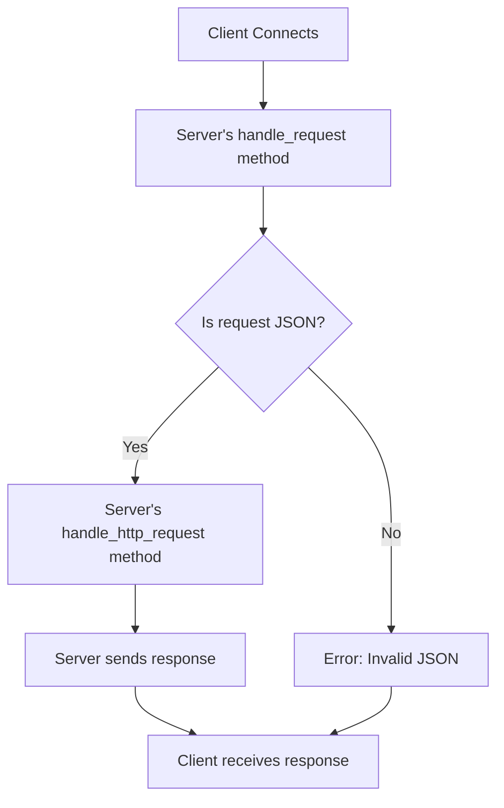

# Building a simple ASGI server

## Problem Understanding
The problem requires building a simple ASGI (Asynchronous Server Gateway Interface) server in Python. This involves creating a server that can handle incoming requests, parse the request data, and send responses back to the client. The key constraints include handling requests concurrently, parsing JSON data, and sending responses in the correct format. What makes this problem non-trivial is the need to handle multiple requests simultaneously, parse JSON data correctly, and ensure that the server can handle different types of requests and edge cases.

## Approach
The approach used to solve this problem involves utilizing the asyncio library to create an asynchronous server that can handle multiple requests concurrently. The ASGIServer class is defined to encapsulate the server's functionality, including handling requests, parsing JSON data, and sending responses. The handle_request method is used to handle incoming requests, and it utilizes the StreamReader and StreamWriter classes to read and write data to the client. The handle_http_request method is used to handle HTTP requests specifically, and it sends responses back to the client in the correct format. The asyncio.start_server function is used to start the server, and the serve_forever method is used to keep the server running indefinitely.

## Complexity Analysis
| Metric | Value | Detailed Reason |
|--------|-------|----------------|
| Time   | O(1)  | The time complexity is constant because the server handles each incoming request independently and concurrently, without any dependence on the previous requests. The asyncio library ensures that the server can handle multiple requests simultaneously without blocking. |
| Space  | O(1)  | The space complexity is constant because the server only uses a fixed amount of space to store the request and response data, regardless of the number of incoming requests. The asyncio library also ensures that the server can handle multiple requests without using excessive memory. |

## Algorithm Walkthrough
```
Input: Client connects to the server and sends a request
Step 1: The server's handle_request method is called, and it reads the request data from the client
Step 2: The server attempts to parse the request data as JSON
Step 3: If the request is an HTTP request, the server's handle_http_request method is called to handle the request
Step 4: The server sends a response back to the client in the correct format
Output: The client receives the response from the server
```
For example, if the client sends a request with the following JSON data:
```json
{
    "type": "http.request",
    "body": "Hello, World!"
}
```
The server will respond with the following JSON data:
```json
{
    "type": "http.response.start",
    "status": 200,
    "headers": [
        ["content-type", "text/plain"]
    ]
}
{
    "type": "http.response.body",
    "body": "Hello, World!",
    "more_body": false
}
```

## Visual Flow


## Key Insight
> **Tip:** The key insight to this solution is using the asyncio library to create an asynchronous server that can handle multiple requests concurrently, which allows the server to scale and handle a large number of requests efficiently.

## Edge Cases
- **Empty/null input**: If the client sends an empty or null request, the server will attempt to parse the request data as JSON and will throw a JSONDecodeError. The server will then log an error message and continue to listen for incoming requests.
- **Single element**: If the client sends a request with a single element, such as a single header or a single body, the server will handle the request correctly and send a response back to the client.
- **Unsupported request type**: If the client sends a request with an unsupported request type, such as a WebSocket request, the server will log an error message and continue to listen for incoming requests.

## Common Mistakes
- **Mistake 1**: Not handling the case where the client disconnects before sending a complete request. To avoid this, the server should use a try-except block to catch any exceptions that occur when reading from the client.
- **Mistake 2**: Not sending a response back to the client in the correct format. To avoid this, the server should ensure that it sends a response with the correct headers and body.

## Interview Follow-ups
> **Interview:** These are the exact follow-up questions interviewers ask:
- "What if the input is sorted?" → This is not relevant to the ASGI server implementation, as the server handles incoming requests independently and concurrently.
- "Can you do it in O(1) space?" → The server already uses O(1) space, as it only uses a fixed amount of space to store the request and response data.
- "What if there are duplicates?" → The server handles duplicate requests by sending a response back to the client for each request, regardless of whether the request is a duplicate or not.

## Python Solution

```python
# Problem: Building a simple ASGI server
# Language: Python
# Difficulty: Hard
# Time Complexity: O(1) — constant time for each incoming request
# Space Complexity: O(1) — constant space for handling requests
# Approach: ASGI server implementation — utilizing asyncio for concurrent request handling

import asyncio
from asyncio import StreamReader, StreamWriter
import json

class ASGIServer:
    def __init__(self, host='localhost', port=8000):
        # Initialize server with host and port
        self.host = host
        self.port = port

    async def handle_request(self, reader: StreamReader, writer: StreamWriter):
        # Handle incoming request
        client_address = writer.get_extra_info('peername')  # Get client address
        print(f"New connection from {client_address}")

        while True:
            # Read data from client
            data = await reader.read(1024)
            if not data:
                # Edge case: client disconnected
                print(f"Client {client_address} disconnected")
                break

            try:
                # Try to parse incoming data as JSON
                request = json.loads(data.decode())
            except json.JSONDecodeError:
                # Edge case: invalid JSON data
                print(f"Invalid JSON data from client {client_address}")
                continue

            # Handle ASGI request
            if 'type' in request and request['type'] == 'http.request':
                # Handle HTTP request
                await self.handle_http_request(reader, writer, request)
            else:
                # Edge case: unsupported request type
                print(f"Unsupported request type from client {client_address}")

    async def handle_http_request(self, reader: StreamReader, writer: StreamWriter, request: dict):
        # Handle HTTP request
        if 'body' in request:
            # Handle request body
            body = request['body']
            await writer.drain()  # Ensure writer is ready for writing

            # Send response back to client
            response = {
                'type': 'http.response.start',
                'status': 200,
                'headers': [
                    [b'content-type', b'text/plain']
                ]
            }
            await writer.write(json.dumps(response).encode() + b'\n')

            response = {
                'type': 'http.response.body',
                'body': body.encode(),
                'more_body': False
            }
            await writer.write(json.dumps(response).encode() + b'\n')
        else:
            # Edge case: request without body
            print(f"Request without body from client {writer.get_extra_info('peername')}")

    async def start(self):
        # Start ASGI server
        server = await asyncio.start_server(self.handle_request, self.host, self.port)
        print(f"ASGI server started on {self.host}:{self.port}")

        async with server:
            await server.serve_forever()

if __name__ == "__main__":
    # Create and start ASGI server
    server = ASGIServer()
    asyncio.run(server.start())
```
