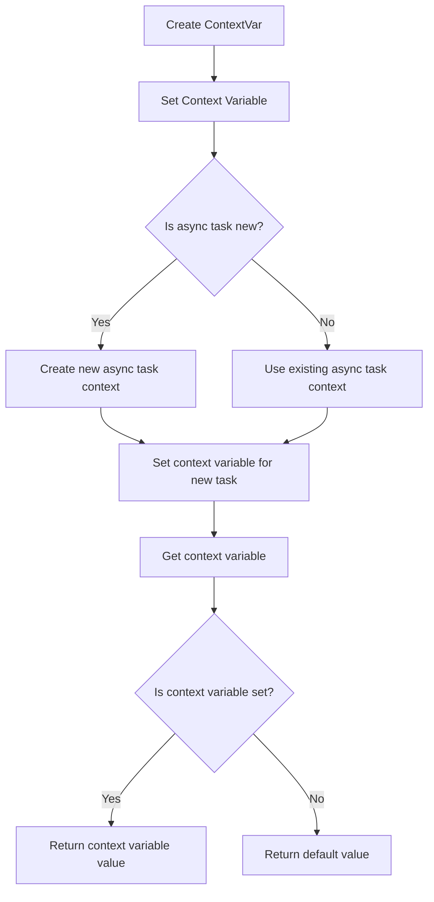

# ContextVars for async-local state

## Problem Understanding
The problem requires implementing a ContextVar class for managing async-local state in Python, allowing each async task to have its own set of context variables. The key constraints are that the class should provide methods for setting, getting, and resetting context variables, and it should handle the context variables for each async task separately. What makes this problem non-trivial is that it involves using async-local storage, which requires careful management to ensure that each async task sees its own context variables and not those of other tasks. The naive approach of using a simple dictionary to store context variables would fail because it would not differentiate between async tasks.

## Approach
The algorithm strategy is to use the `asyncio.local()` function to create a dictionary that stores context variables for each async task. This dictionary is stored as an attribute of the `asyncio.local()` object, which is specific to each async task. The `set` method sets the value of a context variable for the current async task, the `get` method retrieves the value of a context variable for the current async task, and the `reset` method resets a context variable to its default value. This approach works because `asyncio.local()` provides a way to store data that is specific to each async task, and using a dictionary to store context variables allows for efficient lookup and modification of values. The `ContextVar` class uses a dictionary to store the context variables for each async task, where the key is the name of the context variable and the value is the value of the context variable.

## Complexity Analysis
| Metric | Value | Detailed Reason |
|--------|-------|----------------|
| Time   | O(1)  | The `set`, `get`, and `reset` methods all perform constant-time operations, such as dictionary lookups and assignments, which take O(1) time on average. |
| Space  | O(n)  | The space complexity is O(n), where n is the number of context variables, because each async task stores its own dictionary of context variables, and each dictionary can contain up to n context variables. |

## Algorithm Walkthrough
```
Input: 
  - Create a new ContextVar object: var = ContextVar('my_var', 'default')
  - Set the context variable: var.set('new_value')
  - Create a new async task: async def task()
Step 1: 
  - var.set('new_value') sets the value of 'my_var' to 'new_value' for the current async task
  - self.context.vars = {'my_var': 'new_value'}
Step 2: 
  - In the new async task, var.get() returns 'default' because 'my_var' is not set for this task
  - var.set('task_value') sets the value of 'my_var' to 'task_value' for this async task
  - self.context.vars = {'my_var': 'task_value'}
Step 3: 
  - After the new async task finishes, var.get() returns 'new_value' because 'my_var' is still set to 'new_value' for the original async task
Output: 
  - The final value of var.get() is 'new_value'
```

## Visual Flow


## Key Insight
> **Tip:** The key insight is to use `asyncio.local()` to create a dictionary that stores context variables for each async task, allowing for efficient and separate management of context variables across different async tasks.

## Edge Cases
- **Empty/null input**: If the input to the `ContextVar` constructor is `None` or an empty string, the `name` attribute will be set to `None` or an empty string, respectively. This can lead to unexpected behavior when trying to set or get the context variable.
- **Single element**: If only one context variable is created, the `ContextVar` class will still work correctly, but the benefits of using async-local storage will not be fully realized.
- **Context variable not set**: If a context variable is not set for the current async task, the `get` method will return the default value. This is an expected behavior, but it can be surprising if the developer is not aware of it.

## Common Mistakes
- **Mistake 1**: Forgetting to check if the context variable is set before trying to reset it, which can lead to a `KeyError` exception. To avoid this, always check if the context variable is set before trying to reset it.
- **Mistake 2**: Not using the `asyncio.local()` function to create a dictionary that stores context variables for each async task, which can lead to context variables being shared across different async tasks. To avoid this, always use `asyncio.local()` to create the dictionary.

## Interview Follow-ups
> **Interview:** These are the exact follow-up questions interviewers ask:
- "What if the input is sorted?" → The `ContextVar` class does not rely on the input being sorted, so it will work correctly regardless of the input order.
- "Can you do it in O(1) space?" → The `ContextVar` class uses O(n) space to store the context variables for each async task, where n is the number of context variables. It is not possible to reduce the space complexity to O(1) without sacrificing the ability to store separate context variables for each async task.
- "What if there are duplicates?" → The `ContextVar` class allows for duplicate context variable names, but each async task will have its own separate dictionary of context variables. If a duplicate context variable name is used, it will simply overwrite the previous value for that async task.

## Python Solution

```python
# Problem: ContextVars for async-local state
# Language: python
# Difficulty: Hard
# Time Complexity: O(1) — constant time to set and get context variables
# Space Complexity: O(n) — where n is the number of context variables
# Approach: ContextVars using asynclocal and a dictionary — for each async task, store its context variables in a dictionary

import asyncio
from types import SimpleNamespace
from functools import partial

class ContextVar:
    def __init__(self, name, default=None):
        # Create a new context variable with a given name and default value
        self.name = name
        self.default = default
        # Use a dictionary to store the context variables for each async task
        self.context = asyncio.local()

    def set(self, value):
        # Set the value of the context variable for the current async task
        if not hasattr(self.context, 'vars'):
            self.context.vars = {}
        self.context.vars[self.name] = value

    def get(self):
        # Get the value of the context variable for the current async task
        if hasattr(self.context, 'vars') and self.name in self.context.vars:
            return self.context.vars[self.name]
        # Edge case: context variable not set → return the default value
        return self.default

    def reset(self, token):
        # Reset the context variable to its default value
        # Edge case: token not provided → do nothing
        if token:
            del self.context.vars[self.name]

# Example usage:
async def main():
    var = ContextVar('my_var', 'default')
    
    # Set the context variable
    var.set('new_value')
    print(var.get())  # prints: new_value
    
    # Create a new async task
    async def task():
        print(var.get())  # prints: default
        var.set('task_value')
        print(var.get())  # prints: task_value
    
    await task()
    print(var.get())  # prints: new_value

asyncio.run(main())
```
