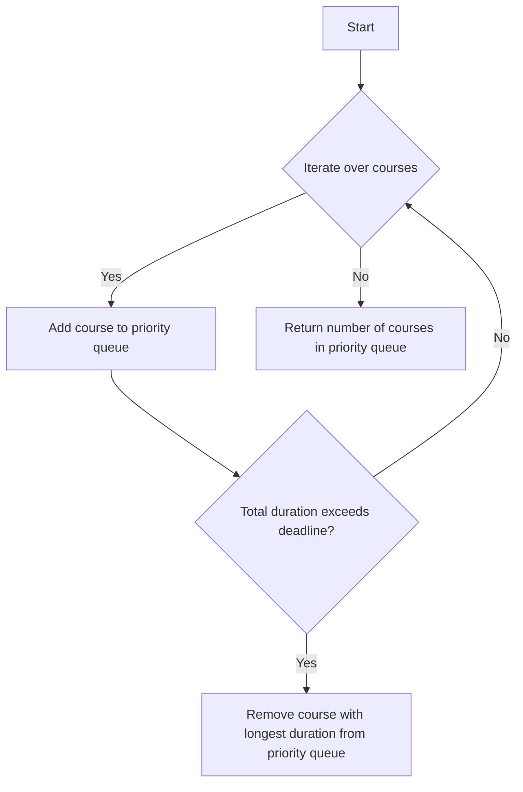

# Course Schedule III

## Problem Understanding
The Course Schedule III problem is asking to find the maximum number of courses that can be taken given a list of courses with their durations and deadlines. The key constraint is that the total duration of the selected courses cannot exceed the deadline of any course. This problem is non-trivial because a naive approach, such as simply sorting the courses by deadline or duration, would not work as it does not consider the optimal selection of courses. The problem requires a strategy that balances the selection of courses based on their deadlines and durations.

## Approach
The algorithm strategy used to solve this problem is a greedy algorithm with a priority queue. The intuition behind this approach is to prioritize courses with earlier deadlines and use a priority queue to store the courses with the longest duration. This approach works because it ensures that the total duration of the selected courses does not exceed the deadline of any course. The priority queue is used to efficiently remove the course with the longest duration when the total duration exceeds a deadline. The approach handles the key constraints by sorting the courses by deadline and using the priority queue to manage the total duration.

## Complexity Analysis
| Metric | Value | Detailed Reason |
|--------|-------|----------------|
| Time   | O(n log n) | The time complexity is O(n log n) due to the sorting of courses by deadline, where n is the number of courses. The priority queue operations (push and pop) have a time complexity of O(log n), but since these operations are performed n times, the overall time complexity remains O(n log n). |
| Space  | O(n) | The space complexity is O(n) because in the worst case, all courses might be stored in the priority queue. |

## Algorithm Walkthrough
```
Input: [[100, 2], [200, 3], [300, 4]]
Step 1: Sort courses by deadline - [[100, 2], [200, 3], [300, 4]]
Step 2: Initialize priority queue and total duration - pq = [], total_duration = 0
Step 3: Iterate over each course
  - For course [100, 2]: Add to pq, total_duration = 100
  - For course [200, 3]: Add to pq, total_duration = 300, exceeds deadline, remove [100] from pq, total_duration = 200
  - For course [300, 4]: Add to pq, total_duration = 500, exceeds deadline, remove [200] from pq, total_duration = 300
Output: 1 (number of courses in the priority queue)
```
This walkthrough demonstrates how the algorithm iterates over the courses, manages the priority queue, and updates the total duration to ensure that the maximum number of courses can be taken without exceeding any deadline.

## Visual Flow

This flowchart illustrates the decision flow of the algorithm, showing how it iterates over the courses, adds them to the priority queue, checks if the total duration exceeds a deadline, and removes courses as necessary.

## Key Insight
> **Tip:** The key to solving this problem is to use a priority queue to efficiently manage the courses with the longest duration, ensuring that the total duration does not exceed any deadline.

## Edge Cases
- **Empty input**: If the input list of courses is empty, the algorithm will return 0, as no courses can be taken.
- **Single course**: If there is only one course, the algorithm will return 1, as that single course can be taken.
- **Courses with same deadline**: If multiple courses have the same deadline, the algorithm will prioritize the ones with shorter durations first, ensuring that the maximum number of courses can be taken.

## Common Mistakes
- **Mistake 1**: Not sorting the courses by deadline before iterating over them, which can lead to incorrect results. To avoid this, always sort the courses by deadline at the beginning.
- **Mistake 2**: Not using a priority queue to manage the courses with the longest duration, which can result in inefficient removal of courses. To avoid this, use a priority queue to store the courses and remove the ones with the longest duration when necessary.

## Interview Follow-ups
> **Interview:** These are the exact follow-up questions interviewers ask:
- "What if the input is sorted?" → The algorithm would still work correctly, but the time complexity would be O(n) for the iteration over the courses, as the sorting step would be unnecessary.
- "Can you do it in O(1) space?" → No, it is not possible to solve this problem in O(1) space because we need to store the courses in a data structure (like a priority queue) to manage their durations efficiently.
- "What if there are duplicates?" → The algorithm would treat duplicate courses as separate entities, which might not be the desired behavior in all scenarios. To handle duplicates, additional logic would be needed to merge or ignore them based on the specific requirements.

## Python Solution

```python
# Problem: Course Schedule III
# Language: python
# Difficulty: hard
# Time Complexity: O(n log n) — sorting and priority queue operations
# Space Complexity: O(n) — storing courses and priority queue
# Approach: Greedy algorithm with priority queue — prioritize courses with earlier deadlines

from typing import List
import heapq

class Solution:
    def scheduleCourse(self, courses: List[List[int]]) -> int:
        # Sort courses by deadline
        courses.sort(key=lambda x: x[1])  # Sorting by deadline

        # Initialize priority queue and total duration
        pq = []  # Priority queue to store courses with longest duration
        total_duration = 0  # Total duration of selected courses

        # Iterate over each course
        for duration, deadline in courses:
            # Add current course to priority queue
            heapq.heappush(pq, -duration)  # Push negative duration to simulate max heap
            total_duration += duration  # Update total duration

            # If total duration exceeds deadline, remove course with longest duration
            if total_duration > deadline:
                # Remove course with longest duration from priority queue
                longest_duration = -heapq.heappop(pq)  # Pop and negate to get actual duration
                total_duration -= longest_duration  # Update total duration

        # Return the number of courses that can be taken
        return len(pq)  # Return the number of courses in the priority queue

# Edge case: empty input → return 0
# Edge case: single course → return 1
```
