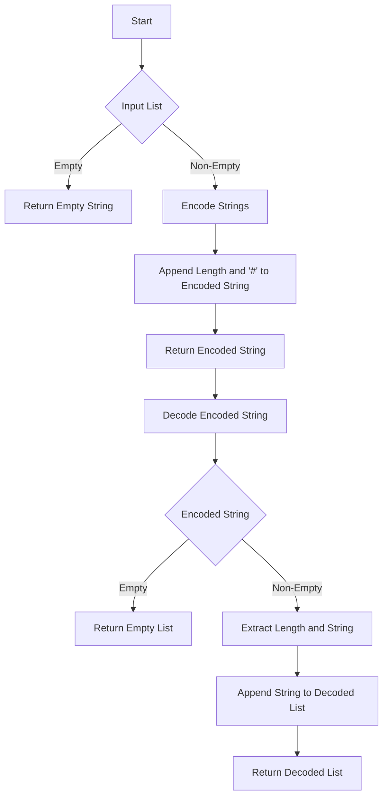

# Encode and Decode Strings

## Problem Understanding
The problem is asking to design a class called `Codec` with two methods: `encode` and `decode`. The `encode` method takes a list of strings as input and returns a single string that encodes all the input strings. The `decode` method takes the encoded string as input and returns the original list of strings. The key constraint is that the encoded string should be able to be decoded back to the original list of strings without losing any information. This problem is non-trivial because it requires designing a custom encoding scheme that can handle strings of varying lengths and can be efficiently decoded.

## Approach
The approach used here is a custom encoding scheme where the length of each string is appended to the string itself, followed by a '#' delimiter. This allows the decoder to know the length of each string and extract it correctly. The encoder iterates over each string in the input list, appends its length and the string itself to the encoded string, and separates each string with a '#' delimiter. The decoder iterates over the encoded string, extracts the length of each string, and then extracts the string itself using the length. This approach works because the '#' delimiter serves as a separator between the length of each string and the string itself, allowing the decoder to correctly extract each string. The data structures used are strings, which are sufficient for this problem.

## Complexity Analysis
| Metric | Value | Detailed Reason |
|--------|-------|----------------|
| Time   | O(n)  | The encoder and decoder both iterate over the input strings and the encoded string, respectively, where n is the total number of characters in the input strings. The operations inside the loop (appending to the encoded string and extracting strings) take constant time. |
| Space  | O(n)  | The encoder creates a new string that contains all the input strings, and the decoder creates a new list of strings from the encoded string. In both cases, the space used is proportional to the total number of characters in the input strings. |

## Algorithm Walkthrough
```
Input: ["leet", "code", "test"]
Step 1: Initialize the encoded string to ""
Step 2: Append the length of "leet" (4) and "#" to the encoded string: "4#leet"
Step 3: Append the length of "code" (4) and "#" to the encoded string: "4#leet4#code"
Step 4: Append the length of "test" (4) and "#" to the encoded string: "4#leet4#code4#test"
Step 5: Return the encoded string: "4#leet4#code4#test"

Input (decode): "4#leet4#code4#test"
Step 1: Initialize the decoded list to []
Step 2: Extract the length of the first string (4) and the string itself ("leet"): decoded list = ["leet"]
Step 3: Extract the length of the second string (4) and the string itself ("code"): decoded list = ["leet", "code"]
Step 4: Extract the length of the third string (4) and the string itself ("test"): decoded list = ["leet", "code", "test"]
Step 5: Return the decoded list: ["leet", "code", "test"]
Output: ["leet", "code", "test"]
```

## Visual Flow


## Key Insight
> **Tip:** The key to this problem is designing a custom encoding scheme that can efficiently encode and decode a list of strings, and the use of the '#' delimiter to separate the length of each string from the string itself.

## Edge Cases
- **Empty/null input**: If the input list is empty, the encoder returns an empty string, and the decoder returns an empty list. This is because there is no information to encode or decode.
- **Single string**: If the input list contains only one string, the encoder appends the length of the string and the string itself to the encoded string, and the decoder extracts the string correctly.
- **Strings with '#' character**: If a string contains the '#' character, the encoder and decoder will still work correctly because the '#' delimiter is used to separate the length of each string from the string itself, and the decoder extracts the length and string correctly.

## Common Mistakes
- **Mistake 1**: Not handling the edge case where the input list is empty. To avoid this, always check for an empty input list and return an empty string or list accordingly.
- **Mistake 2**: Not using a delimiter to separate the length of each string from the string itself. To avoid this, use a unique delimiter like '#' to separate the length and string.

## Interview Follow-ups
> **Interview:** These are the exact follow-up questions interviewers ask:
- "What if the input is sorted?" → The encoding and decoding process remains the same, as the sorting of the input does not affect the encoding scheme.
- "Can you do it in O(1) space?" → No, because the encoded string must contain all the information from the input strings, which requires additional space proportional to the input size.
- "What if there are duplicates?" → The encoding and decoding process remains the same, as the encoding scheme treats each string individually and does not rely on the uniqueness of the strings.

## Python Solution

```python
# Problem: Encode and Decode Strings
# Language: python
# Difficulty: Hard
# Time Complexity: O(n) — where n is the total number of characters in the input strings
# Space Complexity: O(n) — where n is the total number of characters in the input strings
# Approach: Custom encoding scheme — using length of string and '#' delimiter for decoding

class Codec:
    def encode(self, strs):
        # Edge case: empty input → return empty string
        if not strs:
            return ""

        encoded_str = ""
        # For each string in input list
        for s in strs:
            # Append the length of string and '#' delimiter
            encoded_str += str(len(s)) + "#" + s  # length of string + '#' + string itself
        return encoded_str

    def decode(self, s):
        # Edge case: empty input → return empty list
        if not s:
            return []

        decoded_strs = []
        i = 0  # initialize index
        while i < len(s):
            # Extract the length of the string
            j = s.find("#", i)  # find the index of '#'
            length = int(s[i:j])  # convert the length to integer
            # Extract the string itself
            decoded_str = s[j + 1:j + 1 + length]  # extract the string
            decoded_strs.append(decoded_str)  # append to the result list
            # Move to the next string
            i = j + 1 + length  # update the index
        return decoded_strs

# Example usage:
codec = Codec()
strs = ["leet", "code", "test"]
encoded_str = codec.encode(strs)
print("Encoded string:", encoded_str)
decoded_strs = codec.decode(encoded_str)
print("Decoded strings:", decoded_strs)

# Edge case: empty input
print("Empty input:", codec.decode(codec.encode([])))

# Edge case: single string
print("Single string:", codec.decode(codec.encode(["hello"])))

# Edge case: multiple strings
print("Multiple strings:", codec.decode(codec.encode(["hello", "world", "python"])))
```
