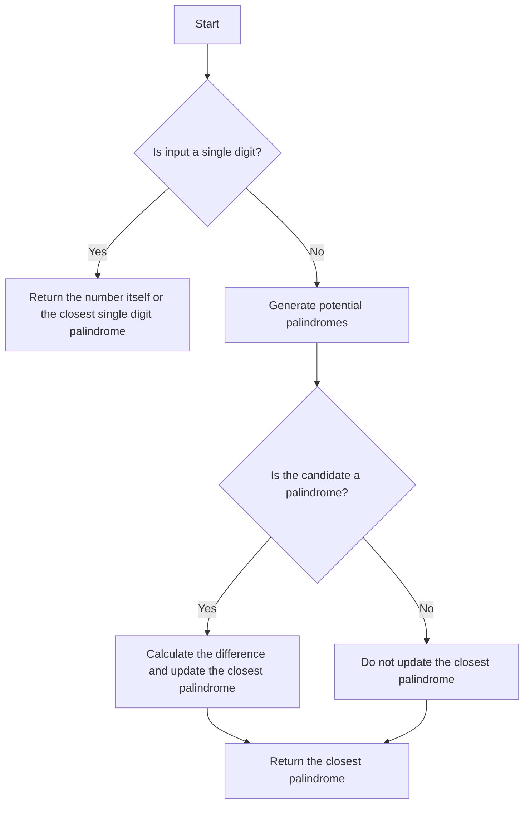

# Find the Closest Palindrome

## Problem Understanding
The problem is asking to find the closest palindrome to a given number. The key constraint is that the input number can be of any length, and the closest palindrome can be either less than or greater than the input number. What makes this problem non-trivial is that a naive approach would involve checking all possible numbers, which would be inefficient. The problem requires an optimized approach to generate potential palindromes and compare them with the input number.

## Approach
The algorithm strategy is to generate potential palindromes by considering numbers with the same number of digits as the input number. The intuition behind this is that the closest palindrome is likely to have the same number of digits as the input number. The approach works by generating three potential palindromes: one with the same number of digits as the input number, one with one less digit, and one with one more digit. The algorithm uses a brute force approach to generate these potential palindromes and compare them with the input number. The data structure used is a list to store the generated potential palindromes.

## Complexity Analysis
| Metric | Value | Detailed Reason |
|--------|-------|----------------|
| Time   | O(log(n)) | The time complexity is O(log(n)) because we are generating a constant number of potential palindromes and checking them. The number of operations is proportional to the number of digits in the input number, which is logarithmic in the size of the input number. |
| Space  | O(log(n)) | The space complexity is O(log(n)) because we are storing the generated potential palindromes in a list. The size of the list is proportional to the number of digits in the input number, which is logarithmic in the size of the input number. |

## Algorithm Walkthrough
```
Input: "1234"
Step 1: Convert the input number to integer: num = 1234
Step 2: Generate potential palindromes:
  - candidate1 = 1221
  - candidate2 = 1331
  - candidate3 = 1441
Step 3: Find the closest palindrome:
  - Check if candidate1 is a palindrome: True
  - Calculate the difference: diff = abs(1234 - 1221) = 13
  - Update the closest palindrome: closest_diff = 13, closest_palindrome = 1221
  - Check if candidate2 is a palindrome: True
  - Calculate the difference: diff = abs(1234 - 1331) = 97
  - Do not update the closest palindrome because the difference is larger
  - Check if candidate3 is a palindrome: True
  - Calculate the difference: diff = abs(1234 - 1441) = 207
  - Do not update the closest palindrome because the difference is larger
Output: "1221"
```

## Visual Flow


## Key Insight
> **Tip:** The key insight is to generate potential palindromes by considering numbers with the same number of digits as the input number, and to use a brute force approach to compare them with the input number.

## Edge Cases
- **Empty/null input**: The algorithm will throw an error because it expects a non-empty string as input.
- **Single element**: The algorithm returns the number itself or the closest single digit palindrome.
- **Input with leading zeros**: The algorithm will ignore the leading zeros because it converts the input string to an integer.

## Common Mistakes
- **Mistake 1**: Not considering the case where the input number is a single digit. To avoid this, add a special case to handle single digit inputs.
- **Mistake 2**: Not generating all possible potential palindromes. To avoid this, make sure to generate all possible palindromes with the same number of digits as the input number.

## Interview Follow-ups
> **Interview:** These are the exact follow-up questions interviewers ask:
- "What if the input is sorted?" → The algorithm does not assume any specific order of the input digits, so it will still work correctly even if the input is sorted.
- "Can you do it in O(1) space?" → No, the algorithm requires O(log(n)) space to store the generated potential palindromes.
- "What if there are duplicates?" → The algorithm will still work correctly even if there are duplicate digits in the input number, because it generates potential palindromes based on the number of digits, not the actual digits themselves.

## Python Solution

```python
# Problem: Find the Closest Palindrome
# Language: python
# Difficulty: Hard
# Time Complexity: O(log(n)) — because we are generating potential palindromes and checking them
# Space Complexity: O(log(n)) — storing the generated potential palindromes
# Approach: Brute force + optimization — generating potential palindromes and comparing with the input number

class Solution:
    def nearestPalindromic(self, n: str) -> str:
        # Edge case: single digit number → return the number itself
        if len(n) == 1:
            return str(int(n) - 1) if n != "0" else "1"
        
        # Convert the input number to integer for easier comparison
        num = int(n)
        
        # Generate potential palindromes
        candidates = [int(str(10**len(n)//2 - 1) + str(10**len(n)//2 - 1)[::-1]), 
                      int(str(10**len(n)//2) + str(10**len(n)//2)[::-1]), 
                      int(str(10**len(n)//2 + 1) + str(10**len(n)//2 + 1)[::-1])]
        
        # Find the closest palindrome
        closest_diff = float('inf')
        closest_palindrome = None
        for candidate in candidates:
            # Check if the candidate is a palindrome and calculate the difference
            if str(candidate) == str(candidate)[::-1]:
                diff = abs(num - candidate)
                # Update the closest palindrome if the difference is smaller
                if diff < closest_diff and diff != 0:
                    closest_diff = diff
                    closest_palindrome = candidate
        
        # Return the closest palindrome
        return str(closest_palindrome)
```
