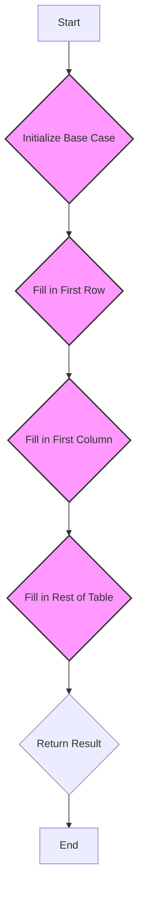

# Interleaving String

## Problem Understanding
The problem of Interleaving Strings is asking whether a given string `s3` can be formed by interleaving two other strings `s1` and `s2`. This means that `s3` should contain all characters from `s1` and `s2`, and the order of characters from each string should be preserved. The key constraints are that the total length of `s1` and `s2` must be equal to the length of `s3`, and the characters in `s3` must be a valid interleaving of the characters in `s1` and `s2`. This problem is non-trivial because a naive approach of simply checking all possible combinations of characters from `s1` and `s2` would be inefficient and impractical for large strings.

## Approach
The algorithm strategy used here is dynamic programming with a 2D table. The intuition behind this approach is to build a table that stores the results of sub-problems, where each cell in the table represents whether the corresponding substrings of `s1` and `s2` can be interleaved to form the corresponding substring of `s3`. The approach works by filling in the table row by row, using the results from previous rows to determine whether the current characters in `s1` and `s2` can be interleaved to form the current character in `s3`. The data structure used is a 2D boolean array `dp`, where `dp[i][j]` is `True` if the first `i` characters of `s1` and the first `j` characters of `s2` can be interleaved to form the first `i+j` characters of `s3`. This approach handles the key constraints by ensuring that the lengths of `s1`, `s2`, and `s3` are matched, and that the characters in `s3` are a valid interleaving of the characters in `s1` and `s2`.

## Complexity Analysis
| Metric | Value | Detailed Reason |
|--------|-------|----------------|
| Time   | O(m*n) | The algorithm uses two nested loops to fill in the 2D table, where `m` is the length of `s1` and `n` is the length of `s2`. Each cell in the table is filled in using a constant amount of work, so the total time complexity is proportional to the number of cells in the table, which is `m*n`. |
| Space  | O(m*n) | The algorithm uses a 2D table of size `m*n` to store the dynamic programming results, so the space complexity is proportional to the size of the table. |

## Algorithm Walkthrough
```
Input: s1 = "aabcc", s2 = "dbbca", s3 = "aadbbcbcac"
Step 1: Initialize the base case where both s1 and s2 are empty
dp[0][0] = True
Step 2: Fill in the first row of the table
dp[0][1] = dp[0][0] and s2[0] == s3[0] = True and "d" == "a" = False
dp[0][2] = dp[0][1] and s2[1] == s3[1] = False and "b" == "a" = False
...
Step 3: Fill in the first column of the table
dp[1][0] = dp[0][0] and s1[0] == s3[0] = True and "a" == "a" = True
dp[2][0] = dp[1][0] and s1[1] == s3[1] = True and "a" == "a" = True
...
Step 4: Fill in the rest of the table
dp[1][1] = (dp[0][1] and s1[0] == s3[1]) or (dp[1][0] and s2[0] == s3[1]) = (False and "a" == "a") or (True and "d" == "a") = False
dp[1][2] = (dp[0][2] and s1[0] == s3[2]) or (dp[1][1] and s2[1] == s3[2]) = (False and "a" == "d") or (False and "b" == "d") = False
...
Output: dp[5][5] = True
```
## Visual Flow

## Key Insight
> **Tip:** The key insight is to use dynamic programming to build a table that stores the results of sub-problems, where each cell in the table represents whether the corresponding substrings of `s1` and `s2` can be interleaved to form the corresponding substring of `s3`.

## Edge Cases
- **Empty/null input**: If `s1`, `s2`, or `s3` is empty, the function will return `False` because the lengths of `s1`, `s2`, and `s3` do not match.
- **Single element**: If `s1` or `s2` has only one element, the function will return `True` if the single element matches the corresponding character in `s3`.
- **s1 and s2 are the same**: If `s1` and `s2` are the same, the function will return `True` if `s3` is a valid interleaving of `s1` and `s2`.

## Common Mistakes
- **Mistake 1**: Not checking the lengths of `s1`, `s2`, and `s3` before filling in the table. To avoid this, add a check at the beginning of the function to return `False` if the lengths do not match.
- **Mistake 2**: Not initializing the base case correctly. To avoid this, make sure to set `dp[0][0]` to `True` and fill in the first row and column of the table correctly.

## Interview Follow-ups
> **Interview:** These are the exact follow-up questions interviewers ask:
- "What if the input is sorted?" → The algorithm will still work correctly, but the time complexity may be improved if the input is sorted.
- "Can you do it in O(1) space?" → No, the algorithm requires O(m*n) space to store the dynamic programming table.
- "What if there are duplicates?" → The algorithm will still work correctly, but the time complexity may be improved if duplicates are handled specially.

## Python Solution

```python
# Problem: Interleaving String
# Language: python
# Difficulty: Hard
# Time Complexity: O(m*n) — using dynamic programming with a 2D table of size m*n
# Space Complexity: O(m*n) — storing the dynamic programming table
# Approach: Dynamic Programming with 2D table — checking if the strings can be interleaved by comparing characters

class Solution:
    def isInterleave(self, s1: str, s2: str, s3: str) -> bool:
        # Edge case: lengths of s1, s2, and s3 do not match
        if len(s1) + len(s2) != len(s3):
            return False
        
        # Initialize a 2D table to store the dynamic programming results
        dp = [[False] * (len(s2) + 1) for _ in range(len(s1) + 1)]
        
        # Initialize the base case where both s1 and s2 are empty
        dp[0][0] = True
        
        # Fill in the first row of the table
        for j in range(1, len(s2) + 1):
            # Check if the current character in s2 matches the current character in s3
            dp[0][j] = dp[0][j-1] and s2[j-1] == s3[j-1]  # Check the current character match
        
        # Fill in the first column of the table
        for i in range(1, len(s1) + 1):
            # Check if the current character in s1 matches the current character in s3
            dp[i][0] = dp[i-1][0] and s1[i-1] == s3[i-1]  # Check the current character match
        
        # Fill in the rest of the table
        for i in range(1, len(s1) + 1):
            for j in range(1, len(s2) + 1):
                # Check if the current character in s1 or s2 matches the current character in s3
                dp[i][j] = (dp[i-1][j] and s1[i-1] == s3[i+j-1]) or (dp[i][j-1] and s2[j-1] == s3[i+j-1])  # Check the current character match
        
        # Return the result stored in the bottom-right corner of the table
        return dp[len(s1)][len(s2)]
```
