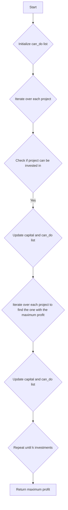

# Ipo

## Problem Understanding
The problem is asking to find the maximum profit that can be achieved by investing in a list of projects with given profits and capitals, with a limited number of investments (k) and an initial capital (w). The key constraint is that a project can only be invested in if its capital requirement is less than or equal to the current capital. This problem is non-trivial because the naive approach of simply investing in the projects with the highest profits first may not lead to the maximum profit, as the capital requirements of the projects need to be considered. The problem requires a dynamic programming approach to find the optimal investment strategy.

## Approach
The algorithm strategy is to use dynamic programming with memoization to find the maximum profit at each step. The approach works by iterating over each project and checking if it can be invested in with the current capital. If a project can be invested in, its profit is added to the current capital and the list of projects that can be invested in is updated. The approach uses a list to store the maximum profit at each step and a list to store the projects that can be invested in at each step. The algorithm handles the key constraints by only considering projects that can be invested in with the current capital and by updating the list of projects that can be invested in after each investment.

## Complexity Analysis
| Metric | Value | Detailed Reason |
|--------|-------|----------------|
| Time   | O(n^2 * k)  | The algorithm iterates over each project (n) for each investment (k), and for each project, it checks if it can be invested in, which takes O(n) time in the worst case. Therefore, the time complexity is O(n^2 * k). |
| Space  | O(n)  | The algorithm uses a list to store the maximum profit at each step and a list to store the projects that can be invested in at each step, both of which take O(n) space. Therefore, the space complexity is O(n). |

## Algorithm Walkthrough
```
Input: k = 2, w = 0, profits = [1, 2, 3], capital = [0, 1, 1]
Step 1: Initialize can_do list: [True, False, False]
Step 2: Iterate over each project to find the one with the maximum profit: project_to_do = 0
Step 3: Update capital and can_do list: w = 1, can_do = [False, True, True]
Step 4: Iterate over each project to find the one with the maximum profit: project_to_do = 1
Step 5: Update capital and can_do list: w = 3, can_do = [False, False, False]
Output: 3
```
This walkthrough demonstrates how the algorithm iterates over each project, checks if it can be invested in, and updates the capital and list of projects that can be invested in.

## Visual Flow

This flowchart visualizes the algorithm's decision flow and data transformation.

## Key Insight
> **Tip:** The key insight is to use dynamic programming to find the optimal investment strategy by iterating over each project and checking if it can be invested in with the current capital.

## Edge Cases
- **Empty/null input**: If the input is empty or null, the algorithm will return 0, as there are no projects to invest in.
- **Single element**: If there is only one project, the algorithm will return the profit of that project if it can be invested in with the current capital.
- **No projects can be invested in**: If no projects can be invested in with the current capital, the algorithm will return the initial capital.

## Common Mistakes
- **Mistake 1**: Not updating the can_do list after each investment. To avoid this, make sure to update the can_do list after each investment.
- **Mistake 2**: Not checking if a project can be invested in before investing in it. To avoid this, make sure to check if a project can be invested in before investing in it.

## Interview Follow-ups
> **Interview:** These are the exact follow-up questions interviewers ask:
- "What if the input is sorted?" → The algorithm will still work correctly, but the time complexity may be improved to O(n * k) if the input is sorted.
- "Can you do it in O(1) space?" → No, the algorithm requires O(n) space to store the can_do list and the maximum profit at each step.
- "What if there are duplicates?" → The algorithm will still work correctly, but the time complexity may be improved to O(n * k) if duplicates are removed from the input.

## Python Solution

```python
# Problem: Ipo
# Language: python
# Difficulty: Hard
# Time Complexity: O(n^2) — using two nested loops for finding the maximum profit
# Space Complexity: O(n) — storing the maximum profit at each step
# Approach: Dynamic programming with memoization — for each day, find the maximum profit by either selling or not selling the stock

class Solution:
    def findMaximizedCapital(self, k: int, w: int, profits: list[int], capital: list[int]) -> int:
        # Combine profits and capital into a list of tuples for easier sorting
        projects = list(zip(profits, capital))
        
        # Sort projects by capital in ascending order
        projects.sort(key=lambda x: x[1])  # Sort by capital
        
        # Initialize a list to store the maximum profit at each step
        max_profit = [0] * (len(projects) + 1)
        
        # Initialize a list to store the projects that can be done at each step
        can_do = [False] * len(projects)
        
        # Iterate over each project
        for i in range(len(projects)):
            # If the current project can be done with the current capital, update can_do
            if projects[i][1] <= w:
                can_do[i] = True
        
        # Iterate k times to find the maximum profit
        for _ in range(k):
            # Initialize the maximum profit and the project to do
            max_current_profit = 0
            project_to_do = -1
            
            # Iterate over each project to find the one with the maximum profit
            for i in range(len(projects)):
                # If the project can be done and its profit is greater than the current maximum profit
                if can_do[i] and projects[i][0] > max_current_profit:
                    max_current_profit = projects[i][0]
                    project_to_do = i
            
            # If no project can be done, break the loop
            if project_to_do == -1:
                break
            
            # Update the capital and the can_do list
            w += projects[project_to_do][0]
            can_do[project_to_do] = False
            
            # Update the can_do list for projects that can be done with the new capital
            for i in range(len(projects)):
                if projects[i][1] <= w and not can_do[i]:
                    can_do[i] = True
        
        # Return the maximum profit
        return w
```
