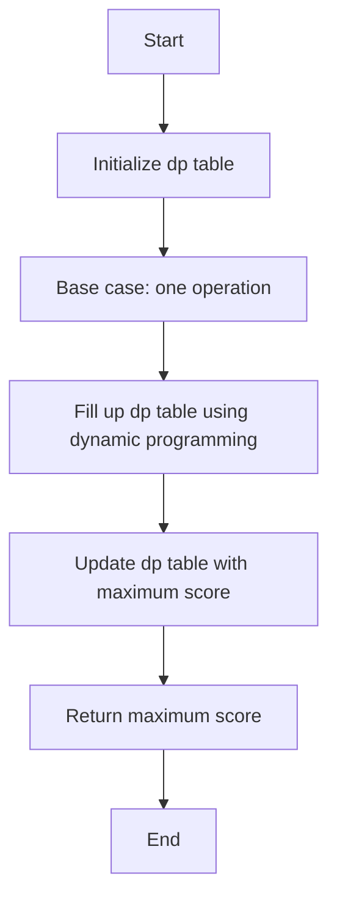

# Maximize Score After N Operations

## Problem Understanding
The problem "Maximize Score After N Operations" asks to find the maximum score that can be obtained by performing a series of operations on a list of numbers. The key constraint is that each operation involves calculating the greatest common divisor (GCD) of two numbers in the list. The problem becomes non-trivial because the naive approach of trying all possible pairs of numbers and calculating their GCD would result in an exponential time complexity. The problem requires a dynamic programming approach to build up a table that stores the maximum score for each subproblem, taking into account the GCD of pairs of numbers.

## Approach
The algorithm strategy is to use dynamic programming to build up a table `dp` where `dp[i][j]` represents the maximum score that can be obtained by performing `j` operations on the first `i` numbers in the list. The intuition behind this approach is to try all possible pairs of numbers and calculate their GCD, and then update the `dp` table accordingly. The `dp` table is filled up using a bottom-up approach, starting from the base case where only one operation is performed. The `gcd` function is used to calculate the GCD of two numbers using the Euclidean algorithm. The approach handles the key constraint of calculating the GCD of pairs of numbers by trying all possible pairs and updating the `dp` table.

## Complexity Analysis
| Metric | Value | Detailed Reason |
|--------|-------|----------------|
| Time   | O(n^2) | The algorithm has two nested loops, each of which runs up to `n` times. The inner loop tries all possible pairs of numbers, resulting in a time complexity of O(n^2). The `gcd` function has a time complexity of O(log min(a, b)), but since it is called inside the nested loops, the overall time complexity remains O(n^2). |
| Space  | O(n^2) | The algorithm uses a `dp` table of size `n x (n // 2 + 1)` to store the maximum score for each subproblem. The space complexity is therefore O(n^2). |

## Algorithm Walkthrough
```
Input: nums = [12, 18, 24, 30]
Step 1: Initialize dp table with zeros
dp = [
  [0, 0, 0],
  [0, 0, 0],
  [0, 0, 0],
  [0, 0, 0],
  [0, 0, 0]
]
Step 2: Base case: one operation
dp[1][1] = max(dp[1][1], gcd(nums[0], nums[0])) = 12
dp[2][1] = max(dp[2][1], gcd(nums[0], nums[1])) = 6
dp[3][1] = max(dp[3][1], gcd(nums[0], nums[2])) = 6
dp[4][1] = max(dp[4][1], gcd(nums[0], nums[3])) = 6
Step 3: Fill up dp table using dynamic programming
dp[2][2] = max(dp[2][2], dp[1][1] + gcd(nums[0], nums[1])) = 12
dp[3][2] = max(dp[3][2], dp[1][1] + gcd(nums[0], nums[2])) = 12
dp[3][2] = max(dp[3][2], dp[2][1] + gcd(nums[1], nums[2])) = 12
dp[4][2] = max(dp[4][2], dp[1][1] + gcd(nums[0], nums[3])) = 12
dp[4][2] = max(dp[4][2], dp[2][1] + gcd(nums[1], nums[3])) = 12
...
Output: dp[4][2] = 12
```
## Visual Flow

## Key Insight
> **Tip:** The key insight is to use dynamic programming to build up a table that stores the maximum score for each subproblem, taking into account the GCD of pairs of numbers.

## Edge Cases
- **Empty/null input**: If the input list is empty, the function returns 0, as there are no numbers to perform operations on.
- **Single element**: If the input list contains only one number, the function returns the number itself, as there is only one possible operation.
- **Duplicate numbers**: If the input list contains duplicate numbers, the function will still calculate the GCD of each pair of numbers, but the maximum score will be the same as if the duplicates were removed.

## Common Mistakes
- **Mistake 1**: Not initializing the `dp` table with zeros, resulting in incorrect maximum scores.
- **Mistake 2**: Not using the `gcd` function to calculate the GCD of pairs of numbers, resulting in incorrect maximum scores.

## Interview Follow-ups
> **Interview:** These are the exact follow-up questions interviewers ask:
- "What if the input is sorted?" → The algorithm will still work correctly, as the `gcd` function is used to calculate the GCD of pairs of numbers, regardless of their order.
- "Can you do it in O(1) space?" → No, the algorithm requires a `dp` table of size `n x (n // 2 + 1)` to store the maximum score for each subproblem, resulting in a space complexity of O(n^2).
- "What if there are duplicates?" → The algorithm will still work correctly, as the `gcd` function is used to calculate the GCD of each pair of numbers, and the maximum score will be the same as if the duplicates were removed.

## Python Solution

```python
# Problem: Maximize Score After N Operations
# Language: python
# Difficulty: Hard
# Time Complexity: O(n^2) — dynamic programming to fill up dp table
# Space Complexity: O(n^2) — dp table of size n x n
# Approach: Dynamic Programming — build up dp table to store maximum score for each subproblem

class Solution:
    def maxScore(self, nums: list[int]) -> int:
        # Edge case: empty input → return 0
        if not nums:
            return 0
        
        n = len(nums)
        
        # Initialize dp table with zeros
        dp = [[0] * (n // 2 + 1) for _ in range(n + 1)]
        
        # Base case: one operation
        for i in range(1, n + 1):
            # Calculate gcd for each pair of numbers
            for j in range(1, i):
                dp[i][1] = max(dp[i][1], self.gcd(nums[j - 1], nums[i - 1]))
        
        # Fill up dp table using dynamic programming
        for i in range(2, n + 1):
            for j in range(2, min(i, n // 2 + 1) + 1):
                # For each subproblem, try all possible pairs and update dp table
                for k in range(1, i):
                    dp[i][j] = max(dp[i][j], dp[k][j - 1] + self.gcd(nums[k - 1], nums[i - 1]))
        
        # The answer is stored in the last cell of dp table
        return dp[n][n // 2]
    
    def gcd(self, a: int, b: int) -> int:
        # Calculate gcd using Euclidean algorithm
        while b:
            a, b = b, a % b
        return a
```
