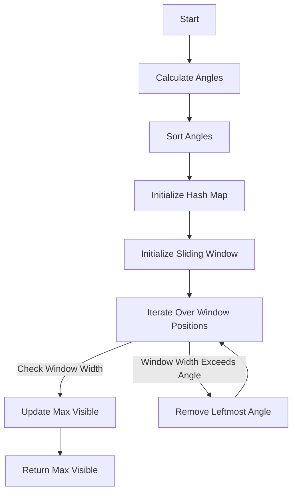

# Maximum Number of Visible Points

## Problem Understanding
The problem is asking to find the maximum number of points that can be seen from a given location within a certain angle. The key constraints are the angle limit and the location, which affects how points are visible. This problem is non-trivial because a naive approach, such as checking every possible subset of points, would be computationally expensive due to the large number of points. The problem requires an efficient algorithm to calculate the maximum number of visible points within the given angle.

## Approach
The algorithm strategy is to use an angular sweep with a hash map to iterate over all points, calculate angles, and find the maximum count. This approach works by first calculating the angles of all points relative to the location, then using a sliding window to find the maximum number of points that can be seen within the given angle. The hash map is used to store the counts of angles, and the sliding window is used to efficiently check all possible subsets of points. The approach handles the key constraints by only considering points within the given angle and using the location as a reference point.

## Complexity Analysis
| Metric | Value | Detailed Reason |
|--------|-------|----------------|
| Time   | O(n^2) | The algorithm iterates over all points to calculate angles, and then uses a sliding window to find the maximum number of points. In the worst case, the algorithm needs to check all possible subsets of points, resulting in a time complexity of O(n^2). The sorting of angles also takes O(n log n) time, but it is dominated by the O(n^2) term. |
| Space  | O(n)   | The algorithm uses a hash map to store the counts of angles, which requires O(n) space. The sliding window also requires O(n) space to store the current window of points. |

## Algorithm Walkthrough
```
Input: points = [[1, 1], [2, 2], [3, 3]], angle = 90, location = [1, 1]
Step 1: Calculate angles relative to the location
  - point (2, 2): angle = 45 degrees
  - point (3, 3): angle = 45 degrees
Step 2: Sort angles
  - angles = [45, 45]
Step 3: Initialize the hash map to store angle counts
  - angle_counts = {45: 2}
Step 4: Initialize variables for the sliding window
  - max_visible = 0
  - window_start = 0
  - window_angles = []
Step 5: Iterate over all possible window positions
  - window_end = 0: add angle 45 to the window
  - window_angles = [45]
  - max_visible = max(0, 1 + 0) = 1
  - window_end = 1: add angle 45 to the window
  - window_angles = [45, 45]
  - max_visible = max(1, 2 + 0) = 2
Output: max_visible = 2
```
## Visual Flow

## Key Insight
> **Tip:** The key insight is to use a sliding window to efficiently check all possible subsets of points within the given angle, allowing the algorithm to avoid checking every possible subset individually.

## Edge Cases
- **Empty/null input**: If the input is empty, the algorithm returns 0, as there are no points to consider.
- **Single element**: If there is only one point, the algorithm returns 1, as the single point is always visible.
- **All points on the same line**: If all points are on the same line, the algorithm returns the number of points, as all points are visible.

## Common Mistakes
- **Mistake 1**: Not handling the case where the angle is greater than 360 degrees. To avoid this, use the modulo operator to ensure the angle is within the range [0, 360).
- **Mistake 2**: Not removing the leftmost angle from the window when the window width exceeds the angle limit. To avoid this, use a while loop to remove the leftmost angle until the window width is within the angle limit.

## Interview Follow-ups
> **Interview:** These are the exact follow-up questions interviewers ask:
- "What if the input is sorted?" → The algorithm still works, but the sorting step can be skipped, reducing the time complexity to O(n).
- "Can you do it in O(1) space?" → No, the algorithm requires O(n) space to store the hash map and the sliding window.
- "What if there are duplicates?" → The algorithm handles duplicates by counting the number of points at each angle, so duplicates do not affect the result.

## Python Solution

```python
# Problem: Maximum Number of Visible Points
# Language: python
# Difficulty: Hard
# Time Complexity: O(n^2) — iterating over all points and potential orientations
# Space Complexity: O(n) — storing angles and counts
# Approach: Angular sweep with hash map — iterate over all points, calculate angles, and find the maximum count

import math
from typing import List

class Solution:
    def maxVisiblePoints(self, points: List[List[int]], angle: int, location: List[int]) -> int:
        # Edge case: empty input → return 0
        if not points:
            return 0

        # Calculate angles relative to the location
        angles = []
        on_location = 0  # count points on the location
        for point in points:
            # Calculate the angle between the point and the location
            dx = point[0] - location[0]
            dy = point[1] - location[1]
            if dx == 0 and dy == 0:  # point is on the location
                on_location += 1
            else:
                angle_rad = math.atan2(dy, dx)  # calculate angle in radians
                # Convert angle to degrees and adjust to the range [0, 360)
                angle_deg = math.degrees(angle_rad)
                if angle_deg < 0:
                    angle_deg += 360
                angles.append(angle_deg)

        # Handle edge case: no points are visible except those on the location
        if not angles:
            return on_location

        # Sort angles
        angles.sort()

        # Initialize the hash map to store angle counts
        angle_counts = {}
        for angle_deg in angles:
            # Use angle modulo 360 to handle angles greater than 360
            angle_mod = angle_deg % 360
            angle_counts[angle_mod] = angle_counts.get(angle_mod, 0) + 1

        # Initialize variables for the sliding window
        max_visible = 0
        window_start = 0
        window_angles = []

        # Iterate over all possible window positions
        for window_end in range(len(angles)):
            # Add the current angle to the window
            window_angles.append(angles[window_end])

            # Check if the window width exceeds the angle limit
            while window_end - window_start + 1 > 0 and angles[window_end] - angles[window_start] > angle:
                # Remove the leftmost angle from the window
                window_angles.pop(0)
                window_start += 1

            # Update the maximum visible points
            max_visible = max(max_visible, window_end - window_start + 1 + on_location)

        return max_visible
```
