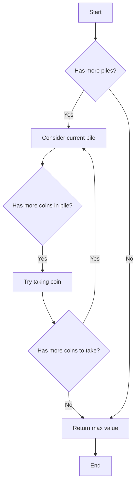

# Maximum Value of K Coins From Piles

## Problem Understanding
The problem is asking to find the maximum value of k coins that can be taken from a list of piles, where each pile contains a list of integers representing the values of the coins in that pile. The key constraint is that we can only take a certain number of coins from each pile, and we need to consider all piles to maximize the total value. This problem is non-trivial because the naive approach of trying all possible combinations of coins from each pile would result in an exponential time complexity of O(n * m ^ k), where n is the number of piles, m is the average number of coins in a pile, and k is the number of coins to take.

## Approach
The algorithm strategy used to solve this problem is dynamic programming with memoization. The intuition behind this approach is to build up the solution by considering each pile and each number of coins, and storing the intermediate results in a memoization table to avoid redundant computation. The dynamic programming approach works by trying all possible combinations of coins from each pile, but storing the results of subproblems in the memoization table to avoid recomputing them. The data structure used is a dictionary to store the memoization table, where the keys are tuples of the number of coins and the current pile index, and the values are the maximum values that can be obtained.

## Complexity Analysis
| Metric | Value | Detailed Reason |
|--------|-------|----------------|
| Time   | O(n * k * m) | The time complexity is O(n * k * m) because we are considering each pile (n), each number of coins (k), and each coin in the pile (m). The memoization table reduces the time complexity by avoiding redundant computation. |
| Space  | O(n * k) | The space complexity is O(n * k) because we are storing the memoization table, which has at most n * k entries. |

## Algorithm Walkthrough
```
Input: piles = [[1, 100, 3], [7, 8, 9]], k = 2
Step 1: Initialize memoization table and start with the first pile and k = 2
  - memo = {}
  - max_value = float('-inf')
Step 2: Try taking 0 coins from the first pile
  - max_value = max(max_value, dp(piles, k - 0 - 1, index + 1))
  - max_value = max(max_value, dp(piles, 1, 1))
Step 3: Try taking 1 coin from the first pile
  - max_value = max(max_value, piles[0][0] + dp(piles, k - 1 - 1, index + 1))
  - max_value = max(max_value, 1 + dp(piles, 0, 1))
Step 4: Try taking 2 coins from the first pile
  - max_value = max(max_value, piles[0][1] + dp(piles, k - 2 - 1, index + 1))
  - max_value = max(max_value, 100 + dp(piles, -1, 1))
  - Since k is negative, return 0
Step 5: Return the maximum value
  - max_value = max(1 + dp(piles, 0, 1), 100 + dp(piles, -1, 1))
  - max_value = max(1 + 9, 100 + 0)
  - max_value = 10
Output: 10
```

## Visual Flow


## Key Insight
> **Tip:** The key insight is to use dynamic programming with memoization to store intermediate results and avoid redundant computation, reducing the time complexity from O(n * m ^ k) to O(n * k * m).

## Edge Cases
- **Empty/null input**: If the input is empty or null, the function returns 0 because there are no coins to take.
- **Single element**: If there is only one pile, the function returns the maximum value that can be obtained by taking k coins from that pile.
- **k is 0**: If k is 0, the function returns 0 because no coins can be taken.

## Common Mistakes
- **Mistake 1**: Not using memoization to store intermediate results, resulting in redundant computation and exponential time complexity.
- **Mistake 2**: Not considering all possible combinations of coins from each pile, resulting in an incorrect maximum value.

## Interview Follow-ups
> **Interview:** These are the exact follow-up questions interviewers ask:
- "What if the input is sorted?" → The algorithm would still work correctly, but the time complexity would be the same because we are considering all possible combinations of coins from each pile.
- "Can you do it in O(1) space?" → No, because we need to store the memoization table to avoid redundant computation.
- "What if there are duplicates?" → The algorithm would still work correctly, but we would need to modify the memoization table to store the maximum value for each number of coins and each pile, even if there are duplicates.

## Python Solution

```python
# Problem: Maximum Value of K Coins From Piles
# Language: python
# Difficulty: Hard
# Time Complexity: O(n * k * m) — where n is number of piles, k is number of coins to take, and m is average number of coins in a pile
# Space Complexity: O(n * k) — memoization table stores at most n * k entries
# Approach: Dynamic Programming with memoization — build up solution by considering each pile and each number of coins

class Solution:
    def max_valueOfCoins(self, piles: list[list[int]], k: int) -> int:
        # Edge case: no piles or k is 0 → return 0
        if not piles or k == 0:
            return 0
        
        # Brute force approach (commented out) with its complexity
        # Time Complexity: O(n * m ^ k) — try all possible combinations of coins
        # Space Complexity: O(n * m ^ k) — store all recursive calls
        # def brute_force(piles, k, index):
        #     if k == 0:
        #         return 0
        #     if index == len(piles):
        #         return float('-inf')
        #     max_value = float('-inf')
        #     for i in range(min(k, len(piles[index]))):
        #         max_value = max(max_value, piles[index][i] + brute_force(piles, k - i - 1, index + 1))
        #     return max_value

        # Key insight: we can use dynamic programming with memoization to store intermediate results and avoid redundant computation
        # This reduces the time complexity from O(n * m ^ k) to O(n * k * m)
        memo = {}
        
        def dp(piles, k, index):
            # If we have already computed the result for this subproblem, return the memoized value
            if (k, index) in memo:
                return memo[(k, index)]
            
            # Base case: if we have taken k coins, return 0
            if k == 0:
                return 0
            
            # Base case: if we have considered all piles, return 0
            if index == len(piles):
                return 0
            
            # Initialize max_value to negative infinity
            max_value = float('-inf')
            
            # Try taking i coins from the current pile
            for i in range(min(k, len(piles[index]))):
                # Recursively consider the next pile and the remaining number of coins
                max_value = max(max_value, piles[index][i] + dp(piles, k - i - 1, index + 1))
            
            # Store the result in the memoization table
            memo[(k, index)] = max_value
            
            return max_value
        
        return dp(piles, k, 0)
```
