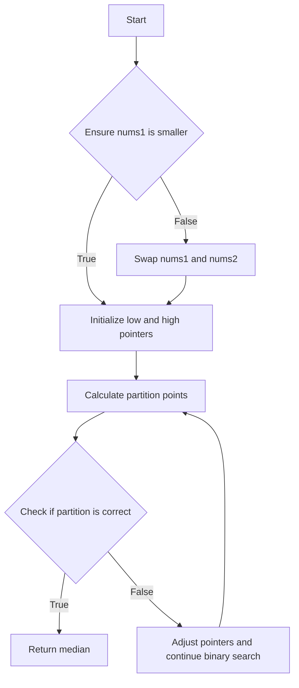

# Median of Two Sorted Arrays

## Problem Understanding
The problem requires finding the median of two sorted arrays. Given two sorted arrays `nums1` and `nums2`, we need to find the middle value(s) when these two arrays are merged and sorted. The key constraints are that the input arrays are sorted, and we need to find the median, which is the middle value in the case of an odd total length or the average of the two middle values in the case of an even total length. This problem is non-trivial because a naive approach of merging the two arrays and then finding the median would result in a time complexity of O(n + m), where n and m are the lengths of the two arrays. However, we can use a more efficient approach to solve this problem.

## Approach
The algorithm strategy used here is a binary search approach to find the partition point that divides the two arrays into two halves with equal sum of elements. We ensure that `nums1` is the smaller array to simplify the logic and then use binary search to find the partition point. We calculate the partition points for both arrays based on the total length and the partition point of `nums1`. We then compare the values at the partition points to determine if the partition is correct. If the partition is correct, we return the median; otherwise, we adjust the pointers and continue the binary search. The data structures used here are the input arrays `nums1` and `nums2`, and we also use variables to store the partition points and the values at the partition points.

## Complexity Analysis
| Metric | Value | Detailed Reason |
|--------|-------|----------------|
| Time   | O(log(min(n, m))) | We use a binary search approach to find the partition point, and the number of iterations is proportional to the logarithm of the length of the smaller array. The comparison of values at the partition points takes constant time. |
| Space  | O(1) | We use a constant amount of space to store the partition points, the values at the partition points, and other variables. The space usage does not grow with the input size. |

## Algorithm Walkthrough
```
Input: nums1 = [1, 3], nums2 = [2]
Step 1: Ensure nums1 is the smaller array: nums1 = [1, 3], nums2 = [2]
Step 2: Calculate the total length: total_length = 3
Step 3: Initialize the low and high pointers: low = 0, high = 2
Step 4: Calculate the partition point for nums1: partition_num1 = 1
Step 5: Calculate the partition point for nums2: partition_num2 = 1
Step 6: Calculate the values at the partition points: max_left_num1 = 1, min_right_num1 = 3, max_left_num2 = 2, min_right_num2 = inf
Step 7: Check if the partition is correct: max_left_num1 <= min_right_num2 and max_left_num2 <= min_right_num1: True
Step 8: Return the median: max(max_left_num1, max_left_num2) = 2
Output: 2
```
## Visual Flow

## Key Insight
> **Tip:** The key insight here is to use binary search to find the partition point that divides the two arrays into two halves with equal sum of elements, which allows us to find the median in O(log(min(n, m))) time complexity.

## Edge Cases
- **Empty/null input**: If both arrays are empty, the function returns None. This is because there is no median for an empty array.
- **Single element**: If one of the arrays has only one element, the function returns the median of the two arrays. For example, if nums1 = [1] and nums2 = [2], the function returns 1.5.
- **Arrays of different lengths**: If the arrays have different lengths, the function ensures that nums1 is the smaller array and then uses binary search to find the partition point. This allows the function to handle arrays of different lengths correctly.

## Common Mistakes
- **Mistake 1**: Not ensuring that nums1 is the smaller array before using binary search. This can lead to incorrect results or incorrect handling of edge cases. To avoid this, always ensure that nums1 is the smaller array before using binary search.
- **Mistake 2**: Not handling the case where the total length is even correctly. In this case, the median is the average of the two middle numbers. To avoid this, always check if the total length is even and return the average of the two middle numbers if it is.

## Interview Follow-ups
> **Interview:** These are the exact follow-up questions interviewers ask:
- "What if the input is sorted?" → The algorithm assumes that the input arrays are sorted, so it would still work correctly.
- "Can you do it in O(1) space?" → The algorithm uses O(1) space, so it already meets this requirement.
- "What if there are duplicates?" → The algorithm would still work correctly even if there are duplicates in the input arrays. It would simply return the median of the merged and sorted array, which may be a duplicate value.

## Python Solution

```python
# Problem: Median of Two Sorted Arrays
# Language: python
# Difficulty: Hard
# Time Complexity: O(log(min(n, m))) — binary search to find partition point
# Space Complexity: O(1) — constant space used for variables
# Approach: Binary search to find partition point — find the partition point that divides the two arrays into two halves with equal sum of elements

class Solution:
    def findMedianSortedArrays(self, nums1: list[int], nums2: list[int]) -> float:
        # Edge case: both arrays are empty → return None
        if not nums1 and not nums2:
            return None
        
        # Ensure that nums1 is the smaller array to simplify the logic
        if len(nums1) > len(nums2):
            # Swap nums1 and nums2 to make nums1 the smaller array
            nums1, nums2 = nums2, nums1
        
        # Calculate the total length of both arrays
        total_length = len(nums1) + len(nums2)
        
        # Initialize the low and high pointers for binary search
        low = 0
        high = len(nums1)
        
        while low <= high:
            # Calculate the partition point for nums1
            partition_num1 = (low + high) // 2
            
            # Calculate the partition point for nums2 based on the total length and partition point of nums1
            partition_num2 = (total_length + 1) // 2 - partition_num1
            
            # Calculate the values at the partition points
            max_left_num1 = float('-inf') if partition_num1 == 0 else nums1[partition_num1 - 1]
            min_right_num1 = float('inf') if partition_num1 == len(nums1) else nums1[partition_num1]
            
            max_left_num2 = float('-inf') if partition_num2 == 0 else nums2[partition_num2 - 1]
            min_right_num2 = float('inf') if partition_num2 == len(nums2) else nums2[partition_num2]
            
            # Check if the partition is correct
            if max_left_num1 <= min_right_num2 and max_left_num2 <= min_right_num1:
                # If the total length is even, return the average of the two middle numbers
                if total_length % 2 == 0:
                    return (max(max_left_num1, max_left_num2) + min(min_right_num1, min_right_num2)) / 2
                # If the total length is odd, return the middle number
                else:
                    return max(max_left_num1, max_left_num2)
            # If the partition is not correct, adjust the pointers and continue the binary search
            elif max_left_num1 > min_right_num2:
                high = partition_num1 - 1
            else:
                low = partition_num1 + 1
```
