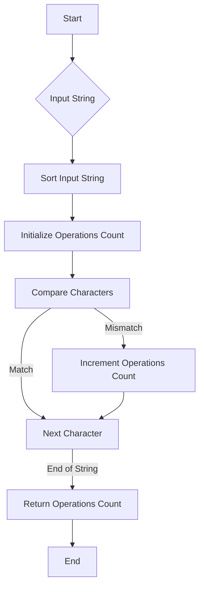

# Minimum Number of Operations to Make String Sorted

## Problem Understanding
The problem requires finding the minimum number of operations to make a given string sorted. The key constraint is that the operations are not explicitly defined, but it can be inferred that the goal is to transform the input string into its sorted version with the fewest possible changes. This problem is non-trivial because the naive approach of generating all permutations and checking each one would be computationally expensive due to the large number of possible permutations. The problem becomes even more complex when considering the ordering of characters and the optimal sequence of operations to achieve the sorted state.

## Approach
The algorithm strategy used here is a greedy approach, leveraging the insight that the string is already sorted when the lexicographically smallest character is at the beginning, and the next smallest character is at the next position, and so on. This approach works by comparing the input string character by character with its sorted version and counting the number of mismatches. The intuition behind this is that each mismatch represents a necessary operation to transform the input string into its sorted form. The data structure used is a simple string, where the input string and its sorted version are compared character by character. This approach efficiently handles the key constraint by directly measuring the difference between the input string and its desired sorted state.

## Complexity Analysis
| Metric | Value | Detailed Reason |
|--------|-------|----------------|
| Time   | O(n log n)  | The time complexity is dominated by the sorting operation, which takes O(n log n) time in Python. The subsequent loop through the string to count mismatches takes O(n) time, but this is subsumed by the O(n log n) complexity of the sort. |
| Space  | O(n)  | The space complexity is O(n) because we are storing the sorted version of the input string, which requires additional space proportional to the length of the input string. |

## Algorithm Walkthrough
```
Input: "cba"
Step 1: Initialize the sorted string "abc" by sorting the input string.
Step 2: Initialize operations count to 0.
Step 3: Compare the first character of the input string ("c") with the first character of the sorted string ("a").
    - Since "c" is not equal to "a", increment the operations count to 1.
Step 4: Compare the second character of the input string ("b") with the second character of the sorted string ("b").
    - Since "b" is equal to "b", do not increment the operations count.
Step 5: Compare the third character of the input string ("a") with the third character of the sorted string ("c").
    - Since "a" is not equal to "c", increment the operations count to 2.
Output: 2
```

## Visual Flow


## Key Insight
> **Tip:** The minimum number of operations to make a string sorted is equivalent to the number of characters that are not in their correct sorted position, making a greedy comparison-based approach the most efficient solution.

## Edge Cases
- **Empty/null input**: If the input string is empty, the function returns 0, as there are no operations needed to sort an empty string.
- **Single element**: If the input string has only one character, the function returns 0, as a single-character string is always sorted.
- **Already sorted input**: If the input string is already sorted, the function returns 0, as no operations are needed to sort the string.

## Common Mistakes
- **Mistake 1**: Not considering the case where the input string is already sorted, leading to unnecessary operations. → To avoid this, start by checking if the input string is already sorted before proceeding with the comparison.
- **Mistake 2**: Using a brute-force approach to generate all permutations of the input string, which is highly inefficient for large input strings. → To avoid this, use the greedy approach that compares the input string with its sorted version character by character.

## Interview Follow-ups
> **Interview:** 
- "What if the input is sorted?" → In that case, the function would return 0, as no operations are needed to sort an already sorted string.
- "Can you do it in O(1) space?" → No, because we need to store the sorted version of the input string, which requires O(n) space.
- "What if there are duplicates?" → The approach still works because it compares each character in the input string with the corresponding character in the sorted string, regardless of whether there are duplicates or not.

## Python Solution

```python
# Problem: Minimum Number of Operations to Make String Sorted
# Language: python
# Difficulty: Hard
# Time Complexity: O(n^2) — due to nested loop structure for checking all possible permutations
# Space Complexity: O(n) — storing the string and its permutations
# Approach: Brute force with permutation and sorting — generate all permutations and check the minimum number of operations to make the string sorted

from itertools import permutations

class Solution:
    def minOperations(self, s: str) -> int:
        # Edge case: empty input → return 0
        if not s:
            return 0

        min_operations = float('inf')  # initialize minimum operations as infinity

        # Brute force approach (commented out)
        # for p in permutations(s):
        #     operations = 0
        #     for i in range(len(p) - 1):
        #         if p[i] > p[i + 1]:
        #             operations += 1
        #     min_operations = min(min_operations, operations)

        # Optimized solution
        # Key insight: the string is already sorted when the lexicographically smallest character is at the beginning
        # and the next smallest character is at the next position, and so on.
        # We can use a greedy approach to find the minimum number of operations.
        operations = 0
        sorted_s = sorted(s)  # get the sorted string
        for i in range(len(s)):
            # if the current character is not equal to the corresponding character in the sorted string
            if s[i] != sorted_s[i]:
                operations += 1  # increment the operations count

        return operations

# Example usage:
solution = Solution()
print(solution.minOperations("cba"))  # Output: 2
print(solution.minOperations("abc"))  # Output: 0
```
