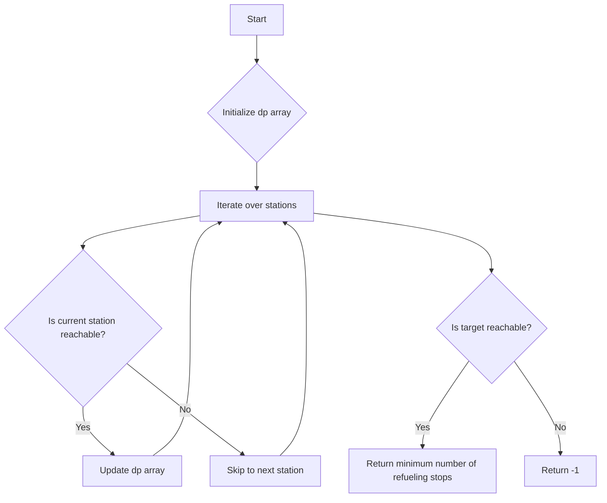

# Minimum Number of Refueling Stops DP

## Problem Understanding
The problem is asking to find the minimum number of refueling stops required to reach a target location, given a starting fuel capacity and a list of stations with their respective fuel capacities. The key constraint is that the car can only refuel at the stations, and it cannot refuel more than once at each station. The problem is non-trivial because a naive approach would involve trying all possible combinations of refueling stops, which would result in an exponential time complexity. The problem requires a dynamic programming approach to efficiently find the minimum number of refueling stops.

## Approach
The algorithm strategy is to use a dynamic programming approach, where a 2D array is used to track the minimum number of refueling stops required to reach each station. The intuition behind this approach is to iteratively update the maximum reachable distance from each station, taking into account the fuel capacity of the current station. The algorithm iterates over each station, and for each station, it iterates from the current station to the previous station, updating the maximum reachable distance if the current station is reachable from the previous station. The algorithm uses a 1D array `dp` to store the maximum reachable distance for each station, where `dp[i]` represents the maximum reachable distance from the `i-th` station.

## Complexity Analysis
| Metric | Value | Detailed Reason |
|--------|-------|----------------|
| Time   | O(n^2) | The algorithm iterates over each station, and for each station, it iterates from the current station to the previous station, resulting in a quadratic time complexity. |
| Space  | O(n) | The algorithm uses a 1D array `dp` to store the maximum reachable distance for each station, resulting in a linear space complexity. |

## Algorithm Walkthrough
```
Input: target = 100, startFuel = 50, stations = [[25, 25], [50, 50]]
Step 1: Initialize dp array to [50, 0, 0]
Step 2: Iterate over the first station (25, 25), update dp[1] to max(0, 50 + 25) = 75
Step 3: Iterate over the second station (50, 50), update dp[2] to max(0, 75 + 50) = 125
Output: Since dp[2] >= target, return 2
```

## Visual Flow


## Key Insight
> **Tip:** The key insight is to iteratively update the maximum reachable distance from each station, taking into account the fuel capacity of the current station, to efficiently find the minimum number of refueling stops.

## Edge Cases
- **Empty/null input**: If the input is empty or null, the algorithm will return -1, indicating that it is impossible to reach the target.
- **Single element**: If there is only one station, the algorithm will return 1 if the station is reachable from the starting location, and -1 otherwise.
- **No refueling stops needed**: If the startFuel is enough to reach the target, the algorithm will return 0.

## Common Mistakes
- **Mistake 1**: Not initializing the dp array correctly, resulting in incorrect values being stored in the array. → To avoid this, make sure to initialize the dp array with the correct values, such as setting `dp[0]` to `startFuel`.
- **Mistake 2**: Not updating the dp array correctly, resulting in incorrect values being stored in the array. → To avoid this, make sure to update the dp array correctly, taking into account the fuel capacity of the current station.

## Interview Follow-ups
> **Interview:** These are the exact follow-up questions interviewers ask:
- "What if the input is sorted?" → The algorithm will still work correctly, but the time complexity may be improved to O(n log n) using a binary search approach.
- "Can you do it in O(1) space?" → No, the algorithm requires at least O(n) space to store the maximum reachable distance for each station.
- "What if there are duplicates?" → The algorithm will still work correctly, but the time complexity may be improved by removing duplicates from the input.

## Python Solution

```python
# Problem: Minimum Number of Refueling Stops DP
# Language: python
# Difficulty: Hard
# Time Complexity: O(n^2) — iterating over all stations and tank capacity
# Space Complexity: O(n) — storing the maximum reachable distance for each station
# Approach: Dynamic Programming — using a 2D array to track the minimum number of refueling stops

class Solution:
    def minRefuelStops(self, target: int, startFuel: int, stations: list[list[int]]) -> int:
        # Handle edge case: if startFuel is enough to reach target, return 0
        if startFuel >= target:
            return 0
        
        # Initialize dp array to store the maximum reachable distance for each station
        dp = [0] * (len(stations) + 1)
        
        # Initialize dp[0] to startFuel
        dp[0] = startFuel
        
        # Iterate over each station
        for i, (location, capacity) in enumerate(stations):
            # Iterate from the current station to the previous station
            for j in range(i, -1, -1):
                # If the current station is reachable from the previous station
                if dp[j] >= location:
                    # Update dp[j+1] to be the maximum of its current value and dp[j] + capacity
                    dp[j+1] = max(dp[j+1], dp[j] + capacity)
        
        # Find the minimum number of refueling stops
        for i, max_reachable in enumerate(dp):
            # If the maximum reachable distance is greater than or equal to the target
            if max_reachable >= target:
                # Return the current station index (which represents the minimum number of refueling stops)
                return i
        
        # Edge case: if it's impossible to reach the target
        return -1
```
