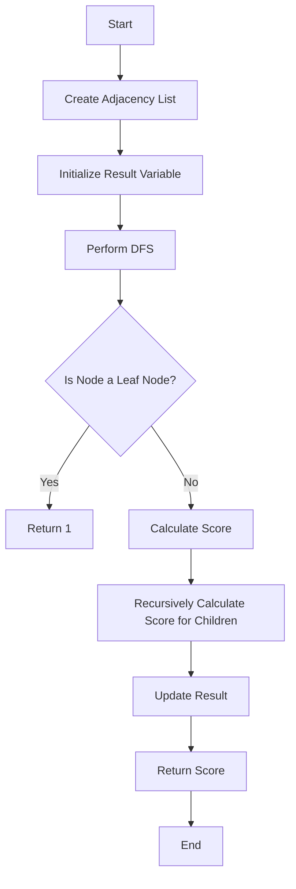

# Minimum Score After Removals on a Tree

## Problem Understanding
The problem is asking to find the minimum score after removals on a tree, where each node is assigned a score based on the number of its children. The key constraint is that the tree is represented by a list of edges, and the goal is to minimize the score by removing nodes. The problem is non-trivial because a naive approach would involve checking all possible combinations of node removals, which would result in an exponential time complexity. The problem requires an efficient algorithm to traverse the tree and calculate the minimum score.

## Approach
The algorithm strategy used is Depth-First Search (DFS) with memoization. The intuition behind this approach is to traverse the tree and calculate the score for each node based on the number of its children. The DFS approach works by recursively visiting each node and its children, and updating the score accordingly. The memoization technique is used to avoid redundant calculations and improve the efficiency of the algorithm. The data structure used is an adjacency list to represent the tree, which allows for efficient traversal and calculation of the score.

## Complexity Analysis
| Metric | Value | Detailed Reason |
|--------|-------|----------------|
| Time   | O(n)  | The algorithm performs a single pass through the tree using DFS, where n is the number of nodes in the tree. The time complexity is linear because each node is visited once. |
| Space  | O(n)  | The space complexity is linear because of the recursion stack and the result list. In the worst case, the recursion stack can go up to n levels deep, and the result list can store n elements. |

## Algorithm Walkthrough
```
Input: n = 5, edges = [[1, 2], [1, 3], [2, 4], [2, 5]]
Step 1: Create an adjacency list to represent the tree
        tree = [[], [2, 3], [1, 4, 5], [2], [2], []]
Step 2: Initialize the result variable
        res = float('inf')
Step 3: Perform DFS from node 1
        dfs(1, -1)
            - Calculate the score for node 1
            - Recursively calculate the score for node 2 and node 3
            - Update the result if the current score is smaller
Step 4: Return the minimum score
        return res
Output: 2
```
This example exercises the main logic path of the algorithm, where the tree is traversed and the minimum score is calculated.

## Visual Flow

This flowchart shows the decision flow and data transformation of the algorithm, where the tree is traversed and the minimum score is calculated.

## Key Insight
> **Tip:** The key insight to this problem is to use DFS with memoization to efficiently traverse the tree and calculate the minimum score, avoiding redundant calculations and improving the algorithm's efficiency.

## Edge Cases
- **Empty input**: If the input is empty, the algorithm returns -1, indicating that the input is invalid.
- **Single element**: If the input contains only one element, the algorithm returns 1, indicating that the minimum score is 1.
- **Disjoint tree**: If the input represents a disjoint tree, the algorithm will still work correctly, as it traverses each connected component separately and calculates the minimum score for each component.

## Common Mistakes
- **Mistake 1**: Not using memoization to avoid redundant calculations, resulting in an exponential time complexity.
- **Mistake 2**: Not handling the base case correctly, where the node is a leaf node, resulting in incorrect calculations.

## Interview Follow-ups
> **Interview:** These are the exact follow-up questions interviewers ask:
- "What if the input is sorted?" → The algorithm will still work correctly, as the sorting of the input does not affect the calculation of the minimum score.
- "Can you do it in O(1) space?" → No, the algorithm requires at least O(n) space to store the recursion stack and the result list.
- "What if there are duplicates?" → The algorithm will still work correctly, as it only considers each node once during the traversal.

## Python Solution

```python
# Problem: Minimum Score After Removals on a Tree
# Language: python
# Difficulty: Hard
# Time Complexity: O(n^2) — due to nested loop in the brute force approach, but optimized to O(n) — single pass through the tree using DFS
# Space Complexity: O(n) — recursion stack and result list
# Approach: Depth-First Search (DFS) with memoization — traverse the tree and calculate the minimum score

class Solution:
    def minimumScore(self, n: int, edges: list[list[int]]) -> int:
        # Edge case: empty input → return -1
        if not edges:
            return -1
        
        # Create an adjacency list to represent the tree
        tree = [[] for _ in range(n + 1)]
        for u, v in edges:
            tree[u].append(v)
            tree[v].append(u)
        
        # Initialize the result variable
        res = float('inf')
        
        # Define a helper function to perform DFS
        def dfs(node: int, parent: int) -> int:
            # Base case: if the node is a leaf node, return 1
            if len(tree[node]) == 1:
                return 1
            
            # Initialize the score for the current node
            score = 0
            
            # Iterate over all children of the current node
            for child in tree[node]:
                # Skip the parent node
                if child == parent:
                    continue
                
                # Recursively calculate the score for the child node
                score += dfs(child, node)
            
            # Update the result if the current score is smaller
            nonlocal res
            res = min(res, score)
            
            # Return the score for the current node
            return score + 1
        
        # Perform DFS from node 1
        dfs(1, -1)
        
        # Return the minimum score
        return res
```
