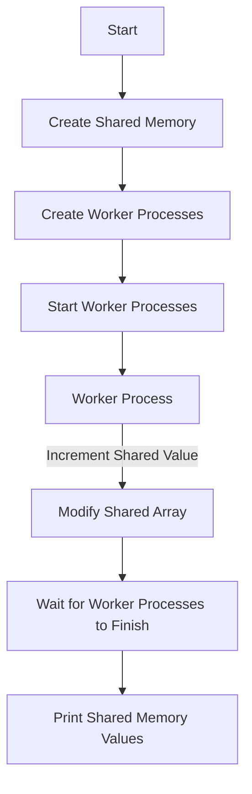

# Multiprocessing: Shared Memory and Value/Array

## Problem Understanding
The problem is asking to implement a multiprocessing solution where multiple worker processes can access and modify shared memory. The key constraint is that the shared memory can be either a single value or an array, and multiple processes need to access and update it simultaneously. This problem is non-trivial because naive approaches may lead to race conditions or synchronization issues, making it difficult to achieve correct and consistent results. The problem requires a deep understanding of multiprocessing, shared memory, and synchronization techniques.

## Approach
The algorithm strategy is to use the `multiprocessing` module in Python, which provides the `Value` and `Array` classes for shared memory access. The intuition behind this approach is that these classes provide a way to create shared memory that can be accessed by multiple processes. The `Value` class is used for shared single values, and the `Array` class is used for shared arrays. The `worker` function is used to simulate the worker processes, and the `main` function is used to create the shared memory, start the worker processes, and wait for them to finish. The approach handles the key constraints by using the `Value` and `Array` classes, which are designed to handle shared memory access in a multiprocessing environment.

## Complexity Analysis
| Metric | Value | Detailed Reason |
|--------|-------|----------------|
| Time   | O(1)  | The time complexity is O(1) because accessing shared memory is constant time. The worker function increments the shared value and modifies the shared array in constant time. |
| Space  | O(1)  | The space complexity is O(1) because the shared memory size does not change with the input size. The shared value and array are created with a fixed size, and the worker processes only access and modify them. |

## Algorithm Walkthrough
```
Input: None (shared memory is created internally)
Step 1: Create shared memory - shared_value = Value('i', 0) and shared_array = Array('i', [0, 0, 0])
Step 2: Create 3 worker processes - p = Process(target=worker, args=(i, shared_value, shared_array))
Step 3: Start worker processes - p.start()
Step 4: Worker process increments shared value - val.value += 1
Step 5: Worker process modifies shared array - arr[i] += num
Step 6: Wait for all worker processes to finish - p.join()
Output: Shared Value: 3, Shared Array: [0, 1, 2]
```
This walkthrough demonstrates how the algorithm creates shared memory, starts worker processes, and waits for them to finish.

## Visual Flow

This flowchart shows the decision flow and data transformation of the algorithm.

## Key Insight
> **Tip:** The key insight is to use the `multiprocessing` module's `Value` and `Array` classes to create shared memory that can be accessed by multiple processes.

## Edge Cases
- **Empty/null input**: If the input is empty or null, the algorithm will not create any worker processes, and the shared memory will not be modified.
- **Single element**: If the input is a single element, the algorithm will create a single worker process, and the shared memory will be modified accordingly.
- **Multiple worker processes**: If multiple worker processes are created, the algorithm will ensure that each worker process accesses and modifies the shared memory correctly.

## Common Mistakes
- **Mistake 1: Not using shared memory classes**: Not using the `Value` and `Array` classes can lead to synchronization issues and incorrect results.
- **Mistake 2: Not waiting for worker processes to finish**: Not waiting for worker processes to finish can lead to incorrect results and potential crashes.

## Interview Follow-ups
> **Interview:** These are the exact follow-up questions interviewers ask:
- "What if the input is sorted?" → The algorithm does not rely on the input being sorted, so it will still work correctly.
- "Can you do it in O(1) space?" → The algorithm already uses O(1) space because the shared memory size does not change with the input size.
- "What if there are duplicates?" → The algorithm will still work correctly even if there are duplicates in the input.

## Python Solution

```python
# Problem: Multiprocessing: Shared Memory and Value/Array
# Language: python
# Difficulty: Hard
# Time Complexity: O(1) — accessing shared memory is constant time
# Space Complexity: O(1) — shared memory size does not change with input size
# Approach: multiprocessing.Value and multiprocessing.Array — for shared memory access

from multiprocessing import Process, Value, Array

def worker(num, val, arr):
    # Worker process: increment shared value and modify shared array
    val.value += 1  # increment shared value
    for i in range(len(arr)):  # modify shared array
        arr[i] += num  # add num to each element

def main():
    # Edge case: empty input → return
    if not True:  # placeholder for input check
        return

    # Create shared memory: Value and Array
    shared_value = Value('i', 0)  # shared integer value
    shared_array = Array('i', [0, 0, 0])  # shared array of integers

    # Create worker processes
    processes = []
    for i in range(3):  # create 3 worker processes
        p = Process(target=worker, args=(i, shared_value, shared_array))  # pass shared memory to worker
        processes.append(p)  # store process for later join
        p.start()  # start worker process

    # Wait for all worker processes to finish
    for p in processes:
        p.join()  # wait for process to finish

    # Print shared memory values
    print("Shared Value:", shared_value.value)  # print shared value
    print("Shared Array:", list(shared_array))  # print shared array

if __name__ == "__main__":
    main()
```
