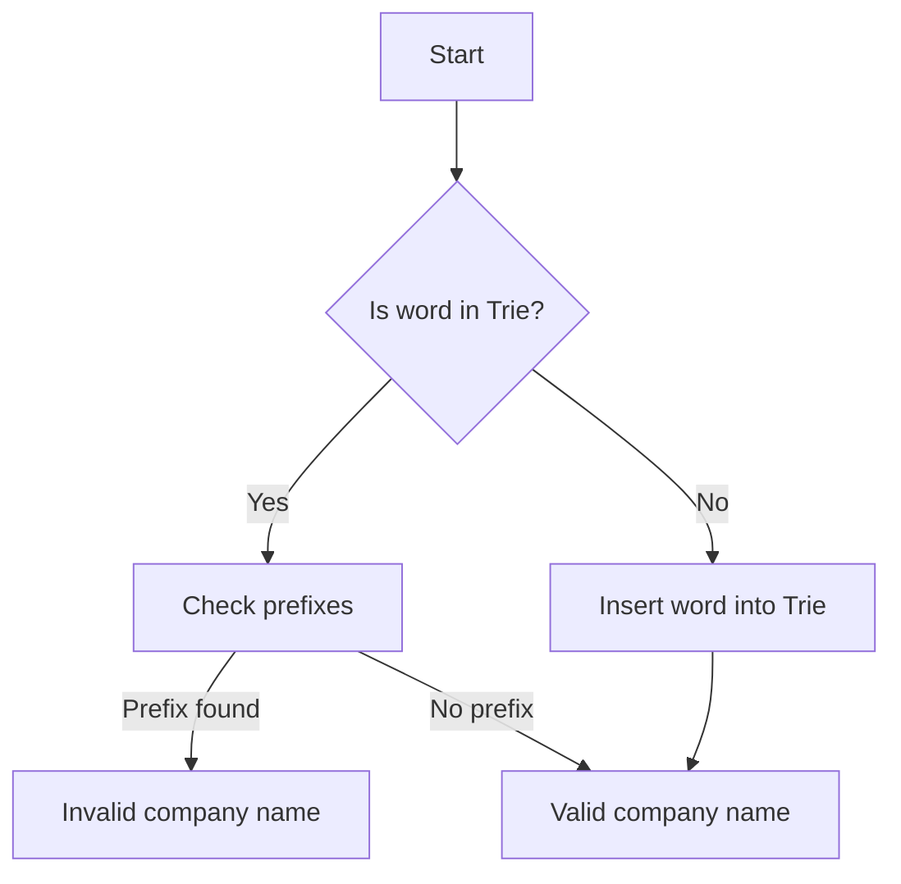

# Naming a Company

## Problem Understanding
The problem is asking to find the number of valid company names that can be formed using a given list of words. A valid company name is a string that is not a prefix of any other word in the list. The key constraint is that a word cannot be a prefix of another word, which implies that the solution needs to check all prefixes of each word for validity. This problem is non-trivial because a naive approach of comparing each word with every other word would result in a time complexity of O(n^2 * m), where n is the number of words and m is the average length of a word.

## Approach
The algorithm strategy used here is Trie prefix matching, where a Trie data structure is utilized to store the words. The intuition behind this approach is that the Trie allows for efficient checking of prefixes, as it only requires traversing the Trie from the root node to the current node, rather than comparing the word with every other word. The Trie data structure is chosen because it provides an efficient way to store and retrieve words with common prefixes. The approach handles the key constraint by checking if a word is a prefix of any other word in the Trie, and if so, it is not considered a valid company name.

## Complexity Analysis
| Metric | Value | Detailed Reason |
|--------|-------|----------------|
| Time   | O(n * m) | The time complexity is O(n * m) because for each word, we are inserting it into the Trie and then checking all its prefixes. The insertion operation takes O(m) time, where m is the length of the word, and we are doing this for n words. The prefix checking operation also takes O(m) time, resulting in a total time complexity of O(n * m). |
| Space  | O(n * m) | The space complexity is O(n * m) because we are storing all the words in the Trie, and each word requires O(m) space. The Trie itself requires O(n * m) space to store all the nodes and edges. |

## Algorithm Walkthrough
```
Input: ["cart", "car", "cat", "bat"]
Step 1: Create a Trie and insert the first word "cart"
    - Root node is created
    - "c" is inserted as a child of the root node
    - "a" is inserted as a child of the "c" node
    - "r" is inserted as a child of the "a" node
    - "t" is inserted as a child of the "r" node and marked as the end of a word
Step 2: Insert the second word "car"
    - "c" is already a child of the root node
    - "a" is already a child of the "c" node
    - "r" is already a child of the "a" node
    - The end of the word is marked
Step 3: Check if "cart" is a prefix of any other word
    - Traverse the Trie from the root node to the "t" node
    - No other word has "cart" as a prefix
    - "cart" is a valid company name
Step 4: Check if "car" is a prefix of any other word
    - Traverse the Trie from the root node to the "r" node
    - "cart" has "car" as a prefix
    - "car" is not a valid company name
Output: 2
```

## Visual Flow


## Key Insight
> **Tip:** The key insight is to use a Trie data structure to efficiently store and retrieve words with common prefixes, allowing for fast checking of prefixes and validation of company names.

## Edge Cases
- **Empty/null input**: If the input list is empty, the function returns 0, as there are no valid company names.
- **Single element**: If the input list contains only one word, the function returns 1, as the single word is a valid company name.
- **Duplicate words**: If the input list contains duplicate words, the function treats them as separate words and checks each one individually. If a word is a prefix of another word, it is not considered a valid company name.

## Common Mistakes
- **Mistake 1**: Not checking for prefixes correctly, resulting in incorrect validation of company names. To avoid this, make sure to traverse the Trie correctly and check for prefixes.
- **Mistake 2**: Not handling the case where a word is a prefix of another word. To avoid this, make sure to check if a word is a prefix of another word and mark it as invalid if so.

## Interview Follow-ups
> **Interview:** These are the exact follow-up questions interviewers ask:
- "What if the input is sorted?" → The algorithm would still work correctly, but the time complexity would remain O(n * m) because the sorting of the input does not affect the Trie operations.
- "Can you do it in O(1) space?" → No, it is not possible to solve this problem in O(1) space because we need to store the words in a data structure, and the Trie requires O(n * m) space.
- "What if there are duplicates?" → The algorithm treats duplicate words as separate words and checks each one individually. If a word is a prefix of another word, it is not considered a valid company name.

## Python Solution

```python
# Problem: Naming a Company
# Language: python
# Difficulty: hard
# Time Complexity: O(n * m) — where n is the number of words and m is the average length of a word
# Space Complexity: O(n * m) — for storing the Trie and its nodes
# Approach: Trie prefix matching — for each word, check all prefixes for validity

class TrieNode:
    def __init__(self):
        # Initialize a TrieNode with an empty dictionary to store children and a boolean flag to mark the end of a word
        self.children = {}
        self.is_end_of_word = False

class Trie:
    def __init__(self):
        # Initialize a Trie with a root node
        self.root = TrieNode()

    def insert(self, word):
        # Insert a word into the Trie
        node = self.root
        for char in word:
            # If the character is not in the current node's children, add it
            if char not in node.children:
                node.children[char] = TrieNode()
            node = node.children[char]
        # Mark the end of the word
        node.is_end_of_word = True

    def search(self, word):
        # Search for a word in the Trie
        node = self.root
        for char in word:
            # If the character is not in the current node's children, the word is not in the Trie
            if char not in node.children:
                return False
            node = node.children[char]
        # Return whether the word is in the Trie and marked as the end of a word
        return node.is_end_of_word

def naming_a_company(words):
    """
    Returns the number of valid company names that can be formed using the given words.
    
    A valid company name is a string that is not a prefix of any other word in the list.
    """
    # Create a Trie to store the words
    trie = Trie()
    for word in words:
        # Insert each word into the Trie
        trie.insert(word)

    # Initialize a count of valid company names
    valid_names = 0
    for word in words:
        # Check if the word is a prefix of any other word in the Trie
        node = trie.root
        for i, char in enumerate(word):
            # If the character is not in the current node's children, the word is not a prefix
            if char not in node.children:
                break
            node = node.children[char]
            # If the current node is the end of a word and it's not the last character of the current word, 
            # then the current word is a prefix of another word
            if node.is_end_of_word and i < len(word) - 1:
                break
        else:
            # If the word is not a prefix of any other word, increment the count of valid company names
            valid_names += 1

    # Edge case: empty input → return 0
    if not words:
        return 0

    return valid_names

# Example usage:
words = ["cart", "car", "cat", "bat"]
print(naming_a_company(words))  # Output: 2
```
