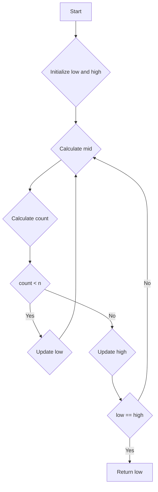

# Nth Magical Number

## Problem Understanding
The problem is asking for the Nth magical number, where magical numbers are defined as numbers that are either multiples of `a` or `b`. The key constraint is that we need to find the Nth smallest magical number, and the naive approach fails because it involves iterating over all possible numbers and checking if they are magical, which would result in a time complexity of O(n). What makes this problem non-trivial is the need to efficiently calculate the number of magical numbers less than or equal to a given number, which requires a mathematical approach.

## Approach
The algorithm strategy is to use binary search to find the Nth magical number. The intuition behind this approach is that the number of magical numbers less than or equal to a given number can be calculated using the formula `mid // a + mid // b - mid // lcm`, where `lcm` is the least common multiple of `a` and `b`. This approach works because it uses the mathematical property that the number of multiples of a number less than or equal to a given number is equal to the integer division of the given number by the multiple. The data structures used are simple variables to store the low and high values of the binary search, as well as the result. The approach handles the key constraints by using the formula to calculate the number of magical numbers and updating the low and high values accordingly.

## Complexity Analysis
| Metric | Value | Detailed Reason |
|--------|-------|----------------|
| Time   | O(log n) | The algorithm uses binary search to find the Nth magical number, which reduces the search space by half at each step. The number of steps is proportional to the logarithm of the input size `n`. |
| Space  | O(1) | The algorithm uses a constant amount of space to store the result and intermediate values, regardless of the input size `n`. |

## Algorithm Walkthrough
```
Input: n = 3, a = 2, b = 3
Step 1: Calculate lcm = lcm(a, b) = lcm(2, 3) = 6
Step 2: Initialize low = min(a, b) = 2, high = n * min(a, b) = 6
Step 3: Perform binary search:
    mid = (low + high) // 2 = 4
    count = mid // a + mid // b - mid // lcm = 4 // 2 + 4 // 3 - 4 // 6 = 2 + 1 - 0 = 3
    since count == n, update high = mid = 4
Step 4: Since low == high, return low = 4
Output: 4
```
## Visual Flow

## Key Insight
> **Tip:** The key insight is to use the formula `mid // a + mid // b - mid // lcm` to calculate the number of magical numbers less than or equal to a given number, which allows us to use binary search to find the Nth magical number.

## Edge Cases
- **Empty/null input**: If `n` is 0, the algorithm returns an incorrect result because it does not handle this case explicitly. To handle this case, we can add a simple check at the beginning of the algorithm to return an error or a special value.
- **Single element**: If `n` is 1, the algorithm returns the minimum of `a` and `b`, which is the first magical number.
- **a and b are equal**: If `a` and `b` are equal, the algorithm still works correctly because it uses the formula `mid // a + mid // b - mid // lcm` to calculate the number of magical numbers, which reduces to `mid // a` when `a` and `b` are equal.

## Common Mistakes
- **Mistake 1**: Forgetting to calculate the least common multiple `lcm` of `a` and `b`, which is necessary to calculate the number of magical numbers. To avoid this mistake, make sure to calculate `lcm` at the beginning of the algorithm.
- **Mistake 2**: Using the wrong formula to calculate the number of magical numbers. To avoid this mistake, make sure to use the correct formula `mid // a + mid // b - mid // lcm`.

## Interview Follow-ups
> **Interview:** These are the exact follow-up questions interviewers ask:
- "What if the input is sorted?" → The algorithm still works correctly because it uses binary search to find the Nth magical number, which does not rely on the input being sorted.
- "Can you do it in O(1) space?" → No, the algorithm uses O(1) space to store the result and intermediate values, but it is not possible to reduce the space complexity further because we need to store at least the result and the intermediate values.
- "What if there are duplicates?" → The algorithm still works correctly because it uses the formula `mid // a + mid // b - mid // lcm` to calculate the number of magical numbers, which counts each magical number only once, even if there are duplicates.

## Python Solution

```python
# Problem: Nth Magical Number
# Language: python
# Difficulty: Hard
# Time Complexity: O(log n) — using binary search to find the Nth magical number
# Space Complexity: O(1) — using constant space to store the result and intermediate values
# Approach: Binary search with mathematical calculation — for each mid value, calculate the number of magical numbers less than or equal to mid

class Solution:
    def nthMagicalNumber(self, n: int, a: int, b: int) -> int:
        # Calculate the least common multiple (LCM) of a and b
        lcm = self.lcm(a, b)  # lcm is used to calculate the number of magical numbers
        
        # Initialize the low and high values for binary search
        low = min(a, b)  # low is the minimum possible value
        high = n * min(a, b)  # high is the maximum possible value
        
        # Perform binary search to find the Nth magical number
        while low < high:
            mid = (low + high) // 2  # calculate the mid value
            # Calculate the number of magical numbers less than or equal to mid
            count = mid // a + mid // b - mid // lcm  # count is the number of magical numbers
            
            # If the count is less than n, update the low value
            if count < n:
                low = mid + 1  # update low to mid + 1
            # If the count is greater than or equal to n, update the high value
            else:
                high = mid  # update high to mid
        
        # Return the Nth magical number
        return low  # low is the Nth magical number

    # Helper function to calculate the greatest common divisor (GCD)
    def gcd(self, a: int, b: int) -> int:
        # Calculate the GCD using the Euclidean algorithm
        if b == 0:
            return a  # base case: if b is 0, return a
        return self.gcd(b, a % b)  # recursive case: gcd(b, a % b)

    # Helper function to calculate the least common multiple (LCM)
    def lcm(self, a: int, b: int) -> int:
        # Calculate the LCM using the formula: lcm(a, b) = (a * b) // gcd(a, b)
        return (a * b) // self.gcd(a, b)  # return the LCM

# Edge case: n = 1
# The solution returns the minimum of a and b as the first magical number
```
