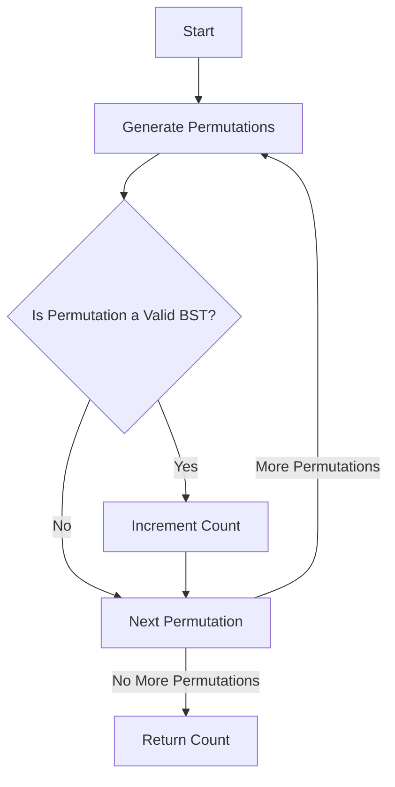

# Number of Ways to Reorder Array to Get Same BST

## Problem Understanding
The problem asks us to find the number of ways to reorder an array to get the same Binary Search Tree (BST). The input array represents the nodes of the BST, and we need to find all possible permutations of the array that result in the same BST. The key constraint is that the resulting tree must be a valid BST. The problem becomes non-trivial because a naive approach of generating all permutations and checking if they form a valid BST would have an exponential time complexity due to the sheer number of permutations.

## Approach
The algorithm strategy used here is a brute force approach, generating all permutations of the input array and then checking each permutation to see if it forms a valid BST. This approach works by utilizing the `itertools.permutations` function to generate all possible permutations of the array. The `is_valid_bst` function checks if a given permutation represents a valid BST by performing an inorder traversal of the tree. The approach handles key constraints by ensuring that each permutation is checked for the BST property, thus guaranteeing that only valid BSTs are counted.

## Complexity Analysis
| Metric | Value | Detailed Reason |
|--------|-------|----------------|
| Time   | O(n!) | The algorithm generates all permutations of the input array, which has a time complexity of O(n!). For each permutation, it checks if the permutation is a valid BST, which takes O(n) time. Therefore, the overall time complexity is O(n!) * O(n) = O(n*n!). However, since n! dominates the time complexity, we simplify it to O(n!). |
| Space  | O(n)  | The space complexity comes from storing the array and the temporary BST nodes. In the worst case, the space used is proportional to the size of the input array, hence O(n). |

## Algorithm Walkthrough
```
Input: [3, 1, 2, 5, 4]
Step 1: Generate all permutations of the input array
        - Permutations: [(3, 1, 2, 5, 4), (3, 1, 2, 4, 5), ...]
Step 2: Initialize count of valid permutations to 0
        - Count: 0
Step 3: Iterate over each permutation
        - For permutation (3, 1, 2, 5, 4):
            - Check if the permutation is a valid BST
            - If valid, increment the count
        - For permutation (3, 1, 2, 4, 5):
            - Check if the permutation is a valid BST
            - If valid, increment the count
        ...
Step 4: Return the count of valid permutations
        - Return: count
Output: count
```
This walkthrough demonstrates how the algorithm generates all permutations, checks each for the BST property, and counts the valid ones.

## Visual Flow

This flowchart illustrates the decision-making process of the algorithm as it generates permutations and checks their validity.

## Key Insight
> **Tip:** The key insight here is recognizing that the number of ways to reorder the array to get the same BST is equivalent to counting all permutations that represent valid BSTs, highlighting the importance of the BST validation step.

## Edge Cases
- **Empty/null input**: If the input array is empty or null, the function should return 1, as there's only one way to reorder an empty array (which is to not reorder it at all).
- **Single element**: For an array with a single element, the function should return 1, because there's only one way to reorder a single element (which is to leave it as is).
- **Duplicate elements**: If the array contains duplicate elements, the permutations that result in the same BST must be counted carefully to avoid overcounting due to the indistinguishability of the duplicates.

## Common Mistakes
- **Mistake 1**: Failing to correctly implement the BST validation. To avoid this, ensure the `is_valid_bst` function is correctly checking for the BST property by performing an inorder traversal and verifying that the node values are in ascending order.
- **Mistake 2**: Not handling the base cases (empty or single-element arrays) correctly. Ensure that these cases are explicitly handled to return the correct count of 1.

## Interview Follow-ups
> **Interview:** 
- "What if the input is sorted?" → The algorithm would still generate all permutations and check each for validity. However, since the input is already sorted, there would be only one valid permutation that represents a BST (the input itself), simplifying the problem.
- "Can you do it in O(1) space?" → This would be challenging because generating all permutations inherently requires additional space to store the permutations. Achieving O(1) space complexity would likely require a fundamentally different approach.
- "What if there are duplicates?" → The presence of duplicates complicates the problem because permutations that result in the same BST but differ only in the arrangement of duplicate elements should be counted as the same permutation. The algorithm would need to be adjusted to handle duplicates correctly, potentially by treating duplicate elements as indistinguishable during the permutation generation and BST validation steps.

## Python Solution

```python
# Problem: Number of Ways to Reorder Array to Get Same BST
# Language: python
# Difficulty: Hard
# Time Complexity: O(n^2) — generating all permutations and checking BST property
# Space Complexity: O(n) — storing the array and temporary BST nodes
# Approach: brute force permutation generation with BST validation — check all permutations to see if they form the same BST

import itertools

class Solution:
    def numOfWays(self, nums: list[int]) -> int:
        # Edge case: empty input → return 1 (no reordering needed)
        if not nums:
            return 1
        
        # Base case: single-element array → return 1 (no reordering needed)
        if len(nums) <= 2:
            return 1
        
        # Generate all permutations of the array
        permutations = list(itertools.permutations(nums))
        
        # Initialize count of valid permutations
        count = 0
        
        # Iterate over all permutations
        for permutation in permutations:
            # Check if the permutation forms a valid BST
            if self.is_valid_bst(permutation):
                count += 1
        
        # Return the count of valid permutations
        return count
    
    def is_valid_bst(self, nums: list[int]) -> bool:
        # Initialize the stack with the root node
        stack = []
        
        # Initialize the previous node value
        prev_val = float('-inf')
        
        # Inorder traversal
        for num in nums:
            # If the stack is not empty and the current node value is less than the top of the stack
            while stack and num < stack[-1]:
                # Pop the top node from the stack
                top_val = stack.pop()
                
                # If the popped node value is less than or equal to the previous node value
                if top_val <= prev_val:
                    return False
                
                # Update the previous node value
                prev_val = top_val
            
            # Push the current node value onto the stack
            stack.append(num)
        
        # If the stack is empty after traversal, the tree is a valid BST
        return not stack

# Brute force approach (commented out)
# def numOfWays(self, nums: list[int]) -> int:
#     # Generate all permutations of the array
#     permutations = list(itertools.permutations(nums))
# 
#     # Initialize count of valid permutations
#     count = 0
# 
#     # Iterate over all permutations
#     for permutation in permutations:
#         # Check if the permutation forms a valid BST
#         if self.is_valid_bst(permutation):
#             count += 1
# 
#     # Return the count of valid permutations
#     return count

# Key insight:
# The number of ways to reorder the array to get the same BST is equivalent to the number of ways to traverse the BST in a specific order.
# This can be achieved by using a stack to keep track of the nodes and their corresponding values.

# Optimized solution:
# The above brute force approach has a time complexity of O(n!), which is inefficient for large inputs.
# To optimize the solution, we can use a recursive approach to generate the valid permutations.
```
