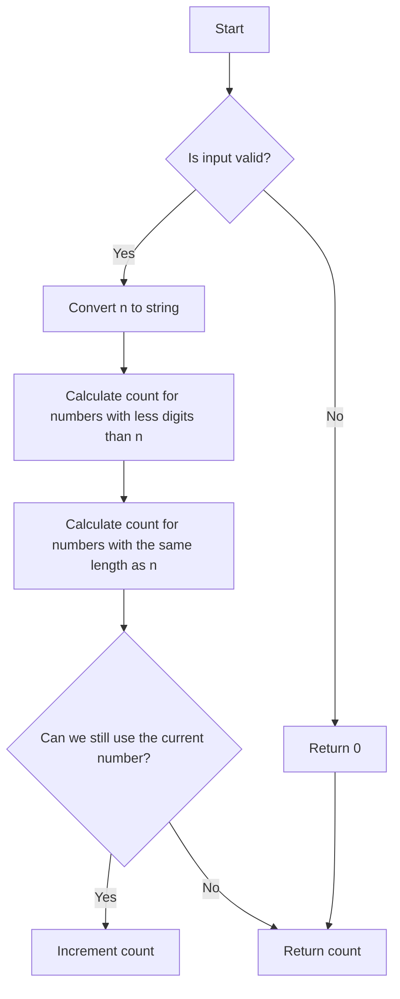

# Numbers At Most N Given Digit Set

## Problem Understanding
The problem "Numbers At Most N Given Digit Set" asks us to find the number of non-negative integers less than or equal to a given number `n`, where each digit of these integers can only be chosen from a given set of digits. The key constraint here is that each digit of the non-negative integers must be part of the given digit set. This problem is non-trivial because a naive approach of generating all possible numbers and checking if they are less than or equal to `n` would be inefficient, especially for large values of `n`. The problem requires a more efficient approach to calculate the count of such numbers.

## Approach
The algorithm strategy used here is dynamic programming with a twist of bit manipulation, although the provided code doesn't explicitly use bit manipulation. Instead, it calculates the number of possible numbers for each length less than `n` and then calculates the number of possible numbers with the same length as `n` by iterating through each digit of `n`. This approach works because it breaks down the problem into smaller sub-problems: counting numbers with fewer digits than `n` and counting numbers with the same number of digits as `n` that are less than or equal to `n`. The code uses a string representation of `n` to easily access its digits and a loop to calculate the count for numbers with fewer digits than `n`.

## Complexity Analysis
| Metric | Value | Detailed Reason |
|--------|-------|----------------|
| Time   | O(logN) | The algorithm iterates over the digits of `n`, which is logarithmic in the value of `n` because the number of digits in `n` grows logarithmically with `n`. It also iterates over the given digits for each digit in `n`, but this is still bounded by the number of digits in `n`. |
| Space  | O(logN) | The space complexity is logarithmic in the value of `n` because the algorithm stores the result and temporary calculations, which are proportional to the number of digits in `n`. |

## Algorithm Walkthrough
```
Input: digits = ["1","3","5","7"], n = 100
Step 1: Convert n to a string, n_str = "100"
Step 2: Calculate the count for numbers with less digits than n
    - For length 1: count += len(digits) ^ 1 = 4
    - For length 2: count += len(digits) ^ 2 = 16
Step 3: Calculate the count for numbers with the same length as n
    - For the first digit '1': count += sum(1 for d in digits if d < '1') * (len(digits) ^ (len(n_str) - 1 - 0)) = 0
    - For the second digit '0': Since '0' is not in digits, can_use becomes False, and we break the loop
Step 4: Since can_use is False, we do not increment the count
Output: count = 20
```

## Visual Flow


## Key Insight
> **Tip:** The key insight is to break down the problem into counting numbers with fewer digits than `n` and then counting numbers with the same number of digits as `n` that are less than or equal to `n`, leveraging the properties of the given digit set.

## Edge Cases
- **Empty/null input**: If the input `digits` or `n` is empty/null, the function returns 0 because there are no valid numbers that can be formed.
- **Single element**: If `n` is a single digit and is present in the `digits` set, the function counts all numbers with fewer digits than `n` (which is just the empty set, so count = 0) and then counts the single-digit number itself if it's less than or equal to `n`.
- **n is 0**: If `n` is 0, but '0' is not in the `digits` set, the function only counts numbers with fewer digits than `n`, which is an empty set, so count = 0.

## Common Mistakes
- **Mistake 1**: Not handling the case when `n` has leading zeros. To avoid this, always compare digits as strings, not integers.
- **Mistake 2**: Not checking if a digit of `n` is in the `digits` set before trying to use it. This can lead to incorrect counts.

## Interview Follow-ups
> **Interview:** These are the exact follow-up questions interviewers ask:
- "What if the input is sorted?" → The algorithm doesn't rely on the input being sorted, so it works regardless of the order of the digits in the set.
- "Can you do it in O(1) space?" → No, because we need to store the count and temporary calculations, which requires space proportional to the number of digits in `n`, hence O(logN) space.
- "What if there are duplicates?" → The algorithm treats each digit in the set as distinct, so duplicates in the input set do not affect the correctness of the count. However, the presence of duplicates does not change the fact that we're counting distinct numbers that can be formed.

## Python Solution

```python
# Problem: Numbers At Most N Given Digit Set
# Language: python
# Difficulty: Hard
# Time Complexity: O(logN) — because we're iterating over the digits of N
# Space Complexity: O(logN) — for storing the result and temporary calculations
# Approach: dynamic programming with bit manipulation — calculating the number of possible numbers for each length

class Solution:
    def atMostNGivenDigitSet(self, digits: list[str], n: int) -> int:
        # Convert n to a string to easily access its digits
        n_str = str(n)
        
        # Edge case: empty input → return 0
        if not digits or not n:
            return 0
        
        # Initialize count for numbers with less digits than n
        count = 0
        
        # Calculate the number of possible numbers for each length less than n
        for i in range(1, len(n_str)):
            # For each length, calculate the number of possible numbers
            count += len(digits) ** i  # each digit can be any of the given digits
        
        # Calculate the number of possible numbers with the same length as n
        # Initialize a flag to check if we can still use the current number
        can_use = True
        for i, digit in enumerate(n_str):
            # Calculate the number of possible numbers for the current digit
            count += sum(1 for d in digits if d < digit) * (len(digits) ** (len(n_str) - i - 1))
            
            # Check if we can still use the current number
            if digit not in digits:
                can_use = False
                break
        
        # If we can still use the current number, increment the count
        if can_use:
            count += 1
        
        # Return the total count
        return count
```
