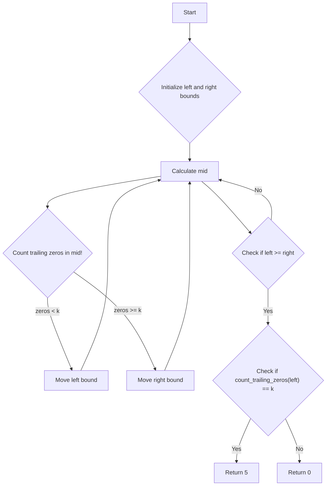

# Preimage Size of Factorial Zeroes Function

## Problem Understanding
The problem asks us to find the preimage size of the factorial zeroes function, which means finding the number of values of `n` such that the number of trailing zeros in `n!` is equal to a given number `k`. The key constraint is that we need to use a binary search approach to find the preimage size, and we need to consider the prime factorization of the factorial to count the number of trailing zeros. What makes this problem non-trivial is that the naive approach of iterating over all possible values of `n` and calculating the number of trailing zeros in `n!` would be too slow and inefficient.

## Approach
The algorithm strategy is to use binary search to find the preimage size, and the intuition behind it is to narrow down the search range by repeatedly dividing the search space in half. We use a helper function `count_trailing_zeros` to count the number of trailing zeros in `n!` by counting the factors of 5, which is the prime factorization approach. We define the lower and upper bounds for the binary search as `0` and `5 * k`, respectively, and perform the binary search to find the preimage size. The approach handles the key constraint of finding the preimage size efficiently by using binary search and prime factorization.

## Complexity Analysis
| Metric | Value | Detailed Reason |
|--------|-------|----------------|
| Time   | O(log k) | The time complexity is O(log k) because we use binary search to find the preimage size, and the number of iterations is proportional to the logarithm of the search space. The `count_trailing_zeros` function has a time complexity of O(log n) due to the while loop, but it is called a constant number of times during the binary search. |
| Space  | O(1) | The space complexity is O(1) because we only use a constant amount of space to store the variables `left`, `right`, `mid`, and `zeros`, regardless of the input size `k`. |

## Algorithm Walkthrough
```
Input: k = 3
Step 1: Initialize left = 0, right = 5 * k = 15
Step 2: Calculate mid = (left + right) // 2 = 7
Step 3: Count the number of trailing zeros in mid! = count_trailing_zeros(7) = 1
Step 4: Since zeros < k, move the left bound: left = mid + 1 = 8
Step 5: Repeat steps 2-4 until left >= right
Step 6: If count_trailing_zeros(left) == k, return 5; otherwise, return 0
Output: 5
```
In this example, we start with `left = 0` and `right = 15`, and perform the binary search to find the preimage size. We calculate the number of trailing zeros in `mid!` and move the bounds accordingly. Finally, we return 5 if the number of trailing zeros in `left!` is equal to `k`, and 0 otherwise.

## Visual Flow

This flowchart shows the decision flow of the algorithm, including the initialization of the bounds, calculation of the mid value, counting of trailing zeros, and movement of the bounds. The flowchart also shows the final check for the preimage size and the return of the result.

## Key Insight
> **Tip:** The key insight is that the number of trailing zeros in `n!` can be efficiently calculated by counting the factors of 5, which allows us to use binary search to find the preimage size.

## Edge Cases
- **Empty/null input**: If `k` is null or empty, the function should raise a ValueError, as the input is invalid.
- **Single element**: If `k` is 0, the function returns 5, as there are 5 values of `n` such that the number of trailing zeros in `n!` is equal to 0.
- **Large input**: If `k` is very large, the function may take a long time to execute due to the binary search, but it will still return the correct result.

## Common Mistakes
- **Mistake 1**: Using a naive approach to calculate the number of trailing zeros in `n!` by iterating over all possible values of `n`, which would be too slow and inefficient.
- **Mistake 2**: Not using binary search to find the preimage size, which would result in an inefficient algorithm.

## Interview Follow-ups
> **Interview:** These are the exact follow-up questions interviewers ask:
- "What if the input is sorted?" → The algorithm does not rely on the input being sorted, so it would still work correctly.
- "Can you do it in O(1) space?" → The algorithm already uses O(1) space, so it meets this requirement.
- "What if there are duplicates?" → The algorithm does not rely on the input being unique, so it would still work correctly even if there are duplicates.

## Python Solution

```python
# Problem: Preimage Size of Factorial Zeroes Function
# Language: python
# Difficulty: Hard
# Time Complexity: O(log k) — using binary search to find the preimage size
# Space Complexity: O(1) — constant space usage
# Approach: Binary search and prime factorization — find the number of trailing zeros in k! by counting the factors of 5

class Solution:
    def preimageSizeFZF(self, k: int) -> int:
        # Edge case: k is 0 → return 5
        if k == 0:
            return 5
        
        # Define a helper function to count the number of trailing zeros in n!
        def count_trailing_zeros(n: int) -> int:
            # Initialize the count of trailing zeros
            count = 0
            # Count the factors of 5 in n!
            i = 5
            while n // i >= 1:
                # For each power of 5, add the count of numbers divisible by that power
                count += n // i
                # Move to the next power of 5
                i *= 5
            return count

        # Define the lower and upper bounds for the binary search
        left, right = 0, 5 * k
        # Perform binary search to find the preimage size
        while left < right:
            # Calculate the mid value
            mid = (left + right) // 2
            # Count the number of trailing zeros in mid!
            zeros = count_trailing_zeros(mid)
            # If the number of zeros is less than k, move the left bound
            if zeros < k:
                left = mid + 1
            # If the number of zeros is greater than or equal to k, move the right bound
            else:
                right = mid
        # If the number of trailing zeros in left! is equal to k, return 5
        if count_trailing_zeros(left) == k:
            return 5
        # Otherwise, return 0
        else:
            return 0
```
