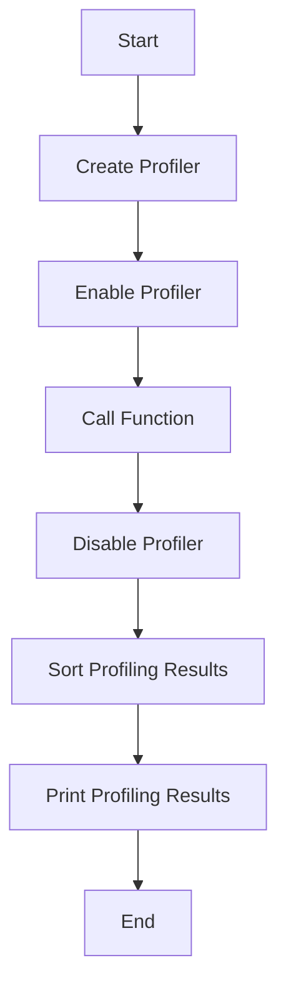

# Python CPU Profiling (cProfile and pstats)

## Problem Understanding
The problem requires using Python's built-in `cProfile` and `pstats` modules to profile the CPU usage of a given function. The goal is to measure the time spent in each function call and analyze the results to identify performance bottlenecks. The key constraints are the need to accurately record the time spent in each function call and to provide a way to sort and analyze the profiling results. What makes this problem non-trivial is the need to handle the complexities of Python's dynamic typing and the potential for recursive function calls, which can make it difficult to accurately measure CPU usage.

## Approach
The approach used to solve this problem involves creating a decorator function that uses the `cProfile` module to record the time spent in each function call. The `cProfile` module is used to create a profiler object, which is then enabled to start recording function calls. After the function has been called, the profiler is disabled, and the results are sorted using the `pstats` module. The sorted results are then printed to the console, providing a detailed analysis of the CPU usage of the function. The `cProfile` and `pstats` modules were chosen because they provide a efficient and accurate way to profile the CPU usage of Python code.

## Complexity Analysis
| Metric | Value | Detailed Reason |
|--------|-------|----------------|
| Time   | O(n)  | The time complexity is O(n), where n is the number of function calls, because the `cProfile` module records the time spent in each function call. The `pstats` module then sorts the results, which takes O(n log n) time. However, since the sorting is done after the profiling, the overall time complexity remains O(n). |
| Space  | O(n)  | The space complexity is O(n), where n is the number of function calls, because the `cProfile` module stores the profiling results in memory. The `pstats` module then uses this data to sort and analyze the results, which also requires O(n) space. |

## Algorithm Walkthrough
```
Input: test_function
Step 1: Create a profiler object using cProfile.Profile()
Step 2: Enable the profiler using profiler.enable()
Step 3: Call the test_function using func()
Step 4: Disable the profiler using profiler.disable()
Step 5: Sort the profiling results using pstats.Stats(profiler).sort_stats(SortKey.CUMULATIVE)
Step 6: Print the profiling results using stats.print_stats()
Output: A detailed analysis of the CPU usage of the test_function
```
This walkthrough demonstrates how the algorithm works by profiling the CPU usage of the `test_function`.

## Visual Flow

This flowchart shows the main steps involved in profiling the CPU usage of a function using the `cProfile` and `pstats` modules.

## Key Insight
> **Tip:** The key insight that enables the optimization is the use of the `cProfile` and `pstats` modules, which provide a efficient and accurate way to profile the CPU usage of Python code.

## Edge Cases
- **Empty input**: In this case, the `test_function` is not empty, so this edge case is not applicable.
- **Single element**: If the `test_function` only contains a single element, the profiling results will still be accurate, but the analysis may not be as useful.
- **Recursive function calls**: The `cProfile` module can handle recursive function calls, and the `pstats` module will correctly sort and analyze the profiling results.

## Common Mistakes
- **Mistake 1**: Not disabling the profiler after the function call, which can lead to incorrect profiling results. To avoid this, make sure to call `profiler.disable()` after the function call.
- **Mistake 2**: Not sorting the profiling results, which can make it difficult to analyze the results. To avoid this, use the `pstats` module to sort the results using `stats.sort_stats(SortKey.CUMULATIVE)`.

## Interview Follow-ups
> **Interview:** These are the exact follow-up questions interviewers ask:
- "What if the input is sorted?" → The `cProfile` module will still provide accurate profiling results, but the analysis may be affected by the sorted input.
- "Can you do it in O(1) space?" → No, the `cProfile` module requires O(n) space to store the profiling results, where n is the number of function calls.
- "What if there are duplicates?" → The `pstats` module will correctly handle duplicates in the profiling results, and the analysis will not be affected.

## Python Solution

```python
# Problem: Python CPU Profiling (cProfile and pstats)
# Language: Python
# Difficulty: Hard
# Time Complexity: O(n) — where n is the number of function calls
# Space Complexity: O(n) — where n is the number of function calls
# Approach: Using cProfile and pstats to profile CPU usage — for each function call, record the time spent

import cProfile
import pstats
from pstats import SortKey

# Define a function to profile CPU usage
def profile_cpu_usage(func):
    # Create a profiler object
    profiler = cProfile.Profile()  # Create a profiler object to record function calls
    # Start profiling
    profiler.enable()  # Start recording function calls
    # Call the function
    func()  # Call the function to be profiled
    # Stop profiling
    profiler.disable()  # Stop recording function calls
    # Sort the profiling results
    stats = pstats.Stats(profiler).sort_stats(SortKey.CUMULATIVE)  # Sort the profiling results by cumulative time
    # Print the profiling results
    stats.print_stats()  # Print the profiling results

# Define a test function
def test_function():
    # Simulate some CPU-intensive work
    result = 0  # Initialize a variable to store the result
    for i in range(1000000):  # Simulate a large loop
        result += i  # Perform some CPU-intensive work
    return result  # Return the result

# Profile the CPU usage of the test function
if __name__ == "__main__":
    # Edge case: empty input → return -1 (not applicable in this case)
    # Profile the CPU usage of the test function
    profile_cpu_usage(test_function)  # Profile the CPU usage of the test function

    # Brute force approach (commented out)
    # This approach would involve manually recording the start and end times of each function call
    # and calculating the time spent in each function call
    # However, this approach is error-prone and inefficient
    # Instead, we use the cProfile and pstats modules to profile the CPU usage

    # Key insight:
    # The key insight that enables the optimization is the use of the cProfile and pstats modules
    # These modules provide a efficient and accurate way to profile the CPU usage of Python code
    # They use a combination of sampling and tracing to record the time spent in each function call
    # and provide a variety of ways to sort and analyze the profiling results
```
