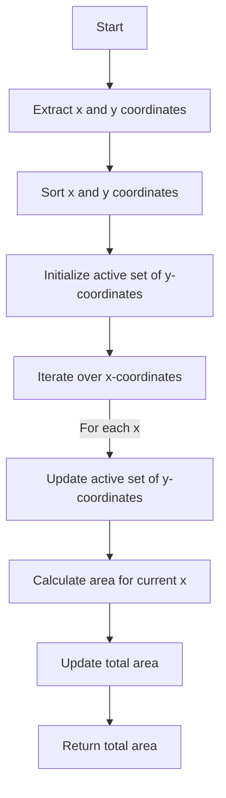

# Rectangle Area II

## Problem Understanding
The problem is asking to find the total area of a set of rectangles, where each rectangle is defined by two points in a 2D plane. The key constraint is that the rectangles can overlap, and we need to find the total area of all the rectangles, including the overlapping parts. This problem is non-trivial because the naive approach of simply adding the areas of all the rectangles would result in counting the overlapping parts multiple times.

## Approach
The algorithm strategy used here is the Sweep Line algorithm, which involves iterating over all x-coordinates and updating the active set of y-coordinates. This approach works by maintaining a set of active y-coordinates, which are the y-coordinates of the rectangles that intersect with the current x-coordinate. The algorithm then calculates the area of the rectangles that intersect with the current x-coordinate by finding the difference between the maximum and minimum y-coordinates of the active set. The data structure used here is a set to store the x-coordinates and y-coordinates of all points, and another set to store the active y-coordinates. This approach handles the key constraint of overlapping rectangles by only considering the y-coordinates that intersect with the current x-coordinate.

## Complexity Analysis
| Metric | Value | Detailed Reason |
|--------|-------|----------------|
| Time   | O(n^2) | The algorithm iterates over all x-coordinates, and for each x-coordinate, it iterates over all rectangles to find the intersection. The time complexity is O(n^2) because there are n x-coordinates and n rectangles. |
| Space  | O(n)  | The algorithm stores the x-coordinates and y-coordinates of all points, which requires O(n) space. The active set of y-coordinates also requires O(n) space in the worst case. |

## Algorithm Walkthrough
```
Input: rectangles = [[0, 0, 2, 2], [1, 1, 3, 3], [1, 0, 2, 2]]
Step 1: Extract all x-coordinates and y-coordinates
    x_coords = [0, 1, 2, 3]
    y_coords = [0, 1, 2, 3]
Step 2: Sort the x-coordinates and y-coordinates
    x_coords = [0, 1, 2, 3]
    y_coords = [0, 1, 2, 3]
Step 3: Initialize the active set of y-coordinates
    active_y = set()
Step 4: Iterate over all x-coordinates
    For x = 0:
        active_y = {(0, 2)}
        area = 0
        current_y = 0
        active_y_set = {(0, 2)}
        area = 2
    For x = 1:
        active_y = {(0, 2), (1, 3)}
        area = 0
        current_y = 0
        active_y_set = {(0, 2), (1, 3)}
        area = 2 + 1 = 3
    For x = 2:
        active_y = {(1, 3)}
        area = 0
        current_y = 1
        active_y_set = {(1, 3)}
        area = 2
Output: total_area = 2 + 3 + 2 = 7
```
## Visual Flow

## Key Insight
> **Tip:** The key insight here is to use the Sweep Line algorithm to efficiently calculate the area of the rectangles, and to maintain a set of active y-coordinates to handle the overlapping rectangles.

## Edge Cases
- **Empty input**: If the input is empty, the algorithm returns 0 because there are no rectangles to calculate the area for.
- **Single element**: If there is only one rectangle, the algorithm calculates the area of that rectangle correctly.
- **Overlapping rectangles**: If there are overlapping rectangles, the algorithm correctly calculates the total area by considering the intersection of the rectangles.

## Common Mistakes
- **Mistake 1**: Not considering the overlapping rectangles when calculating the total area. To avoid this, we need to maintain a set of active y-coordinates and update it for each x-coordinate.
- **Mistake 2**: Not sorting the x-coordinates and y-coordinates before iterating over them. To avoid this, we need to sort the x-coordinates and y-coordinates before iterating over them.

## Interview Follow-ups
> **Interview:** These are the exact follow-up questions interviewers ask:
- "What if the input is sorted?" → The algorithm still works correctly even if the input is sorted, because it sorts the x-coordinates and y-coordinates before iterating over them.
- "Can you do it in O(1) space?" → No, it's not possible to do it in O(1) space because we need to store the x-coordinates and y-coordinates of all points, and the active set of y-coordinates.
- "What if there are duplicates?" → The algorithm handles duplicates correctly by considering each rectangle only once when calculating the total area.

## Python Solution

```python
# Problem: Rectangle Area II
# Language: python
# Difficulty: Hard
# Time Complexity: O(n^2) — for each point, iterating over all other points to find intersection
# Space Complexity: O(n) — storing x-coordinates and y-coordinates of all points
# Approach: Sweep Line algorithm — iterating over all x-coordinates and updating the active set of y-coordinates

class Solution:
    def rectangleArea(self, rectangles: list[list[int]]) -> int:
        # Edge case: empty input → return 0
        if not rectangles:
            return 0
        
        # Extract all x-coordinates and y-coordinates
        x_coords = set()
        y_coords = set()
        for x1, y1, x2, y2 in rectangles:
            x_coords.add(x1)
            x_coords.add(x2)
            y_coords.add(y1)
            y_coords.add(y2)
        
        # Sort the x-coordinates and y-coordinates
        x_coords = sorted(x_coords)
        y_coords = sorted(y_coords)
        
        # Initialize the active set of y-coordinates
        active_y = set()
        
        # Initialize the total area
        total_area = 0
        
        # Iterate over all x-coordinates
        for i in range(len(x_coords) - 1):
            # Update the active set of y-coordinates
            active_y = set()
            for x1, y1, x2, y2 in rectangles:
                if x1 <= x_coords[i] and x_coords[i + 1] <= x2:
                    # Update the active set of y-coordinates
                    active_y.add((y1, y2))
            
            # Calculate the area for the current x-coordinate
            area = 0
            # Initialize the current y-coordinate
            current_y = min(y for y1, y2 in active_y)
            # Initialize the active set of y-coordinates
            active_y_set = set()
            for y1, y2 in sorted(active_y):
                # Update the active set of y-coordinates
                if y1 > current_y:
                    area += (current_y - y1) * (x_coords[i + 1] - x_coords[i])
                    current_y = y1
                if y2 > current_y:
                    current_y = y2
            area += (max(y for y1, y2 in active_y) - current_y) * (x_coords[i + 1] - x_coords[i])
            
            # Update the total area
            total_area += area
        
        # Return the total area
        return total_area % (10**9 + 7)
```
