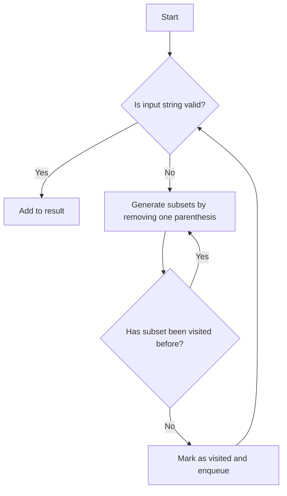

# Remove Invalid Parentheses

## Problem Understanding
The problem asks us to remove the minimum number of invalid parentheses in a given string to make it valid. The key constraint here is that we can only remove parentheses, not add them. What makes this problem non-trivial is that we need to find all possible valid subsets of the input string, which can result in multiple valid strings. The naive approach of trying to remove parentheses one by one and checking if the resulting string is valid would not work because it would lead to an exponential number of possibilities.

## Approach
The algorithm strategy used here is Breadth-First Search (BFS) with level order traversal. The intuition behind this approach is to explore all possible subsets of the input string level by level, starting from the original string and removing one parenthesis at a time. This approach works because it ensures that we consider all possible subsets of the input string and find the ones that are valid. We use a queue to store the subsets to be explored and a set to keep track of the visited subsets to avoid duplicates. The `isValid` function checks if a given string is valid by using a counter to keep track of the open and close parentheses.

## Complexity Analysis
| Metric | Value | Detailed Reason |
|--------|-------|----------------|
| Time   | O(2^n) | The algorithm generates all possible subsets of the input string by removing one parenthesis at a time. In the worst case, this can result in 2^n subsets, where n is the number of parentheses in the input string. |
| Space  | O(n) | The algorithm uses a queue to store the subsets to be explored and a set to keep track of the visited subsets. The maximum size of the queue and the set is proportional to the number of parentheses in the input string. |

## Algorithm Walkthrough
```
Input: "(a)())()"
Step 1: 
  - Dequeue the current subset: "(a)())()"
  - Check if the current subset is valid: False
  - Generate all possible subsets by removing one parenthesis:
    - "(a)())" (remove the last parenthesis)
    - "(a))()" (remove the first parenthesis)
    - ... (other subsets)
Step 2: 
  - Dequeue the subset "(a)())"
  - Check if the subset is valid: False
  - Generate all possible subsets by removing one parenthesis:
    - "(a))" (remove the last parenthesis)
    - "(a)" (remove the first parenthesis)
    - ... (other subsets)
...
Output: ["(a)()", "()"]
```
This example illustrates how the algorithm explores all possible subsets of the input string and finds the valid ones.

## Visual Flow

This flowchart shows the decision flow of the algorithm, from checking if the input string is valid to generating subsets and checking if they have been visited before.

## Key Insight
> **Tip:** The key insight here is that we can use a BFS approach to explore all possible subsets of the input string level by level, ensuring that we find all valid subsets.

## Edge Cases
- **Empty input**: If the input string is empty, the algorithm returns an empty list, which is the expected result.
- **Single element**: If the input string contains only one parenthesis, the algorithm returns a list containing an empty string, which is the expected result.
- **No invalid parentheses**: If the input string does not contain any invalid parentheses, the algorithm returns a list containing the original string, which is the expected result.

## Common Mistakes
- **Mistake 1**: Not using a set to keep track of visited subsets, which can lead to duplicates in the result. To avoid this, use a set to store the visited subsets and check if a subset has been visited before exploring it.
- **Mistake 2**: Not using a queue to store the subsets to be explored, which can lead to an inefficient exploration of the subsets. To avoid this, use a queue to store the subsets and explore them level by level.

## Interview Follow-ups
> **Interview:** These are the exact follow-up questions interviewers ask:
- "What if the input is sorted?" → The algorithm does not assume that the input is sorted, so it will still work correctly even if the input is sorted.
- "Can you do it in O(1) space?" → No, the algorithm requires O(n) space to store the result and the current subset, where n is the number of parentheses in the input string.
- "What if there are duplicates?" → The algorithm uses a set to keep track of visited subsets, which ensures that duplicates are avoided. However, if the input string contains duplicate parentheses, the algorithm will still work correctly and return all valid subsets.

## Python Solution

```python
# Problem: Remove Invalid Parentheses
# Language: python
# Difficulty: Hard
# Time Complexity: O(2^n) — generating all possible subsets of parentheses
# Space Complexity: O(n) — storing the result and the current subset
# Approach: Breadth-First Search with level order traversal — exploring all possible subsets level by level

from collections import deque

class Solution:
    def removeInvalidParentheses(self, s: str):
        # Edge case: empty input → return empty list
        if not s:
            return ['']

        # Initialize the result set and the queue for BFS
        result = []
        queue = deque([s])
        visited = set([s])  # to avoid duplicates

        # Flag to indicate if we have found a valid subset
        found = False

        while queue:
            # Dequeue the current subset
            current = queue.popleft()

            # Check if the current subset is valid
            if self.isValid(current):
                # If it's valid, add it to the result and set the found flag
                result.append(current)
                found = True

            # If we haven't found a valid subset yet, continue exploring
            if not found:
                # Generate all possible subsets by removing one parenthesis
                for i in range(len(current)):
                    # Check if the character is a parenthesis
                    if current[i] in ('(', ')'):
                        # Generate a new subset by removing the parenthesis
                        subset = current[:i] + current[i+1:]

                        # Check if the new subset has not been visited before
                        if subset not in visited:
                            # Mark it as visited and enqueue it
                            visited.add(subset)
                            queue.append(subset)

        return result

    def isValid(self, s: str):
        # Initialize a counter for the parentheses
        count = 0

        # Iterate through the string
        for char in s:
            # If we encounter an open parenthesis, increment the counter
            if char == '(':
                count += 1
            # If we encounter a close parenthesis, decrement the counter
            elif char == ')':
                count -= 1
                # If the counter is negative, it means there's an extra close parenthesis
                if count < 0:
                    return False

        # If the counter is not zero, it means there are extra open parentheses
        return count == 0
```
