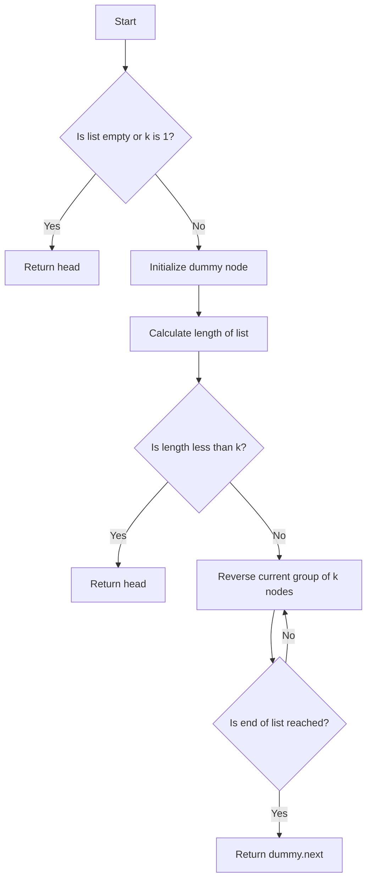

# Reverse Nodes in k-Group

## Problem Understanding
The problem is asking to reverse the nodes of a linked list in groups of k nodes. The key constraint is that the reversal should be done in-place, meaning that only a constant amount of extra space can be used. This problem is non-trivial because a naive approach of reversing the entire list and then rearranging the nodes would not work, as it would require extra space to store the reversed list. Additionally, the problem requires handling edge cases such as when the list is empty, k is 1, or the list length is not a multiple of k.

## Approach
The algorithm strategy is to use an iterative approach to reverse the linked list in groups of k nodes. The intuition behind this approach is to use a dummy node to simplify some corner cases and then iterate through the list in groups of k nodes, reversing each group in-place. The approach works by using a two-pointer technique to reverse the links between nodes, and it handles the key constraints by only using a constant amount of extra space. The data structure used is a linked list, and it is chosen because it allows for efficient insertion and deletion of nodes.

## Complexity Analysis
| Metric | Value | Detailed Reason |
|--------|-------|----------------|
| Time   | O(n)  | The algorithm iterates through the list once, where n is the number of nodes. The reversal of each group of k nodes takes O(k) time, but since this is done n/k times, the total time complexity is O(n). |
| Space  | O(1)  | The algorithm only uses a constant amount of extra space to store the dummy node and the current and previous nodes, regardless of the size of the input list. |

## Algorithm Walkthrough
```
Input: head = [1, 2, 3, 4, 5], k = 2
Step 1: Initialize the dummy node and calculate the length of the list
        dummy = ListNode(0), dummy.next = head, length = 5
Step 2: Iterate through the list in groups of k nodes
        for _ in range(length // k):
            curr = prev.next = [1], next_node = None
            Reverse the current group of k nodes:
                next_node = [2], curr.next = [3], next_node.next = [1]
                prev.next = [2]
            Update the prev node to the last node in the current group
            prev = [2]
Step 3: Repeat step 2 for the next group of k nodes
        curr = prev.next = [3], next_node = None
        Reverse the current group of k nodes:
            next_node = [4], curr.next = [5], next_node.next = [3]
            prev.next = [4]
        Update the prev node to the last node in the current group
        prev = [4]
Output: [2, 1, 4, 3, 5]
```
## Visual Flow

## Key Insight
> **Tip:** The key insight to solving this problem is to use a dummy node to simplify the corner cases and then iterate through the list in groups of k nodes, reversing each group in-place using a two-pointer technique.

## Edge Cases
- **Empty/null input**: If the input list is empty or null, the function returns null as there are no nodes to reverse.
- **Single element**: If the input list has only one element, the function returns the same list as there is nothing to reverse.
- **k is 1**: If k is 1, the function returns the same list as reversing groups of 1 node does not change the list.

## Common Mistakes
- **Mistake 1**: Not handling the edge case where the list is empty or k is 1, which can lead to incorrect results or runtime errors.
- **Mistake 2**: Not using a dummy node to simplify the corner cases, which can make the code more complex and prone to errors.

## Interview Follow-ups
> **Interview:** These are the exact follow-up questions interviewers ask:
- "What if the input is sorted?" → The algorithm still works correctly and reverses the nodes in groups of k, regardless of the input being sorted.
- "Can you do it in O(1) space?" → Yes, the algorithm already uses O(1) space, as it only uses a constant amount of extra space to store the dummy node and the current and previous nodes.
- "What if there are duplicates?" → The algorithm still works correctly and reverses the nodes in groups of k, regardless of the presence of duplicates in the input list.

## Python Solution

```python
# Problem: Reverse Nodes in k-Group
# Language: python
# Difficulty: Hard
# Time Complexity: O(n) — iterating through the list once, where n is the number of nodes
# Space Complexity: O(1) — only using a constant amount of space
# Approach: Iterative list reversal — reversing the list in groups of k nodes

class ListNode:
    def __init__(self, x):
        self.val = x
        self.next = None

class Solution:
    def reverseKGroup(self, head: ListNode, k: int) -> ListNode:
        # Edge case: empty list or k is 1 → return the head as is
        if not head or k == 1:
            return head
        
        # Calculate the length of the list to handle edge cases
        length = 0
        temp = head
        while temp:
            length += 1
            temp = temp.next
        
        # Initialize the dummy node to simplify some corner cases
        dummy = ListNode(0)
        dummy.next = head
        prev = dummy
        
        # Iterate through the list in groups of k nodes
        for _ in range(length // k):
            # Initialize the current node and the next node
            curr = prev.next
            next_node = None
            
            # Reverse the current group of k nodes
            for _ in range(k - 1):
                # Store the next node in the current group
                next_node = curr.next
                # Reverse the link
                curr.next = next_node.next
                # Move the next node to the front of the group
                next_node.next = prev.next
                # Update the prev node's next pointer
                prev.next = next_node
            
            # Update the prev node to the last node in the current group
            prev = curr
        
        return dummy.next
```
