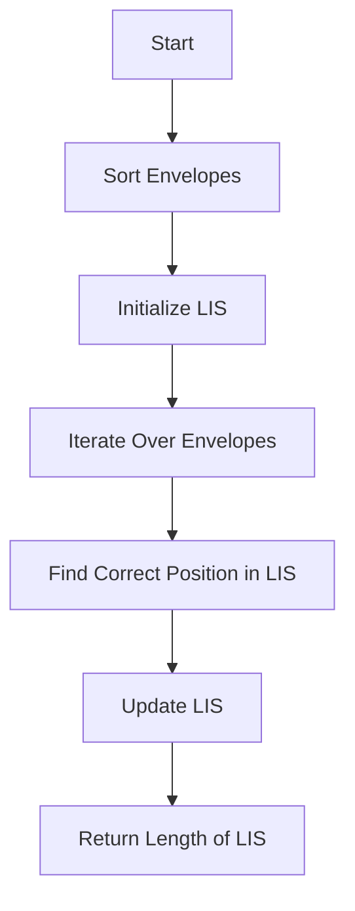

# Russian Doll Envelopes LIS

## Problem Understanding
The Russian Doll Envelopes problem is asking to find the maximum number of envelopes that can be nested inside each other, given their widths and heights. The key constraint is that an envelope can only be nested inside another if its width and height are both smaller. This problem is non-trivial because a naive approach, such as simply sorting the envelopes by their widths or heights, would not work due to the need to consider both dimensions simultaneously. The problem requires finding the longest increasing subsequence (LIS) of envelope heights, which makes it challenging.

## Approach
The algorithm strategy is to use a modified binary search approach to find the longest increasing subsequence (LIS) of envelope heights. This approach works by first sorting the envelopes by their widths and then by their heights in descending order. Then, it iterates over the sorted envelopes and for each envelope, it finds its correct position in the LIS using binary search. If the current envelope's height is greater than the last element in the LIS, it appends it to the LIS. Otherwise, it updates the LIS with the current envelope's height at the correct position. The data structure used is a list to store the LIS, and it is chosen because it allows for efficient insertion and updating of elements. The approach handles the key constraint by considering both the width and height of each envelope.

## Complexity Analysis
| Metric | Value | Detailed Reason |
|--------|-------|----------------|
| Time   | O(n log n) | The sorting step takes O(n log n) time, and the iteration over the envelopes takes O(n) time. The binary search step takes O(log n) time, and it is performed for each envelope. Therefore, the overall time complexity is O(n log n). |
| Space  | O(n) | The space complexity is O(n) because in the worst case, the LIS can contain all the envelopes. |

## Algorithm Walkthrough
```
Input: [[5,4],[6,4],[6,7],[2,3]]
Step 1: Sort the envelopes by width and then by height in descending order
        [[2,3],[5,4],[6,7],[6,4]]
Step 2: Initialize the LIS with the first envelope's height
        lis = [3]
Step 3: Iterate over the rest of the envelopes
        For envelope [5,4], since 4 > 3, append it to the LIS
        lis = [3, 4]
Step 4: For envelope [6,7], since 7 > 4, append it to the LIS
        lis = [3, 4, 7]
Step 5: For envelope [6,4], since 4 < 7, find its correct position in the LIS using binary search
        lis = [3, 4, 7] (no change)
Step 6: Return the length of the LIS
        Output: 3
```
## Visual Flow

## Key Insight
> **Tip:** The key insight is to use a modified binary search approach to find the longest increasing subsequence of envelope heights, which allows for efficient insertion and updating of elements in the LIS.

## Edge Cases
- **Empty input**: If the input is empty, the function returns 0, which is the correct result because there are no envelopes to nest.
- **Single element**: If the input contains only one envelope, the function returns 1, which is the correct result because there is only one envelope to nest.
- **Envelopes with the same width**: If the input contains envelopes with the same width but different heights, the function correctly handles this case by sorting the envelopes by their widths and then by their heights in descending order.

## Common Mistakes
- **Mistake 1**: Not sorting the envelopes by their widths and then by their heights in descending order, which can lead to incorrect results.
- **Mistake 2**: Not using binary search to find the correct position in the LIS, which can lead to inefficient insertion and updating of elements.

## Interview Follow-ups
> **Interview:** These are the exact follow-up questions interviewers ask:
- "What if the input is sorted?" → The function will still work correctly, but the sorting step will be unnecessary, which can improve performance.
- "Can you do it in O(1) space?" → No, the function requires O(n) space to store the LIS, which is necessary to keep track of the longest increasing subsequence of envelope heights.
- "What if there are duplicates?" → The function will correctly handle duplicates by considering the envelopes with the same width and height as the same envelope.

## Python Solution

```python
# Problem: Russian Doll Envelopes LIS
# Language: python
# Difficulty: Hard
# Time Complexity: O(n log n) — using binary search for efficient insertion
# Space Complexity: O(n) — storing the LIS in a separate list
# Approach: Modified Binary Search LIS — for each envelope, find its correct position in the LIS

class Solution:
    def maxEnvelopes(self, envelopes: list[list[int]]) -> int:
        # Edge case: empty input → return 0
        if not envelopes:
            return 0

        # Sort the envelopes by width and then by height in descending order
        # This is because we want to consider the envelopes with the same width but different heights
        envelopes.sort(key=lambda x: (x[0], -x[1]))

        # Initialize the LIS with the first envelope
        lis = [envelopes[0][1]]

        # Iterate over the rest of the envelopes
        for envelope in envelopes[1:]:
            # If the current envelope's height is greater than the last element in the LIS, append it
            if envelope[1] > lis[-1]:
                lis.append(envelope[1])
            else:
                # Otherwise, find the correct position to insert the current envelope's height using binary search
                left, right = 0, len(lis) - 1
                while left < right:
                    mid = (left + right) // 2
                    if lis[mid] < envelope[1]:
                        left = mid + 1
                    else:
                        right = mid
                # Update the LIS with the current envelope's height
                lis[left] = envelope[1]

        # Return the length of the LIS, which represents the maximum number of Russian doll envelopes
        return len(lis)
```
