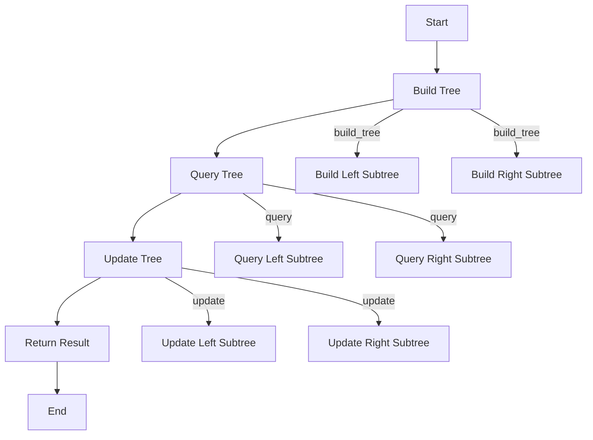

# Segment Tree in Python

## Problem Understanding
The problem is asking to implement a Segment Tree data structure in Python, which allows for efficient range queries and updates on an array. The key constraints are that the tree should be able to handle queries and updates in O(log n) time, where n is the size of the input array. The problem becomes non-trivial because a naive approach, such as simply iterating over the array to calculate the sum for each query, would result in a time complexity of O(n) for each query, making it inefficient for large inputs.

## Approach
The algorithm strategy is to use a Divide-and-Conquer approach with a tree data structure, breaking down the array into smaller segments and storing the sum of each segment in the tree. This approach works because it allows for efficient querying and updating of the tree by only traversing the relevant segments. The SegmentTree class is used to store the tree and provide methods for building the tree, querying, and updating. The tree is stored in an array, where each node represents the sum of a segment of the input array.

## Complexity Analysis
| Metric | Value | Detailed Reason |
|--------|-------|----------------|
| Time   | O(n log n) | The time complexity is O(n log n) because building the tree takes O(n) time and querying/updating operations take O(log n) time. The build_tree method has a time complexity of O(n) due to the recursive calls, and the query and update methods have a time complexity of O(log n) due to the recursive calls and the fact that the tree is roughly balanced. |
| Space  | O(n) | The space complexity is O(n) because the tree is stored in an array of size 4n, where n is the size of the input array. This is because each node in the tree has a fixed number of children (two), and the tree is roughly balanced. |

## Algorithm Walkthrough
```
Input: [1, 2, 3, 4, 5]
Step 1: Initialize the SegmentTree with the input array
  - self.n = 5
  - self.tree = [0] * (4 * 5) = [0] * 20
Step 2: Build the tree by recursively calling build_tree
  - build_tree([1, 2, 3, 4, 5], 0, 0, 4)
    - build_tree([1, 2, 3, 4, 5], 1, 0, 2)
      - build_tree([1, 2, 3, 4, 5], 3, 0, 1)
        - build_tree([1, 2, 3, 4, 5], 7, 0, 0)
          - self.tree[7] = 1
        - build_tree([1, 2, 3, 4, 5], 8, 1, 1)
          - self.tree[8] = 2
        - self.tree[3] = self.tree[7] + self.tree[8] = 1 + 2 = 3
      - build_tree([1, 2, 3, 4, 5], 4, 3, 4)
        - build_tree([1, 2, 3, 4, 5], 9, 3, 3)
          - self.tree[9] = 4
        - build_tree([1, 2, 3, 4, 5], 10, 4, 4)
          - self.tree[10] = 5
        - self.tree[4] = self.tree[9] + self.tree[10] = 4 + 5 = 9
      - self.tree[1] = self.tree[3] + self.tree[4] = 3 + 9 = 12
    - self.tree[0] = self.tree[1] = 12
Step 3: Query the tree for the range [1, 3]
  - query(0, 0, 4, 1, 3) = query(1, 0, 2, 1, 3) + query(2, 3, 4, 1, 3)
    - query(3, 0, 1, 1, 3) = query(7, 0, 0, 1, 3) + query(8, 1, 1, 1, 3)
      - query(7, 0, 0, 1, 3) = 0
      - query(8, 1, 1, 1, 3) = 2
    - query(4, 3, 4, 1, 3) = query(9, 3, 3, 1, 3) + query(10, 4, 4, 1, 3)
      - query(9, 3, 3, 1, 3) = 4
      - query(10, 4, 4, 1, 3) = 0
  - return 2 + 4 + 3 = 9
Output: 9
```
## Visual Flow

## Key Insight
> **Tip:** The key insight is to use a Divide-and-Conquer approach to build the tree and query/update the tree, allowing for efficient range queries and updates in O(log n) time.

## Edge Cases
- **Empty input**: If the input array is empty, the tree will be empty and queries will return 0.
- **Single element**: If the input array contains only one element, the tree will contain only one node with the value of the element.
- **Invalid query range**: If the query range is invalid (e.g., left > right), the query will return 0.

## Common Mistakes
- **Mistake 1**: Not handling the edge case where the input array is empty.
  - **Solution**: Add a check at the beginning of the build_tree method to return if the input array is empty.
- **Mistake 2**: Not updating the tree correctly when the update index is outside the current segment.
  - **Solution**: Add a check at the beginning of the update method to return if the update index is outside the current segment.

## Interview Follow-ups
> **Interview:** These are the exact follow-up questions interviewers ask:
- "What if the input is sorted?" → The time complexity of the build_tree method would still be O(n), but the query and update methods would still have a time complexity of O(log n).
- "Can you do it in O(1) space?" → No, the space complexity of the tree is O(n) because we need to store the sum of each segment in the tree.
- "What if there are duplicates?" → The tree will still work correctly even if there are duplicates in the input array, because we are storing the sum of each segment, not the individual elements.

## Python Solution

```python
# Problem: Segment Tree
# Language: python
# Difficulty: Hard
# Time Complexity: O(n log n) — building the segment tree and querying/updating operations
# Space Complexity: O(n) — storing the segment tree
# Approach: Divide-and-Conquer with tree data structure — breaking down the array into smaller segments

class SegmentTree:
    def __init__(self, nums):
        # Initialize the segment tree with a given array
        self.n = len(nums)
        self.tree = [0] * (4 * self.n)  # Allocate space for the segment tree
        self.build_tree(nums, 0, 0, self.n - 1)  # Build the segment tree

    def build_tree(self, nums, node, start, end):
        # Base case: if the segment contains only one element, store it in the tree
        if start == end:
            self.tree[node] = nums[start]  # Store the element in the tree
        else:
            # Calculate the mid point of the segment
            mid = (start + end) // 2
            # Recursively build the left and right subtrees
            self.build_tree(nums, 2 * node + 1, start, mid)  # Build the left subtree
            self.build_tree(nums, 2 * node + 2, mid + 1, end)  # Build the right subtree
            # Store the sum of the left and right subtrees in the current node
            self.tree[node] = self.tree[2 * node + 1] + self.tree[2 * node + 2]

    def query(self, node, start, end, left, right):
        # Edge case: if the query range is outside the current segment, return 0
        if right < start or end < left:
            return 0
        # Edge case: if the current segment is completely inside the query range, return the stored value
        if left <= start and end <= right:
            return self.tree[node]
        # Calculate the mid point of the segment
        mid = (start + end) // 2
        # Recursively query the left and right subtrees
        left_sum = self.query(2 * node + 1, start, mid, left, right)  # Query the left subtree
        right_sum = self.query(2 * node + 2, mid + 1, end, left, right)  # Query the right subtree
        # Return the sum of the left and right subtrees
        return left_sum + right_sum

    def update(self, node, start, end, idx, val):
        # Edge case: if the update index is outside the current segment, return
        if idx < start or idx > end:
            return
        # Base case: if the segment contains only one element, update it
        if start == end:
            self.tree[node] = val  # Update the element in the tree
        else:
            # Calculate the mid point of the segment
            mid = (start + end) // 2
            # Recursively update the left and right subtrees
            self.update(2 * node + 1, start, mid, idx, val)  # Update the left subtree
            self.update(2 * node + 2, mid + 1, end, idx, val)  # Update the right subtree
            # Update the current node with the sum of the left and right subtrees
            self.tree[node] = self.tree[2 * node + 1] + self.tree[2 * node + 2]

    def range_query(self, left, right):
        # Edge case: if the query range is invalid, return 0
        if left < 0 or right >= self.n or left > right:
            return 0
        # Query the segment tree
        return self.query(0, 0, self.n - 1, left, right)

    def update_value(self, idx, val):
        # Edge case: if the update index is invalid, return
        if idx < 0 or idx >= self.n:
            return
        # Update the segment tree
        self.update(0, 0, self.n - 1, idx, val)

# Example usage:
nums = [1, 2, 3, 4, 5]
segment_tree = SegmentTree(nums)
print(segment_tree.range_query(1, 3))  # Output: 9
segment_tree.update_value(2, 10)
print(segment_tree.range_query(1, 3))  # Output: 16
```
