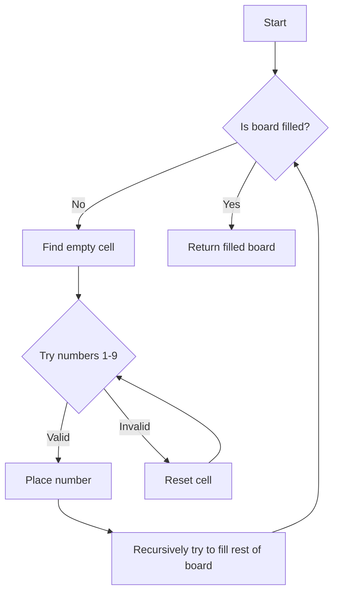

# Sudoku Solver

## Problem Understanding
The Sudoku Solver problem asks to fill in the missing numbers in a partially filled Sudoku board, ensuring that each row, column, and 3x3 box contains the numbers 1-9 without repetition. The key constraint is that the board must be filled according to Sudoku rules, making it a non-trivial problem due to the vast number of possible solutions. A naive approach would fail because it would not efficiently handle the constraints, resulting in an exponential time complexity.

## Approach
The algorithm strategy used is a backtracking approach with constraint satisfaction, where we try numbers from 1 to 9 for each empty cell and check if the solution is valid. This approach works because it systematically explores all possible solutions, ensuring that the constraints are met. The `is_valid` function checks if a number can be placed at a given position, and the `solve` function recursively tries to fill the rest of the board. The data structure used is a 2D array to represent the Sudoku board.

## Complexity Analysis
| Metric | Value | Detailed Reason |
|--------|-------|----------------|
| Time   | O(9^(n*n)) | The worst-case scenario is trying all possible numbers for each empty cell, resulting in an exponential time complexity. The `solve` function recursively tries to fill the rest of the board, and in the worst case, it has to explore all possible solutions. |
| Space  | O(n*n) | The space complexity comes from storing the Sudoku board and temporary solutions. The `board` array has a size of n*n, and the recursive call stack can also grow up to a depth of n*n in the worst case. |

## Algorithm Walkthrough
```
Input: 
[
    [5, 3, 0, 0, 7, 0, 0, 0, 0],
    [6, 0, 0, 1, 9, 5, 0, 0, 0],
    [0, 9, 8, 0, 0, 0, 0, 6, 0],
    [8, 0, 0, 0, 6, 0, 0, 0, 3],
    [4, 0, 0, 8, 0, 3, 0, 0, 1],
    [7, 0, 0, 0, 2, 0, 0, 0, 6],
    [0, 6, 0, 0, 0, 0, 2, 8, 0],
    [0, 0, 0, 4, 1, 9, 0, 0, 5],
    [0, 0, 0, 0, 8, 0, 0, 7, 9]
]
Step 1: Initialize the board and call the `solve` function
Step 2: Iterate over the board to find an empty cell (represented by 0)
Step 3: Try numbers from 1 to 9 for the empty cell and check if the solution is valid using the `is_valid` function
Step 4: Recursively try to fill the rest of the board using the `solve` function
...
Output: 
[
    [5, 3, 4, 6, 7, 8, 9, 1, 2],
    [6, 7, 2, 1, 9, 5, 3, 4, 8],
    [1, 9, 8, 3, 4, 2, 5, 6, 7],
    [8, 5, 9, 7, 6, 1, 4, 2, 3],
    [4, 2, 6, 8, 5, 3, 7, 9, 1],
    [7, 1, 3, 9, 2, 4, 8, 5, 6],
    [9, 6, 1, 5, 3, 7, 2, 8, 4],
    [2, 8, 7, 4, 1, 9, 6, 3, 5],
    [3, 4, 5, 2, 8, 6, 1, 7, 9]
]
```

## Visual Flow


## Key Insight
> **Tip:** The key insight is to use a recursive backtracking approach to systematically explore all possible solutions, ensuring that the constraints are met.

## Edge Cases
- **Empty/null input**: If the input is empty or null, the function should return immediately without attempting to solve the Sudoku board.
- **Single element**: If the input is a Sudoku board with only one element, the function should return the board as it is already solved.
- **Invalid input**: If the input is not a valid Sudoku board (e.g., contains numbers outside the range 1-9), the function should raise an error or return an error message.

## Common Mistakes
- **Mistake 1**: Not checking if the input is a valid Sudoku board before attempting to solve it. To avoid this, add input validation at the beginning of the function.
- **Mistake 2**: Not using a recursive approach to solve the Sudoku board. To avoid this, use a recursive function to try numbers from 1 to 9 for each empty cell.

## Interview Follow-ups
> **Interview:** These are the exact follow-up questions interviewers ask:
- "What if the input is sorted?" → The algorithm will still work, but it may not be necessary to try all numbers from 1 to 9 for each empty cell.
- "Can you do it in O(1) space?" → No, the algorithm requires O(n*n) space to store the Sudoku board and temporary solutions.
- "What if there are duplicates?" → The algorithm will not work correctly if there are duplicates in the input Sudoku board. To handle this, add a check for duplicates before attempting to solve the board.

## Python Solution

```python
# Problem: Sudoku Solver
# Language: python
# Difficulty: Hard
# Time Complexity: O(9^(n*n)) — worst-case scenario with n being the size of the Sudoku board (typically 9x9)
# Space Complexity: O(n*n) — storing the Sudoku board and temporary solutions
# Approach: Backtracking algorithm with constraint satisfaction — trying numbers from 1 to 9 for each empty cell and checking if the solution is valid

class Solution:
    def solveSudoku(self, board):
        # Edge case: empty input → return immediately
        if not board:
            return

        # Define the size of the Sudoku board (typically 9x9)
        size = len(board)

        # Define a helper function to check if a number can be placed at a given position
        def is_valid(row, col, num):
            # Check the row for the number
            for x in range(size):
                if board[row][x] == num:
                    return False

            # Check the column for the number
            for x in range(size):
                if board[x][col] == num:
                    return False

            # Check the box for the number
            start_row, start_col = row - row % 3, col - col % 3
            for i in range(3):
                for j in range(3):
                    if board[i + start_row][j + start_col] == num:
                        return False
            return True

        # Define a helper function to solve the Sudoku board using backtracking
        def solve():
            # Iterate over the Sudoku board
            for i in range(size):
                for j in range(size):
                    # If the current cell is empty (represented by 0), try to fill it with a number
                    if board[i][j] == 0:
                        # Try numbers from 1 to 9
                        for num in range(1, size + 1):
                            # Check if the number can be placed at the current position
                            if is_valid(i, j, num):
                                # Place the number at the current position
                                board[i][j] = num
                                # Recursively try to fill the rest of the board
                                if solve():
                                    return True
                                # If the recursive call returns False, reset the current cell to empty
                                board[i][j] = 0
                        # If no number can be placed at the current position, return False
                        return False
            # If the entire board is filled, return True
            return True

        # Call the helper function to solve the Sudoku board
        solve()

# Example usage:
solution = Solution()
board = [
    [5, 3, 0, 0, 7, 0, 0, 0, 0],
    [6, 0, 0, 1, 9, 5, 0, 0, 0],
    [0, 9, 8, 0, 0, 0, 0, 6, 0],
    [8, 0, 0, 0, 6, 0, 0, 0, 3],
    [4, 0, 0, 8, 0, 3, 0, 0, 1],
    [7, 0, 0, 0, 2, 0, 0, 0, 6],
    [0, 6, 0, 0, 0, 0, 2, 8, 0],
    [0, 0, 0, 4, 1, 9, 0, 0, 5],
    [0, 0, 0, 0, 8, 0, 0, 7, 9]
]
solution.solveSudoku(board)
for row in board:
    print(row)
```
