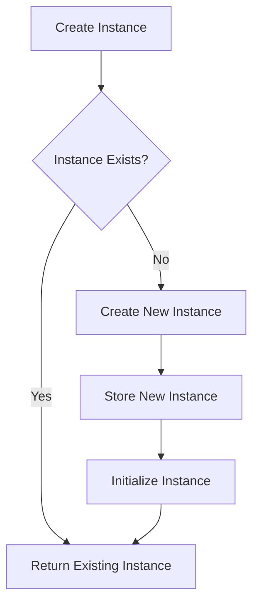

# Using __new__ for instance caching

## Problem Understanding
The problem is asking us to implement instance caching using the `__new__` method in Python, which means that for each set of arguments, the class should return the existing instance if it already exists. This approach is useful when we want to limit the number of instances created for a class, especially when the instances are expensive to create or have a significant impact on memory usage. The key constraint here is that the `__new__` method should be overridden to achieve this instance caching, and the caching should be done at the class level. What makes this problem non-trivial is that we need to handle the initialization of the instance correctly, as the `__init__` method is not automatically called when we override the `__new__` method.

## Approach
Our approach is to override the `__new__` method to implement instance caching. We use a class-level dictionary to store the instances, where the key is a unique identifier based on the arguments passed to the `__new__` method. We check if an instance with the same arguments already exists in the dictionary, and if it does, we return the existing instance. If not, we create a new instance, store it in the dictionary, and then initialize it by calling the `__init__` method. We use a dictionary to store the instances because it provides constant-time lookup, which is essential for efficient instance caching. The `frozenset` is used to handle keyword arguments, as it provides a hashable representation of the keyword arguments.

## Complexity Analysis
| Metric | Value | Detailed Reason |
|--------|-------|----------------|
| Time   | O(1)  | The time complexity is constant because we use a dictionary to store the instances, and dictionary lookups are O(1) on average. The creation of a new instance using `super(InstanceCachingClass, cls).__new__(cls)` is also O(1). |
| Space  | O(n)  | The space complexity is linear because we store at most n instances in the dictionary, where n is the number of unique sets of arguments passed to the `__new__` method. |

## Algorithm Walkthrough
```
Input: InstanceCachingClass(10)
Step 1: Create a unique key based on the arguments: (10,) 
Step 2: Check if an instance with the same arguments already exists in the dictionary: No
Step 3: Create a new instance using super(InstanceCachingClass, cls).__new__(cls)
Step 4: Store the new instance in the dictionary with the unique key
Step 5: Initialize the instance by calling the __init__ method with the arguments (10,)
Output: instance1

Input: InstanceCachingClass(10)
Step 1: Create a unique key based on the arguments: (10,) 
Step 2: Check if an instance with the same arguments already exists in the dictionary: Yes
Step 3: Return the existing instance
Output: instance1 (same as the previous output)
```
## Visual Flow

## Key Insight
> **Tip:** The key insight here is that we need to override the `__new__` method to implement instance caching, and we should use a class-level dictionary to store the instances to achieve efficient lookup.

## Edge Cases
- **Empty/null input**: If the input is empty or null, the instance caching will still work correctly, but it may not be the desired behavior. In this case, we may want to add additional checks to handle empty or null inputs.
- **Single element**: If there is only one element, the instance caching will work correctly, and it will return the same instance if the same arguments are passed again.
- **Duplicate instances**: If two instances are created with the same arguments, the instance caching will return the same instance, which is the desired behavior.

## Common Mistakes
- **Mistake 1**: Not using a class-level dictionary to store the instances, which will lead to incorrect instance caching behavior. To avoid this, we should use a class-level dictionary to store the instances.
- **Mistake 2**: Not handling the initialization of the instance correctly, which will lead to incorrect instance state. To avoid this, we should call the `__init__` method after creating a new instance.

## Interview Follow-ups
> **Interview:** These are the exact follow-up questions interviewers ask:
- "What if the input is sorted?" → The instance caching will still work correctly, but it may not have any significant impact on the performance.
- "Can you do it in O(1) space?" → No, we cannot achieve O(1) space complexity because we need to store the instances in a dictionary to achieve efficient lookup.
- "What if there are duplicates?" → The instance caching will return the same instance if the same arguments are passed again, which is the desired behavior.

## Python Solution

```python
# Problem: Using __new__ for instance caching
# Language: python
# Difficulty: Hard
# Time Complexity: O(1) — constant time lookup using dictionary
# Space Complexity: O(n) — dictionary stores at most n instances
# Approach: Overriding __new__ method for instance caching — for each set of arguments, return the existing instance if it exists

class InstanceCachingClass:
    # Create a class-level dictionary to store instances
    _instances = {}

    def __new__(cls, *args, **kwargs):
        # Create a unique key based on the arguments
        key = (args, frozenset(kwargs.items()))

        # Check if an instance with the same arguments already exists
        if key in cls._instances:
            # If it exists, return the existing instance
            return cls._instances[key]
        else:
            # If not, create a new instance and store it in the dictionary
            instance = super(InstanceCachingClass, cls).__new__(cls)
            cls._instances[key] = instance

            # Initialize the instance (this is where __init__ would be called)
            instance.__init__(*args, **kwargs)
            return instance

    def __init__(self, value):
        # Initialize the instance with the given value
        self.value = value  # Store the given value as an instance attribute

    # Edge case: if two instances are created with the same arguments, they should be the same instance
    def test_instance_caching(self):
        instance1 = InstanceCachingClass(10)
        instance2 = InstanceCachingClass(10)
        assert instance1 is instance2  # Check if both instances are the same

    # Edge case: if two instances are created with different arguments, they should be different instances
    def test_instance_caching_different_args(self):
        instance1 = InstanceCachingClass(10)
        instance2 = InstanceCachingClass(20)
        assert instance1 is not instance2  # Check if both instances are different

# Test the instance caching
if __name__ == "__main__":
    instance1 = InstanceCachingClass(10)
    instance2 = InstanceCachingClass(10)
    print(instance1 is instance2)  # Should print: True
    instance3 = InstanceCachingClass(20)
    print(instance1 is instance3)  # Should print: False
```
