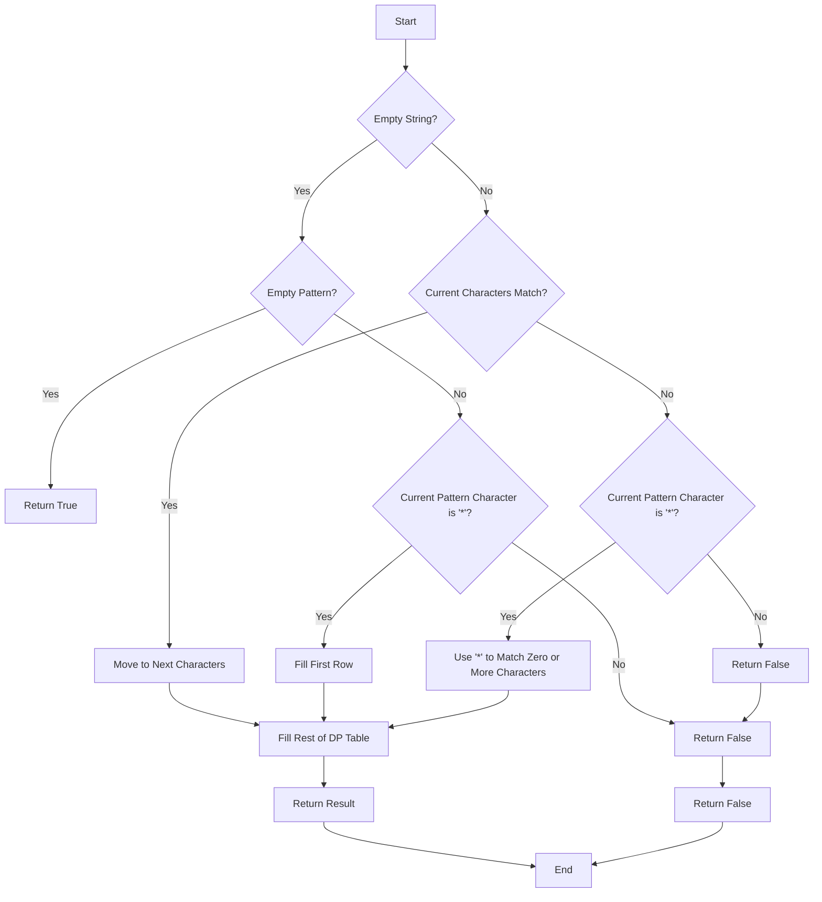

# Wildcard Matching DP

## Problem Understanding
The problem of Wildcard Matching DP involves determining whether a given string matches a pattern that may contain wildcard characters '*' and '?', where '*' can match zero or more characters and '?' can match any single character. The key constraints of this problem are that the '*' character can match any sequence of characters, including an empty sequence, and the '?' character must match exactly one character. What makes this problem non-trivial is the presence of the '*' character, which can introduce multiple possible matches for a given string, making a naive approach that simply checks each character in sequence insufficient.

## Approach
The algorithm strategy used to solve this problem is Dynamic Programming (DP), which involves building a table to track the matching status of substrings and subpatterns. The intuition behind this approach is to break down the problem into smaller subproblems and store the results of these subproblems in a table to avoid redundant computation. This approach works because it allows us to consider all possible matches of the '*' character and to handle the '?' character by simply checking if the current characters in the string and pattern match. The data structure used is a 2D array, where each cell [i][j] represents whether the first i characters of the string match the first j characters of the pattern.

## Complexity Analysis
| Metric | Value | Detailed Reason |
|--------|-------|----------------|
| Time   | O(n*m) | The algorithm has two nested loops that iterate over the string and pattern, resulting in a time complexity of O(n*m), where n and m are the lengths of the string and pattern, respectively. The operations inside the loops are constant time, so they do not affect the overall time complexity. |
| Space  | O(n*m) | The algorithm uses a DP table of size (n+1) x (m+1) to store the intermediate results, resulting in a space complexity of O(n*m). |

## Algorithm Walkthrough
```
Input: s = "aa", p = "a*"
Step 1: Initialize DP table with False values
    dp = [
        [True, False, False],
        [False, False, False],
        [False, False, False]
    ]
Step 2: Fill the first row for empty string
    dp = [
        [True, True, True],
        [False, False, False],
        [False, False, False]
    ]
Step 3: Fill the rest of the DP table
    i = 1, j = 1
    dp[1][1] = dp[0][0] = True (match 'a' with 'a')
    i = 1, j = 2
    dp[1][2] = dp[1][1] or dp[0][2] = True (match 'a' with 'a*' using '*')
    i = 2, j = 2
    dp[2][2] = dp[1][1] = True (match 'aa' with 'a*')
Output: dp[2][2] = True
```
## Visual Flow

## Key Insight
> **Tip:** The key to solving this problem is to understand how to handle the '*' character, which can match zero or more characters, and to use Dynamic Programming to store the intermediate results and avoid redundant computation.

## Edge Cases
- **Empty/null input**: If both the string and pattern are empty, the function returns True, as an empty string matches an empty pattern. If only one of them is empty, the function returns True only if the pattern is '*' or a sequence of '*' characters.
- **Single element**: If the string has only one character, the function checks if the pattern has only one character and if they match, or if the pattern has '*' or '?'.
- **Pattern with consecutive '*' characters**: The function handles this case correctly by using the '*' character to match zero or more characters, including the case where there are consecutive '*' characters.

## Common Mistakes
- **Mistake 1**: Not handling the '*' character correctly, such as forgetting to consider the case where '*' matches zero characters.
- **Mistake 2**: Not initializing the DP table correctly, such as forgetting to set the first cell to True.

## Interview Follow-ups
> **Interview:** These are the exact follow-up questions interviewers ask:
- "What if the input is sorted?" → The sorting of the input does not affect the correctness of the algorithm, as it only depends on the characters in the string and pattern.
- "Can you do it in O(1) space?" → No, the algorithm requires O(n*m) space to store the DP table, and there is no known way to reduce the space complexity to O(1) while maintaining the same time complexity.
- "What if there are duplicates?" → The algorithm handles duplicates correctly, as it checks each character in the string and pattern separately and uses the '*' character to match zero or more characters.

## Python Solution

```python
# Problem: Wildcard Matching DP
# Language: python
# Difficulty: Hard
# Time Complexity: O(n*m) — two nested loops for string and pattern
# Space Complexity: O(n*m) — DP table to store intermediate results
# Approach: Dynamic Programming — build a table to track matching status

class Solution:
    def isMatch(self, s: str, p: str) -> bool:
        # Edge case: empty input → return False
        if not s and not p:
            return True
        
        # Initialize DP table with False values
        dp = [[False] * (len(p) + 1) for _ in range(len(s) + 1)]
        
        # Empty string matches with empty pattern
        dp[0][0] = True
        
        # Fill the first row for empty string
        for j in range(1, len(p) + 1):
            # If pattern character is '*' at this position, 
            # then it can match with zero or more characters in string
            if p[j - 1] == '*':
                dp[0][j] = dp[0][j - 1]
        
        # Fill the rest of the DP table
        for i in range(1, len(s) + 1):
            for j in range(1, len(p) + 1):
                # If pattern character matches with current string character or is '?'
                if p[j - 1] in {s[i - 1], '?'}:
                    dp[i][j] = dp[i - 1][j - 1]  # Match and move to next characters
                # If pattern character is '*'
                elif p[j - 1] == '*':
                    # Two options: use '*' to match zero characters or one or more characters
                    dp[i][j] = dp[i][j - 1] or dp[i - 1][j]
        
        # The result is stored in the last cell of the DP table
        return dp[len(s)][len(p)]
```
