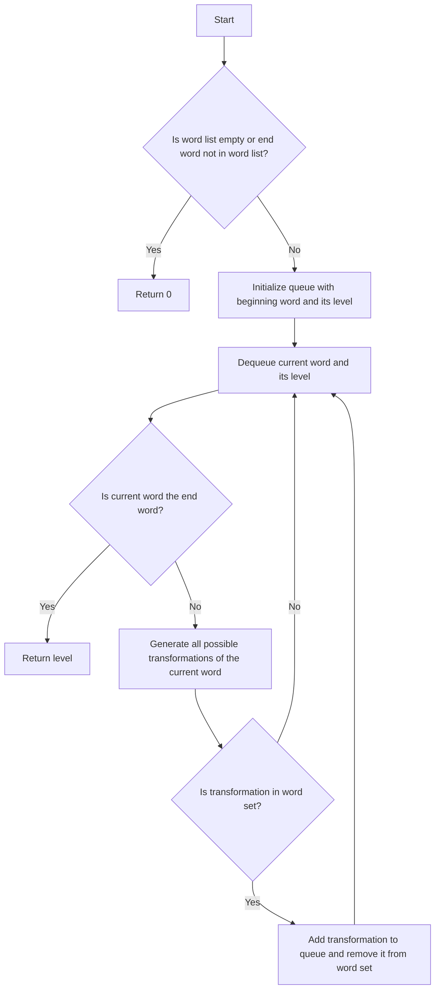

# Word Ladder

## Problem Understanding
The Word Ladder problem is asking to find the length of the shortest transformation sequence from a given start word to an end word, where each transformation involves changing one character in the current word to get a new word that is in the provided word list. The key constraint is that each transformation must result in a valid word that is present in the word list. This problem is non-trivial because a naive approach of trying all possible transformations would result in an exponential time complexity due to the large number of possible transformations. The problem requires an efficient algorithm to explore the possible transformations in a systematic way.

## Approach
The algorithm strategy used here is Breadth-First Search (BFS) with word transformation, where we explore all possible word transformations level by level. This approach works because BFS is guaranteed to find the shortest path to the target word if such a path exists. We use a queue data structure to keep track of the words to be processed and a set data structure to store the remaining words in the word list for efficient lookup. The approach handles the key constraint of ensuring each transformation results in a valid word by checking if the transformed word is in the word set before adding it to the queue.

## Complexity Analysis
| Metric | Value | Detailed Reason |
|--------|-------|----------------|
| Time   | O(N * M * 26) | The time complexity is O(N * M * 26) because in the worst case, we need to process each of the N words, and for each word, we generate M * 26 possible transformations, where M is the length of the word and 26 is the number of possible characters. |
| Space  | O(N + M) | The space complexity is O(N + M) because we store all the words in a set for efficient lookup, which takes O(N) space, and we also use a queue to store the words to be processed, which can contain at most N words, each of length M. |

## Algorithm Walkthrough
```
Input: beginWord = "hit", endWord = "cog", wordList = ["hot","dot","dog","lot","log","cog"]
Step 1: Initialize the queue with the beginning word and its level: [("hit", 1)]
Step 2: Dequeue the current word and its level: ("hit", 1)
Step 3: Generate all possible transformations of the current word: ["hot", "lit", ...]
Step 4: For each transformation, check if it is in the word set: "hot" is in the word set
Step 5: Add "hot" to the queue and remove it from the word set: [("hot", 2)]
Step 6: Repeat steps 2-5 until the queue is empty or the end word is found: [("hot", 2), ("dot", 3), ("dog", 3), ("lot", 3), ("log", 4), ("cog", 5)]
Output: 5
```
This walkthrough demonstrates how the algorithm explores the possible transformations level by level until it finds the shortest path to the end word.

## Visual Flow

This flowchart shows the decision flow of the algorithm, including the checks for the end word and the word set.

## Key Insight
> **Tip:** The key insight here is to use a BFS approach with word transformation to systematically explore the possible transformations level by level, ensuring that each transformation results in a valid word that is present in the word list.

## Edge Cases
- **Empty/null input**: If the word list is empty or the end word is not in the word list, the algorithm returns 0, indicating that there is no transformation path.
- **Single element**: If the word list contains only one word, the algorithm returns 1 if the beginning word is the same as the end word, and 0 otherwise.
- **No transformation path**: If there is no transformation path from the beginning word to the end word, the algorithm returns 0.

## Common Mistakes
- **Mistake 1**: Not checking if the transformation is in the word set before adding it to the queue, which can result in exploring invalid transformations.
- **Mistake 2**: Not removing the transformation from the word set after adding it to the queue, which can result in exploring the same transformation multiple times.

## Interview Follow-ups
> **Interview:** These are the exact follow-up questions interviewers ask:
- "What if the input is sorted?" → The algorithm does not assume that the input is sorted, and it works correctly regardless of the order of the words in the word list.
- "Can you do it in O(1) space?" → No, the algorithm requires at least O(N + M) space to store the words in the word set and the queue.
- "What if there are duplicates?" → The algorithm handles duplicates by checking if the transformation is in the word set before adding it to the queue, and removing it from the word set after adding it to the queue.

## Python Solution

```python
# Problem: Word Ladder
# Language: python
# Difficulty: Hard
# Time Complexity: O(N * M * 26) — where N is the length of the word list and M is the length of each word
# Space Complexity: O(N + M) — where N is the number of words and M is the length of the longest word
# Approach: Breadth-First Search (BFS) with word transformation — explore all possible word transformations level by level

from collections import deque

class Solution:
    def ladderLength(self, beginWord: str, endWord: str, wordList: list[str]) -> int:
        # Edge case: empty word list or end word not in word list → return 0
        if not wordList or endWord not in wordList:
            return 0
        
        # Create a set of words for O(1) lookup
        word_set = set(wordList)
        
        # Initialize the queue with the beginning word and its level
        queue = deque([(beginWord, 1)])
        
        # Perform BFS
        while queue:
            # Dequeue the current word and its level
            current_word, level = queue.popleft()
            
            # If the current word is the end word, return its level
            if current_word == endWord:
                return level
            
            # Generate all possible transformations of the current word
            for i in range(len(current_word)):
                for char in 'abcdefghijklmnopqrstuvwxyz':
                    # Skip the same character to avoid duplicates
                    if char == current_word[i]:
                        continue
                    
                    # Generate the next word by replacing the character
                    next_word = current_word[:i] + char + current_word[i + 1:]
                    
                    # If the next word is in the word set, add it to the queue and remove it from the word set
                    if next_word in word_set:
                        queue.append((next_word, level + 1))
                        word_set.remove(next_word)
        
        # Edge case: no transformation path found → return 0
        return 0
```
