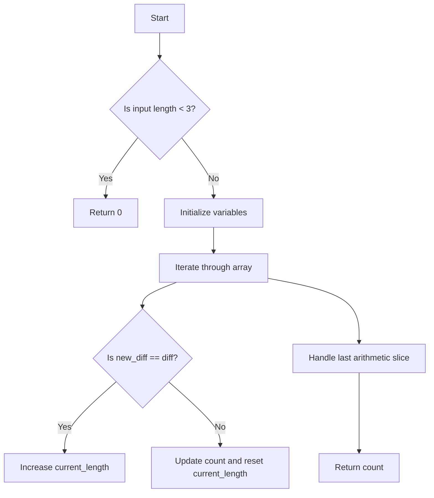

# Arithmetic Slices

## Problem Understanding
The problem asks to find the number of arithmetic slices in a given list of integers. An arithmetic slice is a sequence of at least three numbers where the difference between any two consecutive numbers is the same. The key constraint is that the input list must have at least three elements to form an arithmetic slice. What makes this problem non-trivial is that a naive approach would involve checking all possible subsequences, resulting in a time complexity of O(n^3), which is inefficient. The problem requires a more efficient approach to handle large inputs.

## Approach
The algorithm strategy used here is dynamic programming, where we iterate through the array and keep track of the difference between consecutive numbers. We use the intuition that if the difference between two consecutive numbers is the same as the previous difference, it's an arithmetic slice. We use variables to store the count of arithmetic slices, the difference between consecutive numbers, and the length of the current arithmetic slice. The approach handles the key constraint by initializing the difference and length variables and updating them accordingly as we iterate through the array. We use a simple loop to iterate through the array, and the time complexity is O(n), where n is the length of the input array.

## Complexity Analysis
| Metric | Value | Detailed Reason |
|--------|-------|----------------|
| Time   | O(n)  | The algorithm iterates through the input array once, where n is the length of the array. The operations inside the loop are constant time, so the overall time complexity is linear. |
| Space  | O(1)  | The algorithm uses a constant amount of space to store the count of arithmetic slices, the difference between consecutive numbers, and the length of the current arithmetic slice, regardless of the input size. |

## Algorithm Walkthrough
```
Input: [1, 2, 3, 4]
Step 1: Initialize variables - count = 0, diff = 1 (2-1), current_length = 2
Step 2: Iterate to the third element - new_diff = 3-2 = 1, since new_diff == diff, current_length += 1
Step 3: Iterate to the fourth element - new_diff = 4-3 = 1, since new_diff == diff, current_length += 1
Step 4: After the loop, handle the last arithmetic slice - count += (current_length - 1) * (current_length - 2) // 2 = (4-1)*(4-2)//2 = 3
Output: 3
```
This example demonstrates how the algorithm works for a simple arithmetic sequence.

## Visual Flow

This flowchart shows the decision flow of the algorithm, including the handling of edge cases and the iteration through the input array.

## Key Insight
> **Tip:** The key insight is to recognize that an arithmetic slice can be extended by one element if the difference between the last two elements is the same as the previous difference, allowing for efficient counting of arithmetic slices.

## Edge Cases
- **Empty/null input**: If the input list is empty or null, the algorithm returns 0, as there are no arithmetic slices.
- **Single element**: If the input list has only one element, the algorithm returns 0, as there are no arithmetic slices.
- **Two elements**: If the input list has only two elements, the algorithm returns 0, as there are no arithmetic slices (an arithmetic slice requires at least three elements).

## Common Mistakes
- **Mistake 1**: Not handling the edge case where the input list has less than three elements. To avoid this, add a check at the beginning of the algorithm to return 0 if the input list has less than three elements.
- **Mistake 2**: Not updating the count of arithmetic slices correctly. To avoid this, use the formula `(current_length - 1) * (current_length - 2) // 2` to calculate the count of arithmetic slices for each sequence.

## Interview Follow-ups
> **Interview:** These are the exact follow-up questions interviewers ask:
- "What if the input is sorted?" → The algorithm still works correctly, as it only depends on the differences between consecutive elements, not the overall order of the elements.
- "Can you do it in O(1) space?" → The algorithm already uses O(1) space, excluding the input array, so this is already achieved.
- "What if there are duplicates?" → The algorithm handles duplicates correctly, as it only considers the differences between consecutive elements, not the actual values.

## Python Solution

```python
# Problem: Arithmetic Slices
# Language: python
# Difficulty: Medium
# Time Complexity: O(n) — single pass through array using dynamic programming
# Space Complexity: O(1) — constant space for variables, excluding input array
# Approach: dynamic programming — counting the number of arithmetic slices

class Solution:
    def numberOfArithmeticSlices(self, nums: list[int]) -> int:
        # Edge case: empty input → return 0
        if len(nums) < 3:
            return 0
        
        # Initialize variables to store the count of arithmetic slices and difference between consecutive numbers
        count = 0
        diff = nums[1] - nums[0]  # initial difference
        
        # Initialize variable to store the length of the current arithmetic slice
        current_length = 2
        
        # Iterate through the array starting from the third element
        for i in range(2, len(nums)):
            # Calculate the difference between the current and previous numbers
            new_diff = nums[i] - nums[i - 1]
            
            # If the difference is the same as the previous difference, it's an arithmetic slice
            if new_diff == diff:
                # Increase the length of the current arithmetic slice
                current_length += 1
            else:
                # Calculate the count of arithmetic slices for the current slice
                # using the formula n*(n-1)/2, where n is the length of the slice
                count += (current_length - 1) * (current_length - 2) // 2 if current_length > 2 else 0
                
                # Update the difference and reset the length of the current arithmetic slice
                diff = new_diff
                current_length = 2
        
        # Handle the last arithmetic slice
        count += (current_length - 1) * (current_length - 2) // 2 if current_length > 2 else 0
        
        return count
```
