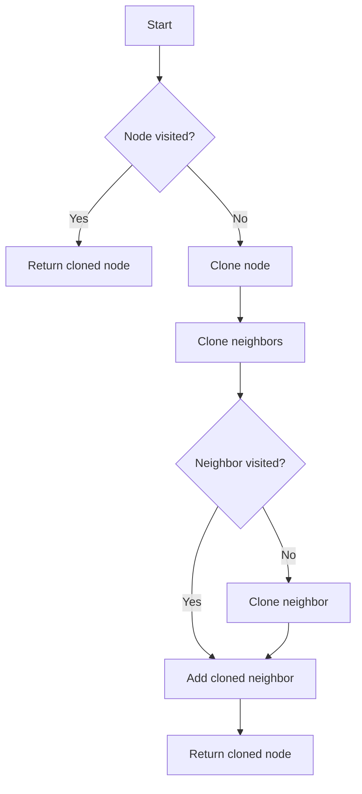

# Clone Graph

## Problem Understanding
The problem is asking to clone a given graph, where each node in the graph contains a value and a list of its neighboring nodes. The key constraint here is that the cloned graph should be a deep copy of the original graph, meaning that each node in the cloned graph should have the same value and the same neighbors as the corresponding node in the original graph. What makes this problem non-trivial is that the graph can contain cycles, and a naive approach might end up in an infinite loop. The problem requires a strategy to keep track of visited nodes to avoid revisiting them.

## Approach
The algorithm strategy used here is Depth-First Search (DFS) with dictionary lookup. The intuition behind it is to visit each node in the graph and clone its neighbors. A dictionary is used to store the visited nodes, which allows for efficient lookup of cloned nodes. This approach works because DFS is well-suited for traversing graphs, and the dictionary lookup ensures that each node is cloned only once. The algorithm handles the key constraint of avoiding infinite loops by storing visited nodes in the dictionary.

## Complexity Analysis
| Metric | Value | Detailed Reason |
|--------|-------|----------------|
| Time   | O(n + m) | The algorithm visits each node once (n nodes) and each edge once (m edges), resulting in a time complexity of O(n + m). The dictionary lookup and insertion operations take constant time, so they do not affect the overall time complexity. |
| Space  | O(n) | The algorithm uses a dictionary to store the visited nodes, which requires O(n) space. The recursive call stack also requires O(n) space in the worst case, when the graph is a linked list. |

## Algorithm Walkthrough
```
Input: node with value 1 and neighbors [node with value 2, node with value 3]
Step 1: Create a dictionary to store visited nodes, and define a helper function dfs.
Step 2: Call dfs on the input node.
Step 3: In dfs, check if the node is already visited. If not, create a clone of the node and store it in the dictionary.
Step 4: Clone the neighbors of the current node by recursively calling dfs on each neighbor.
Step 5: Return the cloned node.
Output: Cloned graph with the same structure as the input graph.
```
For example, given a graph with nodes {1, 2, 3} and edges {(1, 2), (1, 3), (2, 3)}, the algorithm will clone the graph as follows:
- Create a clone of node 1.
- Clone the neighbors of node 1: create clones of nodes 2 and 3.
- Clone the neighbors of node 2: create a clone of node 3 (if not already cloned).
- Clone the neighbors of node 3: create clones of nodes 1 and 2 (if not already cloned).

## Visual Flow

The flowchart shows the decision flow of the algorithm. It checks if a node is visited, and if so, returns the cloned node. If not, it clones the node and its neighbors.

## Key Insight
> **Tip:** The key insight is to use a dictionary to store visited nodes, which allows for efficient lookup of cloned nodes and avoids infinite loops.

## Edge Cases
- **Empty/null input**: If the input node is None, the algorithm returns None, as there is no graph to clone.
- **Single element**: If the input graph contains only one node, the algorithm clones the node and returns the cloned node.
- **Graph with cycles**: If the input graph contains cycles, the algorithm uses the dictionary to keep track of visited nodes and avoid revisiting them.

## Common Mistakes
- **Mistake 1**: Not using a dictionary to store visited nodes, which can lead to infinite loops. → To avoid this, use a dictionary to store visited nodes and clone each node only once.
- **Mistake 2**: Not handling the case where the input node is None. → To avoid this, add a check at the beginning of the algorithm to return None if the input node is None.

## Interview Follow-ups
> **Interview:** These are the exact follow-up questions interviewers ask:
- "What if the input is sorted?" → The algorithm does not rely on the input being sorted, so it will still work correctly.
- "Can you do it in O(1) space?" → No, the algorithm requires O(n) space to store the visited nodes.
- "What if there are duplicates?" → The algorithm handles duplicates by storing each node in the dictionary only once. If a node is visited again, the algorithm returns the cloned node from the dictionary instead of cloning it again.

## Python Solution

```python
# Problem: Clone Graph
# Language: python
# Difficulty: Medium
# Time Complexity: O(n + m) — visiting each node and edge once
# Space Complexity: O(n) — storing the visited nodes in the dictionary
# Approach: Depth-First Search with dictionary lookup — for each node, clone its neighbors

"""
# Definition for a Node.
class Node:
    def __init__(self, val = 0, neighbors = None):
        self.val = val
        self.neighbors = neighbors if neighbors is not None else []
"""

class Solution:
    def cloneGraph(self, node: 'Node') -> 'Node':
        # Edge case: empty input → return None
        if not node:
            return None
        
        # Create a dictionary to store the visited nodes
        visited = {}  # dictionary to store the cloned nodes
        
        # Define a helper function to perform the DFS
        def dfs(node):
            # If the node is already visited, return the cloned node
            if node in visited:
                return visited[node]
            
            # Clone the current node
            clone = Node(node.val)
            visited[node] = clone  # store the cloned node
            
            # Clone the neighbors of the current node
            for neighbor in node.neighbors:
                clone.neighbors.append(dfs(neighbor))
            
            return clone
        
        # Perform the DFS from the given node
        return dfs(node)
```
