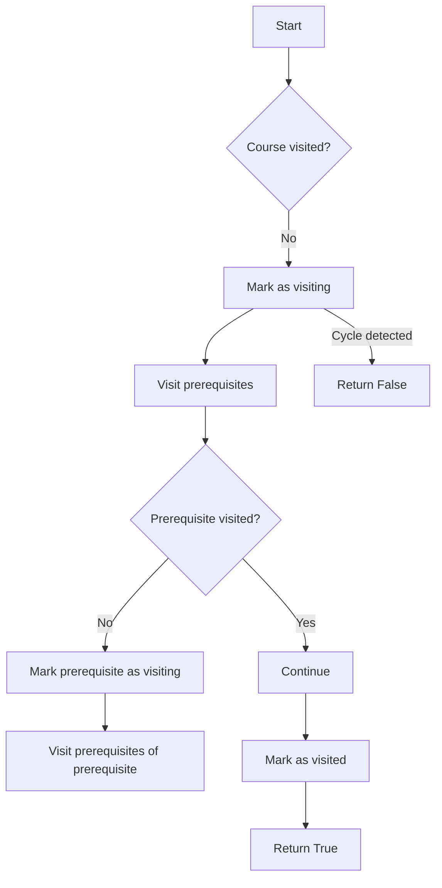

# Course Schedule Cycle Detection

## Problem Understanding
The problem of Course Schedule Cycle Detection is asking whether it's possible to finish all courses based on their prerequisites. The key constraint is that a course can only be taken if all its prerequisites have been completed. What makes this problem non-trivial is the presence of cycles in the course prerequisites, which would prevent some or all courses from being completed. A naive approach would be to simply check if a course has prerequisites, but this fails to account for the complexity of cycles and the need to visit each course and its prerequisites in a specific order.

## Approach
The algorithm strategy used here is Depth-First Search (DFS) cycle detection. The intuition behind this approach is to simulate the process of taking courses and their prerequisites, and to detect if a cycle is present. This approach works because it visits each course and its prerequisites in a specific order, allowing it to detect cycles. The data structure used is an adjacency list representation of a graph, where each course is a node and its prerequisites are edges. The approach handles key constraints by marking each course as visiting or visited, and by checking for cycles when visiting a course.

## Complexity Analysis
| Metric | Value | Detailed Reason |
|--------|-------|----------------|
| Time   | O(n + m) | The time complexity is linear because we visit each course (n) and each prerequisite (m) once. The dfs function is called recursively for each course, but each course is only visited once due to the visited array. |
| Space  | O(n + m) | The space complexity is also linear because we need to store the graph (m edges) and the visited array (n courses). The recursive call stack also takes up to n space in the worst case. |

## Algorithm Walkthrough
```
Input: numCourses = 2, prerequisites = [[1,0]]
Step 1: Create a graph and visited array
  - graph = [[], [0]]
  - visited = [0, 0]
Step 2: Perform DFS on course 0
  - visited[0] = 1
  - No prerequisites for course 0
  - visited[0] = 2
Step 3: Perform DFS on course 1
  - visited[1] = 1
  - Visit prerequisite 0
  - Since visited[0] = 2, we can continue
  - visited[1] = 2
Output: True (no cycle detected)
```
This example exercises the main logic path of the algorithm.

## Visual Flow

This flowchart shows the decision flow of the algorithm.

## Key Insight
> **Tip:** The key insight here is that by marking each course as visiting or visited, we can detect cycles in the course prerequisites and determine if it's possible to finish all courses.

## Edge Cases
- **Empty/null input**: If the input is empty (i.e., numCourses = 0 and prerequisites = []), the function should return True because there are no courses to take.
- **Single element**: If there is only one course with no prerequisites, the function should return True because the course can be taken.
- **Self-prerequisite**: If a course has itself as a prerequisite, the function should return False because this creates a cycle.

## Common Mistakes
- **Mistake 1**: Not marking each course as visiting or visited, which can lead to infinite recursion and incorrect results. To avoid this, use a visited array to keep track of each course's status.
- **Mistake 2**: Not checking for cycles when visiting a course, which can lead to incorrect results. To avoid this, check if a course is already being visited before visiting its prerequisites.

## Interview Follow-ups
> **Interview:** These are the exact follow-up questions interviewers ask:
- "What if the input is sorted?" → The algorithm still works because it doesn't rely on the input being sorted. The time complexity remains the same.
- "Can you do it in O(1) space?" → No, because we need to store the visited array and the graph, which requires O(n + m) space.
- "What if there are duplicates?" → The algorithm still works because it doesn't rely on the input being unique. The time complexity remains the same, but we may need to handle duplicates when building the graph.

## Python Solution

```python
# Problem: Course Schedule Cycle Detection
# Language: python
# Difficulty: Medium
# Time Complexity: O(n + m) — visiting each node and edge once
# Space Complexity: O(n + m) — storing graph and visited sets
# Approach: Depth-First Search cycle detection — detect cycles in the graph representing course prerequisites

from typing import List

class Solution:
    def canFinish(self, numCourses: int, prerequisites: List[List[int]]) -> bool:
        # Create a graph to store the course prerequisites
        graph = [[] for _ in range(numCourses)]  # adjacency list representation
        visited = [0 for _ in range(numCourses)]  # 0: unvisited, 1: visiting, 2: visited
        
        # Build the graph
        for course, prerequisite in prerequisites:
            graph[course].append(prerequisite)  # add an edge from prerequisite to course
        
        # Define a helper function for DFS
        def dfs(course: int) -> bool:
            # If the course is already being visited, it means we've found a cycle
            if visited[course] == 1:  # visiting
                return False  # cycle detected
            # If the course has already been visited, we don't need to visit it again
            if visited[course] == 2:  # visited
                return True  # no cycle found
            
            # Mark the course as being visited
            visited[course] = 1  # visiting
            
            # Visit all the prerequisites of the course
            for prerequisite in graph[course]:
                if not dfs(prerequisite):  # recursive call
                    return False  # cycle detected
            
            # Mark the course as visited
            visited[course] = 2  # visited
            return True  # no cycle found
        
        # Perform DFS on all courses
        for course in range(numCourses):
            if not dfs(course):
                return False  # cycle detected
        
        # If we've visited all courses without finding a cycle, the schedule is valid
        return True  # no cycle found

    # Edge case: empty input
    def canFinishEmpty(self, numCourses: int, prerequisites: List[List[int]]) -> bool:
        if numCourses == 0 and not prerequisites:
            return True  # empty input is valid
        return self.canFinish(numCourses, prerequisites)

# Example usage
solution = Solution()
print(solution.canFinish(2, [[1,0]]))  # True
print(solution.canFinish(2, [[1,0],[0,1]]))  # False
```
