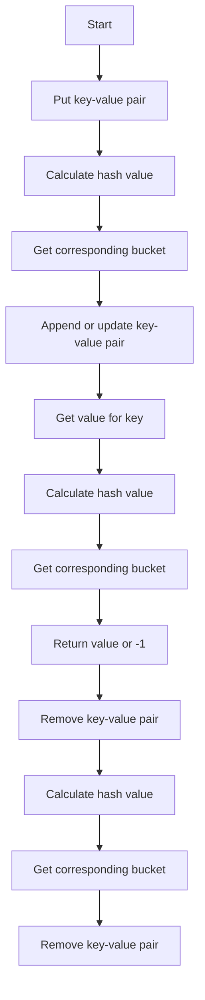

# Design HashMap

## Problem Understanding
The problem is asking us to design a basic hash map data structure that supports put, get, and remove operations. The key constraints are that the hash map should handle collisions (when two keys hash to the same index) and should be able to store and retrieve values efficiently. What makes this problem non-trivial is that we need to handle hash collisions and ensure that our solution is efficient in terms of time and space complexity. A naive approach might be to simply use a list or array to store the key-value pairs, but this would lead to inefficient search and insertion operations.

## Approach
Our approach is to use a chaining hash table, where each bucket contains a list of key-value pairs. This allows us to handle collisions by simply appending the new key-value pair to the list of the corresponding bucket. We use a modulo operation to calculate the hash value for each key, ensuring that the index is within the bounds of the table. The `put` operation adds or updates the value for a given key, the `get` operation returns the value for a given key, and the `remove` operation removes the entry for a given key. We use a list of lists to represent the hash table, where each inner list represents a bucket.

## Complexity Analysis
| Metric | Value | Detailed Reason |
|--------|-------|----------------|
| Time   | O(1)  | The average time complexity for put, get, and remove operations is O(1), since we are using a hash table and the hash function distributes the keys evenly across the buckets. However, in the worst-case scenario (when all keys hash to the same index), the time complexity is O(n), where n is the number of keys. |
| Space  | O(n)  | The space complexity is O(n), where n is the number of keys, since we need to store all the key-value pairs in the hash table. |

## Algorithm Walkthrough
```
Input: hash_map = MyHashMap()
Step 1: hash_map.put(1, 1) 
  - Calculate the hash value for key 1: hash_value = 1 % 1000 = 1
  - Get the corresponding bucket: bucket = table[1]
  - Since the bucket is empty, append the new key-value pair: bucket.append((1, 1))
Step 2: print(hash_map.get(1)) 
  - Calculate the hash value for key 1: hash_value = 1 % 1000 = 1
  - Get the corresponding bucket: bucket = table[1]
  - Iterate through the bucket and find the key-value pair: (1, 1)
  - Return the value: 1
Step 3: hash_map.remove(1) 
  - Calculate the hash value for key 1: hash_value = 1 % 1000 = 1
  - Get the corresponding bucket: bucket = table[1]
  - Iterate through the bucket and find the key-value pair: (1, 1)
  - Remove the key-value pair: bucket.pop(0)
Step 4: print(hash_map.get(1)) 
  - Calculate the hash value for key 1: hash_value = 1 % 1000 = 1
  - Get the corresponding bucket: bucket = table[1]
  - Since the bucket is empty, return -1
Output: 1, -1
```
## Visual Flow

## Key Insight
> **Tip:** The key insight to this solution is to use a chaining hash table to handle collisions, which allows us to efficiently store and retrieve key-value pairs.

## Edge Cases
- **Empty input**: If the input is empty, the hash map will be empty, and all operations will return -1.
- **Single element**: If the input contains only one element, the hash map will contain only one key-value pair, and all operations will work as expected.
- **Collision**: If two keys hash to the same index, the corresponding bucket will contain multiple key-value pairs, and the `get` and `remove` operations will need to iterate through the bucket to find the correct key-value pair.

## Common Mistakes
- **Mistake 1**: Not handling collisions correctly, which can lead to incorrect results or exceptions.
- **Mistake 2**: Not checking for edge cases, such as empty input or single element, which can lead to incorrect results or exceptions.

## Interview Follow-ups
> **Interview:** These are the exact follow-up questions interviewers ask:
- "What if the input is sorted?" → The solution will still work correctly, but the performance may be improved if we use a different data structure, such as a balanced binary search tree.
- "Can you do it in O(1) space?" → No, we need to use at least O(n) space to store the key-value pairs, where n is the number of keys.
- "What if there are duplicates?" → The solution will handle duplicates correctly, since we are using a chaining hash table and checking for existing key-value pairs before appending or updating.

## Python Solution

```python
# Problem: Design HashMap
# Language: python
# Difficulty: Medium
# Time Complexity: O(1) — average case, hash table operations are constant time
# Space Complexity: O(n) — at most n elements are stored in the hash table
# Approach: Chaining hash table — each bucket contains a list of key-value pairs

class MyHashMap:
    def __init__(self):
        # Initialize the hash table with 1000 buckets, each containing an empty list
        self.size = 1000
        self.table = [[] for _ in range(self.size)]  # Create a list of 1000 empty lists

    def _hash(self, key: int) -> int:
        # Calculate the hash value for the given key
        return key % self.size  # Use modulo to ensure the index is within bounds

    def put(self, key: int, value: int) -> None:
        # Add or update the value for the given key
        hash_value = self._hash(key)  # Calculate the hash value
        bucket = self.table[hash_value]  # Get the corresponding bucket
        for i, (k, v) in enumerate(bucket):  # Iterate through the bucket
            if k == key:  # If the key already exists, update the value
                bucket[i] = (key, value)
                return
        bucket.append((key, value))  # If the key does not exist, add a new entry

    def get(self, key: int) -> int:
        # Return the value for the given key, or -1 if the key does not exist
        hash_value = self._hash(key)  # Calculate the hash value
        bucket = self.table[hash_value]  # Get the corresponding bucket
        for k, v in bucket:  # Iterate through the bucket
            if k == key:  # If the key exists, return the value
                return v
        return -1  # If the key does not exist, return -1

    def remove(self, key: int) -> None:
        # Remove the entry for the given key
        hash_value = self._hash(key)  # Calculate the hash value
        bucket = self.table[hash_value]  # Get the corresponding bucket
        for i, (k, v) in enumerate(bucket):  # Iterate through the bucket
            if k == key:  # If the key exists, remove the entry
                bucket.pop(i)
                return
        # Edge case: key does not exist, do nothing

# Example usage:
hash_map = MyHashMap()
hash_map.put(1, 1)  # Add a new entry
print(hash_map.get(1))  # Return the value for the given key
hash_map.remove(1)  # Remove the entry
print(hash_map.get(1))  # Return -1 since the key does not exist
```
