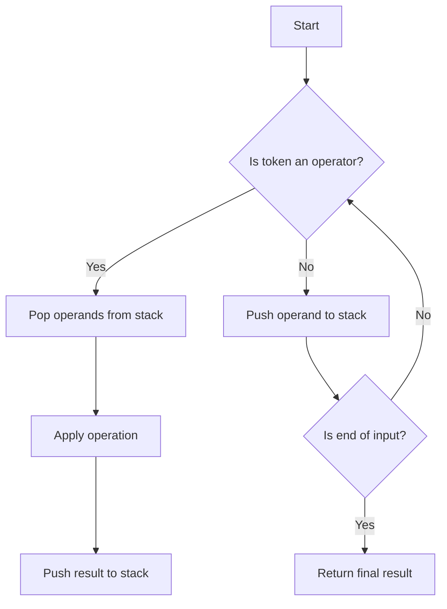

# Evaluate Reverse Polish Notation

## Problem Understanding
The problem requires evaluating the value of an arithmetic expression in Reverse Polish Notation (RPN). In RPN, operators follow their operands, so the expression is written in a postfix notation. The key constraints are that the input is a list of strings representing the tokens in the RPN expression, and each token is either an operator (+, -, \*, /) or an operand. What makes this problem non-trivial is that the naive approach of recursively parsing the expression would be inefficient and prone to errors, especially for complex expressions. The problem also requires handling edge cases such as insufficient operands, empty input, and multiple results.

## Approach
The algorithm strategy is to use a stack-based evaluation approach, where each token in the RPN expression is processed iteratively. The intuition behind this approach is that the stack can be used to store the intermediate results of the operations, allowing for efficient evaluation of the expression. The approach works by iterating over each token in the expression, applying the corresponding operation if the token is an operator, and pushing the result back to the stack. The stack is used to store the operands and intermediate results, and the supported operators are defined using a dictionary that maps each operator to its corresponding lambda function. The approach handles the key constraints by checking for insufficient operands and handling edge cases such as empty input and multiple results.

## Complexity Analysis
| Metric | Value | Detailed Reason |
|--------|-------|----------------|
| Time   | O(n)  | The algorithm iterates over each token in the RPN expression once, where n is the number of tokens. The operations performed within the loop (pushing and popping from the stack, applying operators) take constant time. |
| Space  | O(n)  | The algorithm uses a stack to store the intermediate results, and in the worst case, the stack can grow up to the size of the input expression, i.e., n tokens. |

## Algorithm Walkthrough
```
Input: ["2", "1", "+", "3", "*"]
Step 1: Initialize an empty stack []
Step 2: Token "2" is an operand, push it to the stack [2]
Step 3: Token "1" is an operand, push it to the stack [2, 1]
Step 4: Token "+" is an operator, pop the last two operands from the stack [2, 1], apply the operation, and push the result back to the stack [3]
Step 5: Token "3" is an operand, push it to the stack [3, 3]
Step 6: Token "*" is an operator, pop the last two operands from the stack [3, 3], apply the operation, and push the result back to the stack [9]
Output: 9
```
This walkthrough demonstrates how the algorithm evaluates the RPN expression and returns the final result.

## Visual Flow

This flowchart illustrates the decision flow of the algorithm, showing how it processes each token in the RPN expression and applies the corresponding operations.

## Key Insight
> **Tip:** The key insight is to use a stack to store the intermediate results, allowing for efficient evaluation of the RPN expression by applying operators in a postfix notation.

## Edge Cases
- **Empty/null input**: If the input is empty or null, the algorithm returns None, as there are no tokens to process.
- **Single element**: If the input contains a single token that is an operand, the algorithm returns the operand as the final result.
- **Insufficient operands**: If the input contains an operator but there are not enough operands on the stack, the algorithm returns None, as the operation cannot be applied.

## Common Mistakes
- **Mistake 1**: Forgetting to handle edge cases such as empty input or insufficient operands. To avoid this, always check for these cases and handle them accordingly.
- **Mistake 2**: Using a recursive approach instead of an iterative one. To avoid this, use a stack to store the intermediate results and process each token iteratively.

## Interview Follow-ups
> **Interview:** These are the exact follow-up questions interviewers ask:
- "What if the input is sorted?" → The algorithm does not rely on the input being sorted, so it would still work correctly.
- "Can you do it in O(1) space?" → No, the algorithm requires a stack to store the intermediate results, which takes O(n) space.
- "What if there are duplicates?" → The algorithm handles duplicates correctly, as it processes each token independently and applies the corresponding operation based on the operator.

## Python Solution

```python
# Problem: Evaluate Reverse Polish Notation
# Language: python
# Difficulty: Medium
# Time Complexity: O(n) — single pass through the expression tokens
# Space Complexity: O(n) — stack stores at most n elements
# Approach: Stack-based evaluation — for each token, apply the corresponding operation

class Solution:
    def evalRPN(self, tokens: list[str]) -> int:
        # Initialize an empty stack to store the intermediate results
        stack = []
        
        # Define the supported operators
        operators = {
            "+": lambda a, b: a + b,
            "-": lambda a, b: a - b,
            "*": lambda a, b: a * b,
            "/": lambda a, b: int(a / b)  # Use int() to perform integer division
        }
        
        # Iterate over each token in the expression
        for token in tokens:
            # Check if the token is an operator
            if token in operators:
                # Edge case: insufficient operands
                if len(stack) < 2:
                    return None  # or raise an exception
                
                # Pop the last two operands from the stack
                operand2 = stack.pop()
                operand1 = stack.pop()
                
                # Apply the operation and push the result back to the stack
                result = operators[token](operand1, operand2)
                stack.append(result)
            else:
                # Token is an operand, convert it to an integer and push it to the stack
                stack.append(int(token))
        
        # Edge case: empty input or multiple results
        if len(stack) != 1:
            return None  # or raise an exception
        
        # Return the final result
        return stack[0]
```
