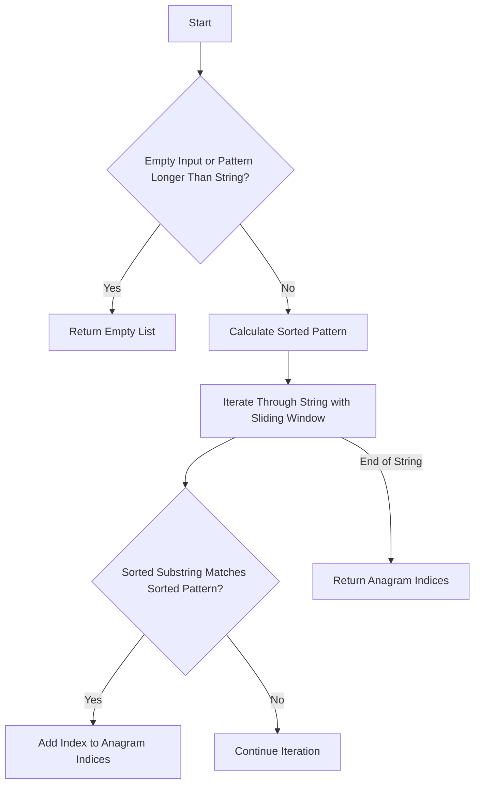

# Find All Anagrams in String

## Problem Understanding
The problem asks us to find all starting indices of anagrams of a given pattern within a string. An anagram is a word or phrase formed by rearranging the letters of a different word or phrase, typically using all the original letters exactly once. The key constraints are that the pattern must be found within the string, and the anagram must use all the characters of the pattern. This problem is non-trivial because a naive approach of generating all permutations of the pattern and checking if they exist in the string would be inefficient due to the large number of permutations.

## Approach
The algorithm strategy used here is a sliding window approach combined with sorted pattern comparison. For each substring of the string that matches the length of the pattern, we sort its characters and compare them with the sorted pattern. If they match, we have found an anagram and add its starting index to the result list. This approach works because sorting the characters of both the substring and the pattern allows us to efficiently compare them without having to generate all permutations of the pattern. The data structure used is a list to store the indices of the anagrams.

## Complexity Analysis
| Metric | Value | Detailed Reason |
|--------|-------|----------------|
| Time   | O(n*m log m)  | The time complexity is dominated by the sorting operation inside the loop. The loop iterates over the string (O(n)), and for each iteration, we sort the substring (O(m log m)), where m is the length of the pattern. Thus, the overall time complexity is O(n*m log m). |
| Space  | O(m)  | The space complexity is O(m) because we need to store the sorted pattern and the sorted substring, both of which are of length m. |

## Algorithm Walkthrough
```
Input: s = "abxaba", p = "ab"
Step 1: Initialize anagram_indices = [], sorted_p = ['a', 'b']
Step 2: Iterate i = 0, substring = "ab", sorted(substring) = ['a', 'b'] == sorted_p, anagram_indices = [0]
Step 3: Iterate i = 1, substring = "bx", sorted(substring) = ['b', 'x'] != sorted_p, anagram_indices remains [0]
Step 4: Iterate i = 2, substring = "xa", sorted(substring) = ['a', 'x'] != sorted_p, anagram_indices remains [0]
Step 5: Iterate i = 3, substring = "ab", sorted(substring) = ['a', 'b'] == sorted_p, anagram_indices = [0, 3]
Step 6: Iterate i = 4, substring = "ba", sorted(substring) = ['a', 'b'] == sorted_p, anagram_indices = [0, 3, 4]
Output: [0, 3, 4]
```
This walkthrough demonstrates how the algorithm identifies anagrams of the pattern "ab" within the string "abxaba".

## Visual Flow

This flowchart illustrates the decision-making process and the flow of the algorithm.

## Key Insight
> **Tip:** The key insight here is to use sorting to efficiently compare substrings with the pattern, reducing the problem to a simple string comparison.

## Edge Cases
- **Empty/null input**: If the input string or pattern is empty, or if the pattern is longer than the string, the function returns an empty list because there cannot be any anagrams.
- **Single element**: If the pattern is a single character, the function will return the indices of all occurrences of that character in the string, as each occurrence is technically an anagram of the pattern.
- **Pattern longer than string**: If the pattern is longer than the string, the function returns an empty list because it's impossible for the string to contain an anagram of the pattern.

## Common Mistakes
- **Mistake 1**: Not checking for the edge case where the pattern is longer than the string, which would lead to incorrect results.
- **Mistake 2**: Not using a sliding window approach, which would result in inefficient iteration over the string.

## Interview Follow-ups
> **Interview:** 
- "What if the input is sorted?" → This does not affect the algorithm since we are sorting substrings and the pattern for comparison.
- "Can you do it in O(1) space?" → No, because we need at least O(m) space to store the sorted pattern and the sorted substring, where m is the length of the pattern.
- "What if there are duplicates?" → The algorithm handles duplicates correctly by sorting the substrings and the pattern, ensuring that anagrams with duplicate characters are identified.

## Python Solution

```python
# Problem: Find All Anagrams in String
# Language: python
# Difficulty: Medium
# Time Complexity: O(n*m) — where n is the length of the string and m is the length of the pattern
# Space Complexity: O(1) — not using any additional space that scales with input size
# Approach: Sliding Window with sorted pattern comparison — for each substring, check if its sorted characters match the sorted pattern

class Solution:
    def findAnagrams(self, s: str, p: str) -> list[int]:
        # Edge case: empty input or pattern longer than string → return empty list
        if not s or not p or len(p) > len(s):
            return []
        
        # Initialize the result list
        anagram_indices = []
        
        # Calculate the sorted pattern for comparison
        sorted_p = sorted(p)  # Get the sorted pattern for comparison
        
        # Iterate through the string with a sliding window of pattern length
        for i in range(len(s) - len(p) + 1):
            # Extract the current substring
            substring = s[i:i + len(p)]
            
            # Check if the sorted substring matches the sorted pattern
            if sorted(substring) == sorted_p:
                # If it matches, add the current index to the result list
                anagram_indices.append(i)
        
        # Return the list of anagram indices
        return anagram_indices
```
