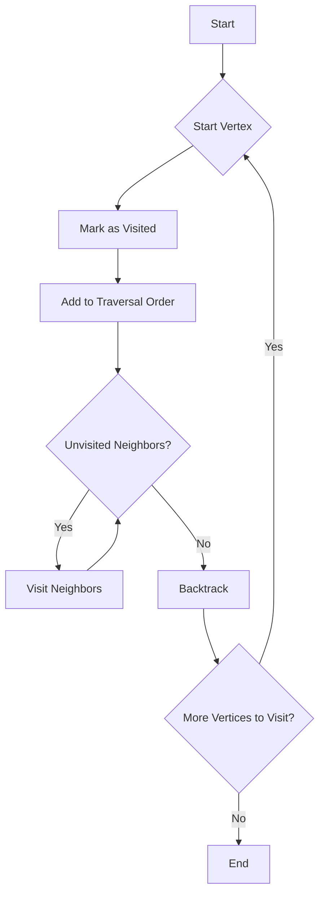

# Graph DFS Recursive and Iterative

## Problem Understanding
The problem is asking to implement a Depth-First Search (DFS) traversal on a graph, which explores as far as possible along each branch before backtracking. The key constraint is that the graph can be represented using an adjacency list, and the traversal should start from a specified vertex. The problem is non-trivial because it requires handling recursive and iterative approaches, as well as avoiding infinite loops by keeping track of visited vertices. The naive approach fails because it does not consider the graph's structure and may get stuck in an infinite loop.

## Approach
The algorithm strategy is to use a Depth-First Search traversal, which explores the graph by visiting a vertex and then visiting all of its neighbors before backtracking. The approach works by using a recursive helper function for the recursive DFS traversal and a stack for the iterative DFS traversal. The recursive approach uses a set to keep track of visited vertices, while the iterative approach uses a set and a stack to keep track of visited vertices and vertices to be visited, respectively. The key data structures used are sets for keeping track of visited vertices and adjacency lists for representing the graph.

## Complexity Analysis
| Metric | Value | Detailed Reason |
|--------|-------|----------------|
| Time   | O(V + E) | The algorithm visits each vertex and edge once, where V is the number of vertices and E is the number of edges. This is because the algorithm explores the graph by visiting a vertex and then visiting all of its neighbors before backtracking. |
| Space  | O(V) | The algorithm uses a set to keep track of visited vertices, which in the worst case can be all vertices in the graph. Additionally, the recursive approach uses the system call stack, which can also grow up to a maximum depth of V. |

## Algorithm Walkthrough
```
Input: Graph with 5 vertices and edges between them
Step 1: Initialize an empty set to keep track of visited vertices
Step 2: Initialize an empty list to store the traversal order
Step 3: Start the DFS traversal from vertex 0
Step 4: Mark vertex 0 as visited and add it to the traversal order
Step 5: Visit all unvisited neighbors of vertex 0 (vertices 1 and 2)
Step 6: Mark vertex 1 as visited and add it to the traversal order
Step 7: Visit all unvisited neighbors of vertex 1 (vertices 3 and 4)
Step 8: Mark vertices 3 and 4 as visited and add them to the traversal order
Step 9: Backtrack to vertex 2
Step 10: Since vertex 2 has no unvisited neighbors, backtrack to vertex 0
Output: Traversal order [0, 1, 3, 4, 2]
```

## Visual Flow


## Key Insight
> **Tip:** The key insight is to use a set to keep track of visited vertices to avoid infinite loops, and to use a recursive helper function or a stack to explore the graph in a depth-first manner.

## Edge Cases
- **Empty/null input**: If the graph is empty, the algorithm will return an empty list, as there are no vertices to visit.
- **Single element**: If the graph has only one vertex, the algorithm will return a list containing that vertex, as there are no neighbors to visit.
- **Disjoint subgraphs**: If the graph has disjoint subgraphs, the algorithm will only visit the subgraph containing the start vertex, unless the start vertex is specified for each subgraph.

## Common Mistakes
- **Mistake 1**: Not keeping track of visited vertices, leading to infinite loops. To avoid this, use a set to keep track of visited vertices.
- **Mistake 2**: Not handling the case where the graph has disjoint subgraphs. To avoid this, specify the start vertex for each subgraph or use a separate algorithm to detect disjoint subgraphs.

## Interview Follow-ups
> **Interview:** These are the exact follow-up questions interviewers ask:
- "What if the input is sorted?" → The algorithm will still work correctly, but the traversal order may be different.
- "Can you do it in O(1) space?" → No, because we need to keep track of visited vertices, which requires at least O(V) space.
- "What if there are duplicates?" → The algorithm will still work correctly, but the traversal order may be different. To avoid duplicates, use a set to keep track of visited vertices.

## Python Solution

```python
# Problem: Graph DFS Recursive and Iterative
# Language: python
# Difficulty: medium
# Time Complexity: O(V + E) — visiting each vertex and edge once
# Space Complexity: O(V) — maximum recursion depth or stack size
# Approach: Depth-First Search traversal — exploring as far as possible along each branch before backtracking

class Graph:
    def __init__(self, num_vertices):
        # Initialize an empty graph with a specified number of vertices
        self.num_vertices = num_vertices
        self.adj_list = [[] for _ in range(num_vertices)]

    def add_edge(self, vertex1, vertex2):
        # Add a directed edge from vertex1 to vertex2
        self.adj_list[vertex1].append(vertex2)

    def dfs_recursive(self, start_vertex):
        # Recursive DFS traversal starting from a specified vertex
        visited = set()  # Keep track of visited vertices to avoid infinite loops
        traversal_order = []  # Store the order of visited vertices

        def dfs_helper(vertex):
            # Recursive helper function for DFS traversal
            visited.add(vertex)  # Mark the current vertex as visited
            traversal_order.append(vertex)  # Add the vertex to the traversal order
            for neighbor in self.adj_list[vertex]:
                # Recursively visit all unvisited neighbors of the current vertex
                if neighbor not in visited:
                    dfs_helper(neighbor)

        dfs_helper(start_vertex)  # Start the DFS traversal from the specified vertex
        return traversal_order

    def dfs_iterative(self, start_vertex):
        # Iterative DFS traversal starting from a specified vertex
        visited = set()  # Keep track of visited vertices to avoid infinite loops
        traversal_order = []  # Store the order of visited vertices
        stack = [start_vertex]  # Initialize a stack with the starting vertex

        while stack:
            # Continue the traversal until the stack is empty
            vertex = stack.pop()  # Pop the top vertex from the stack
            if vertex not in visited:
                # Mark the vertex as visited and add it to the traversal order
                visited.add(vertex)
                traversal_order.append(vertex)
                for neighbor in reversed(self.adj_list[vertex]):
                    # Push all unvisited neighbors of the current vertex onto the stack
                    if neighbor not in visited:
                        stack.append(neighbor)

        return traversal_order


# Example usage:
if __name__ == "__main__":
    graph = Graph(5)
    graph.add_edge(0, 1)
    graph.add_edge(0, 2)
    graph.add_edge(1, 3)
    graph.add_edge(1, 4)

    print("Recursive DFS Traversal:", graph.dfs_recursive(0))
    print("Iterative DFS Traversal:", graph.dfs_iterative(0))

    # Edge case: empty graph
    empty_graph = Graph(0)
    print("Recursive DFS Traversal (empty graph):", empty_graph.dfs_recursive(0))
    print("Iterative DFS Traversal (empty graph):", empty_graph.dfs_iterative(0))

    # Edge case: single-vertex graph
    single_vertex_graph = Graph(1)
    print("Recursive DFS Traversal (single-vertex graph):", single_vertex_graph.dfs_recursive(0))
    print("Iterative DFS Traversal (single-vertex graph):", single_vertex_graph.dfs_iterative(0))
```
