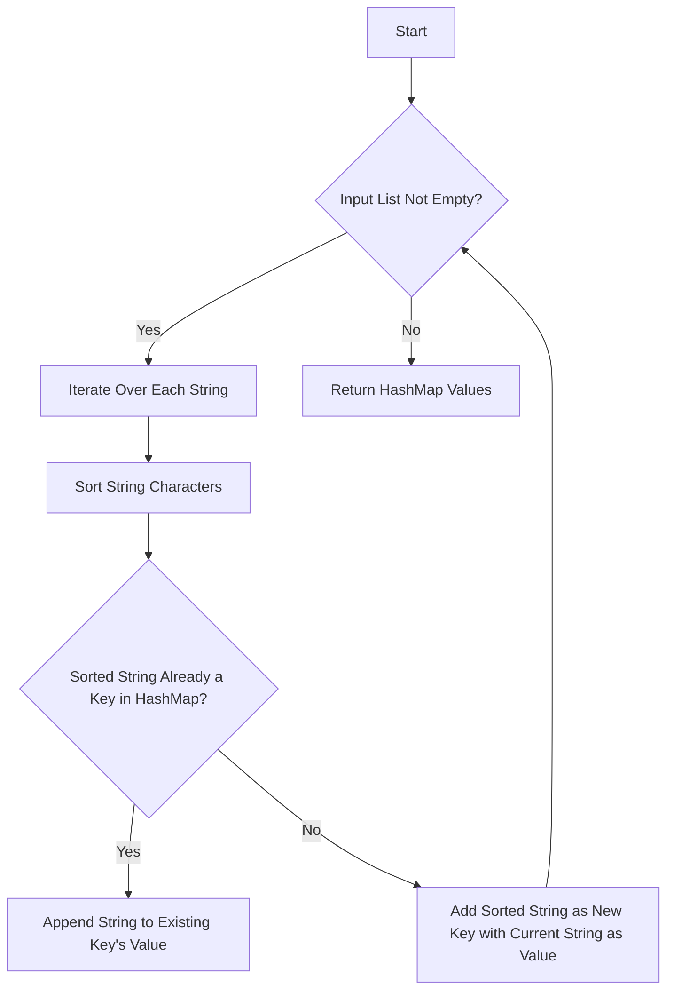

# Group Anagrams

## Problem Understanding
The problem of grouping anagrams involves taking a list of strings as input and returning a list of lists where each sublist contains strings that are anagrams of each other. An anagram is a word or phrase formed by rearranging the letters of a different word or phrase, typically using all the original letters exactly once. The key constraint here is that the input list can contain any number of strings, and each string can be of any length, making the naive approach of comparing each string with every other string inefficient. What makes this problem non-trivial is the need to efficiently identify and group all anagrams together without directly comparing every string with each other, which would result in a time complexity of O(n^2*m), where n is the number of strings and m is the maximum length of a string.

## Approach
The algorithm strategy for solving this problem involves sorting each string and using the sorted string as a key in a HashMap. The intuition behind this approach is that anagrams will have the same characters when sorted, thus allowing them to be grouped together efficiently. This approach works because sorting a string and using it as a key in a HashMap allows for efficient grouping of anagrams. The HashMap data structure is chosen because it provides constant time complexity for lookups, insertions, and deletions, making it ideal for this problem. The approach handles key constraints by iterating through each string in the input list, sorting its characters, and using the sorted string as a key in the HashMap to group anagrams together.

## Complexity Analysis
| Metric | Value | Detailed Reason |
|--------|-------|----------------|
| Time   | O(n*m*log(m)) | The time complexity is O(n*m*log(m)) because for each of the n strings, we are sorting m characters. The sorting operation in Python uses Timsort, which has a worst-case time complexity of O(m*log(m)). |
| Space  | O(n*m) | The space complexity is O(n*m) because in the worst case, we might need to store all the strings in the HashMap. Each string can have up to m characters, and there are n strings, hence the space complexity. |

## Algorithm Walkthrough
```
Input: ["eat", "tea", "tan", "ate", "nat", "bat"]
Step 1: Initialize an empty HashMap `anagrams`.
Step 2: Iterate over the first string "eat", sort its characters to get "aet", and use "aet" as a key in `anagrams`. Since "aet" is not a key in `anagrams`, add it as a key with the value ["eat"].
Step 3: Iterate over the second string "tea", sort its characters to get "aet", and use "aet" as a key in `anagrams`. Since "aet" is already a key in `anagrams`, append "tea" to its value, making it ["eat", "tea"].
Step 4: Continue this process for all strings.
    - For "tan", the sorted string is "ant", so it becomes a new key in `anagrams` with the value ["tan"].
    - For "ate", the sorted string is "aet", so it is appended to the existing key "aet" in `anagrams`, making it ["eat", "tea", "ate"].
    - For "nat", the sorted string is "ant", so it is appended to the existing key "ant" in `anagrams`, making it ["tan", "nat"].
    - For "bat", the sorted string is "abt", so it becomes a new key in `anagrams` with the value ["bat"].
Output: [["eat", "tea", "ate"], ["tan", "nat"], ["bat"]]
```

## Visual Flow


## Key Insight
> **Tip:** The key insight here is using the sorted version of each string as a unique identifier (key) in a HashMap to efficiently group anagrams together, leveraging the fact that anagrams will have the same characters when sorted.

## Edge Cases
- **Empty input list**: If the input list is empty, the function will simply return an empty list because there are no strings to process.
- **Single element in the input list**: If the input list contains only one string, the function will return a list containing a single list with that string, since a single string is technically an anagram of itself.
- **Input list containing duplicate strings**: If the input list contains duplicate strings, these duplicates will be treated as separate instances and grouped accordingly. For example, if "eat" appears twice in the input list, it will appear twice in the output list within the same group of anagrams.

## Common Mistakes
- **Mistake 1: Not sorting the strings correctly**: Ensure that the sorting operation is correctly implemented. In Python, using the built-in `sorted` function and `join` method is a straightforward way to sort the characters in a string.
- **Mistake 2: Not handling the case when a key is not present in the HashMap**: Always check if a key exists in the HashMap before trying to append to its value. If the key does not exist, create a new entry with the appropriate value.

## Interview Follow-ups
> **Interview:** 
- "What if the input is sorted?" → The algorithm's efficiency does not rely on the input being sorted. It sorts each string individually to group anagrams, so the initial order of the input strings does not affect the outcome.
- "Can you do it in O(1) space?" → Achieving O(1) space complexity is not feasible for this problem because we need to store the result, which in the worst case can be of the same size as the input. However, we can optimize the space usage by avoiding unnecessary data structures and operations.
- "What if there are duplicates?" → The algorithm handles duplicates by appending them to the appropriate group in the HashMap. Each string, regardless of whether it's a duplicate or not, is processed and grouped based on its sorted characters.

## Python Solution

```python
# Problem: Group Anagrams
# Language: python
# Difficulty: medium
# Time Complexity: O(n*m*log(m)) — where n is the number of strings and m is the maximum length of a string
# Space Complexity: O(n*m) — for storing the result
# Approach: Sorting each string and using it as a key in a HashMap — for each string, sort its characters and use the sorted string as a key

class Solution:
    def groupAnagrams(self, strs: list[str]) -> list[list[str]]:
        # Initialize an empty HashMap to store the anagrams
        anagrams = {}

        # Iterate over each string in the input list
        for string in strs:
            # Edge case: empty string → sort it to a single empty string
            if not string: 
                sorted_string = ""
            else:
                # Sort the characters in the current string and join them into a new string
                sorted_string = "".join(sorted(string))  # Sort the characters to create a unique key

            # If the sorted string is already a key in the HashMap, append the current string to its value
            if sorted_string in anagrams:
                anagrams[sorted_string].append(string)  # Append the string to the list of anagrams
            else:
                # Otherwise, add the sorted string as a new key and initialize its value with the current string
                anagrams[sorted_string] = [string]  # Create a new list with the current string

        # Return the values in the HashMap, which represent the groups of anagrams
        return list(anagrams.values())  # Convert the HashMap values to a list of lists

# Example usage:
solution = Solution()
print(solution.groupAnagrams(["eat", "tea", "tan", "ate", "nat", "bat"])) 
# Output: [["eat", "tea", "ate"], ["tan", "nat"], ["bat"]]
```
