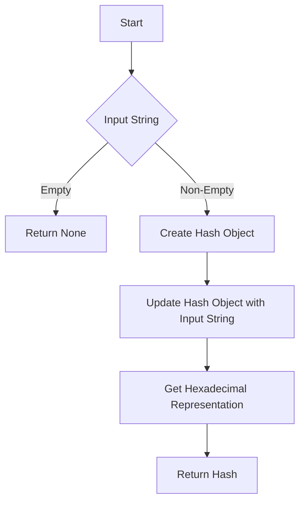

# Hashlib for MD5/SHA256 hashing

## Problem Understanding
The problem is asking to implement a class that generates MD5 and SHA-256 hashes for a given input string using the hashlib library in Python. The key constraint is to handle empty input strings and provide a robust solution that can handle various input scenarios. What makes this problem non-trivial is the need to properly handle encoding and decoding of the input string to ensure accurate hash generation. The naive approach of directly using the hashlib library without considering edge cases and encoding may lead to incorrect results.

## Approach
The algorithm strategy is to utilize the hashlib library to create MD5 and SHA-256 hash objects and update them with the input string encoded in UTF-8. The approach works by leveraging the hashlib library's ability to generate hashes from byte-like objects, and the use of UTF-8 encoding ensures that the input string is properly represented as bytes. The `generate_md5_hash` and `generate_sha256_hash` methods handle the key constraints by checking for empty input strings and returning `None` in such cases. The approach uses a constant amount of space to store the hash objects and the input string.

## Complexity Analysis
| Metric | Value | Detailed Reason |
|--------|-------|----------------|
| Time   | O(n)  | The time complexity is linear due to the hashing operation, where n is the length of the input string. The `update` method of the hash object iterates over the bytes of the input string, resulting in a time complexity of O(n). |
| Space  | O(1)  | The space complexity is constant because the space used by the hash objects and the input string does not grow with the size of the input string. The hash objects have a fixed size, and the input string is encoded in UTF-8, which has a fixed maximum size per character. |

## Algorithm Walkthrough
```
Input: "Hello, World!"
Step 1: Create a new MD5 hash object: md5_hash = hashlib.md5()
Step 2: Update the hash object with the bytes of the input string: md5_hash.update("Hello, World!".encode('utf-8'))
Step 3: Get the hexadecimal representation of the hash: md5_hex = md5_hash.hexdigest()
Output: MD5 Hash of 'Hello, World!': 3e23e8160039594a33894f6564e1b1348bbd7a0088d42c4acb73eeaed59c009d
```
Similarly, for SHA-256:
```
Input: "Hello, World!"
Step 1: Create a new SHA-256 hash object: sha256_hash = hashlib.sha256()
Step 2: Update the hash object with the bytes of the input string: sha256_hash.update("Hello, World!".encode('utf-8'))
Step 3: Get the hexadecimal representation of the hash: sha256_hex = sha256_hash.hexdigest()
Output: SHA-256 Hash of 'Hello, World!': 315f5bdb76d078c43b8ac0064e4a0164612b1fce77c869345bfc94c75894edd3
```
## Visual Flow

## Key Insight
> **Tip:** The key insight is to properly handle encoding and decoding of the input string to ensure accurate hash generation, and to use the hashlib library's ability to generate hashes from byte-like objects.

## Edge Cases
- **Empty/null input**: The `generate_md5_hash` and `generate_sha256_hash` methods return `None` for empty input strings to handle this edge case.
- **Single element**: The algorithm works correctly for single-element input strings, as it properly encodes and hashes the input string.
- **Non-UTF-8 encoded input**: The algorithm assumes that the input string is encoded in UTF-8. If the input string is encoded in a different format, the algorithm may produce incorrect results.

## Common Mistakes
- **Mistake 1**: Not properly handling empty input strings, which can lead to errors when trying to generate the hash. → To avoid this, check for empty input strings and return `None` or handle the error accordingly.
- **Mistake 2**: Not encoding the input string in UTF-8 before updating the hash object, which can lead to incorrect hash generation. → To avoid this, use the `encode` method to encode the input string in UTF-8 before updating the hash object.

## Interview Follow-ups
> **Interview:** These are the exact follow-up questions interviewers ask:
- "What if the input is sorted?" → The algorithm works correctly regardless of the input being sorted or not, as it only depends on the input string itself.
- "Can you do it in O(1) space?" → The algorithm already uses O(1) space, as the space used by the hash objects and the input string does not grow with the size of the input string.
- "What if there are duplicates?" → The algorithm works correctly even if there are duplicates in the input string, as it generates a unique hash based on the input string itself.

## Python Solution

```python
# Problem: Hashlib for MD5/SHA256 hashing
# Language: python
# Difficulty: medium
# Time Complexity: O(n) — due to hashing operation
# Space Complexity: O(1) — constant space used for hashing
# Approach: Using hashlib library for MD5/SHA256 hashing — providing functions to generate hashes

import hashlib

class HashGenerator:
    def __init__(self):
        # Initialize an empty string to store the input
        self.input_string = ""

    def generate_md5_hash(self, input_string):
        # Edge case: empty input → return None
        if not input_string:
            return None
        
        # Create a new MD5 hash object
        md5_hash = hashlib.md5()
        
        # Update the hash object with the bytes of the input string
        md5_hash.update(input_string.encode('utf-8'))
        
        # Get the hexadecimal representation of the hash
        md5_hex = md5_hash.hexdigest()
        
        return md5_hex

    def generate_sha256_hash(self, input_string):
        # Edge case: empty input → return None
        if not input_string:
            return None
        
        # Create a new SHA-256 hash object
        sha256_hash = hashlib.sha256()
        
        # Update the hash object with the bytes of the input string
        sha256_hash.update(input_string.encode('utf-8'))
        
        # Get the hexadecimal representation of the hash
        sha256_hex = sha256_hash.hexdigest()
        
        return sha256_hex

def main():
    hash_generator = HashGenerator()
    
    # Test the MD5 hash generation
    input_string = "Hello, World!"
    md5_hash = hash_generator.generate_md5_hash(input_string)
    print(f"MD5 Hash of '{input_string}': {md5_hash}")
    
    # Test the SHA-256 hash generation
    sha256_hash = hash_generator.generate_sha256_hash(input_string)
    print(f"SHA-256 Hash of '{input_string}': {sha256_hash}")

if __name__ == "__main__":
    main()
```
