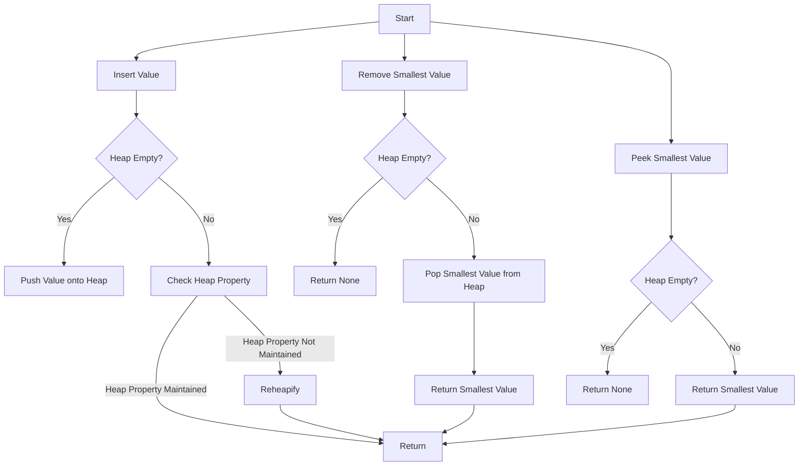

# Heap Operations with heapq

## Problem Understanding
The problem asks us to implement a heap data structure using Python's built-in `heapq` module. The key constraints are that we need to support insertion, removal, peeking, and checking the size and emptiness of the heap. What makes this problem non-trivial is that we need to ensure the heap property is maintained after each operation, meaning the smallest element is always at the root. The `heapq` module provides an efficient way to implement a heap, but we need to understand how to use it correctly to achieve the desired time and space complexity.

## Approach
The algorithm strategy is to utilize the `heapq` module to create a min-heap, where the smallest element is always at the root. We use `heapq.heappush` to insert values into the heap, which maintains the heap property. We use `heapq.heappop` to remove and return the smallest value from the heap, also maintaining the heap property. We use a list to store the heap elements, and the `heapq` module ensures that the list is always a valid heap. The approach works because the `heapq` module is implemented using a binary heap, which guarantees logarithmic time complexity for insertion and removal operations.

## Complexity Analysis
| Metric | Value | Detailed Reason |
|--------|-------|----------------|
| Time   | O(log n) | The `heapq.heappush` and `heapq.heappop` operations have a time complexity of O(log n) because they need to maintain the heap property by potentially swapping elements up or down the heap. The `peek` operation has a time complexity of O(1) because it simply returns the root element. The `size` and `isEmpty` operations have a time complexity of O(1) because they simply return the length of the heap list or check if it's empty. |
| Space  | O(n) | The heap stores at most n elements, where n is the number of insertions. The `heapq` module uses a list to store the heap elements, which has a space complexity of O(n). |

## Algorithm Walkthrough
```
Input: [5, 3, 8]
Step 1: Initialize the heap as an empty list []
Step 2: Insert 5 into the heap using heapq.heappush: [5]
Step 3: Insert 3 into the heap using heapq.heappush: [3, 5]
Step 4: Insert 8 into the heap using heapq.heappush: [3, 5, 8]
Step 5: Remove and return the smallest value from the heap using heapq.heappop: [5, 8], return 3
Step 6: Return the smallest value from the heap without removing it: 5
Step 7: Return the number of elements in the heap: 2
Step 8: Check if the heap is empty: False
Output: [3, 5, 8], 3, 5, 2, False
```
This walkthrough demonstrates the main logic path of the algorithm, including insertion, removal, peeking, and checking the size and emptiness of the heap.

## Visual Flow

This flowchart shows the decision flow of the algorithm, including the insertion, removal, and peeking operations.

## Key Insight
> **Tip:** The key insight is to use the `heapq` module to maintain the heap property, ensuring that the smallest element is always at the root, which allows for efficient insertion and removal operations.

## Edge Cases
- **Empty/null input**: If the input is empty or null, the heap is initialized as an empty list. The `isEmpty` method returns True, and the `size` method returns 0.
- **Single element**: If the input contains a single element, the heap is initialized with that element. The `peek` method returns that element, and the `remove` method returns that element and leaves the heap empty.
- **Duplicate elements**: If the input contains duplicate elements, the heap may contain multiple copies of the same element. The `insert` method adds each duplicate element to the heap, and the `remove` method removes the smallest element, which may be a duplicate.

## Common Mistakes
- **Mistake 1**: Not checking for an empty heap before removing an element, which can raise an error. To avoid this, check if the heap is empty before calling `heappop`.
- **Mistake 2**: Not maintaining the heap property after insertion or removal, which can lead to incorrect results. To avoid this, use the `heapq` module to ensure that the heap property is maintained.

## Interview Follow-ups
> **Interview:** These are the exact follow-up questions interviewers ask:
- "What if the input is sorted?" → The `heapq` module still works correctly, but the time complexity may be better than O(log n) because the input is already sorted.
- "Can you do it in O(1) space?" → No, because the heap needs to store at least n elements, which requires O(n) space.
- "What if there are duplicates?" → The `heapq` module handles duplicates correctly, and the heap may contain multiple copies of the same element.

## Python Solution

```python
# Problem: Heap Operations with heapq
# Language: python
# Difficulty: medium
# Time Complexity: O(log n) — heap insertion and removal are logarithmic
# Space Complexity: O(n) — heap stores at most n elements
# Approach: heapq module — utilizes Python's built-in heap implementation

import heapq

class Heap:
    def __init__(self):
        # Initialize the heap as an empty list
        self.heap = []

    def insert(self, val):
        # Insert a value into the heap using heapq.heappush
        heapq.heappush(self.heap, val)  # maintains the heap property

    def remove(self):
        # Remove and return the smallest value from the heap using heapq.heappop
        if not self.heap:  # Edge case: empty heap
            return None
        return heapq.heappop(self.heap)  # maintains the heap property

    def peek(self):
        # Return the smallest value from the heap without removing it
        if not self.heap:  # Edge case: empty heap
            return None
        return self.heap[0]  # the smallest value is at the root

    def size(self):
        # Return the number of elements in the heap
        return len(self.heap)

    def isEmpty(self):
        # Check if the heap is empty
        return len(self.heap) == 0

# Example usage:
if __name__ == "__main__":
    heap = Heap()
    heap.insert(5)  # insert values into the heap
    heap.insert(3)
    heap.insert(8)
    print(heap.remove())  # remove and print the smallest value (3)
    print(heap.peek())  # print the smallest value without removing (5)
    print(heap.size())  # print the number of elements in the heap (2)
    print(heap.isEmpty())  # check if the heap is empty (False)
```
