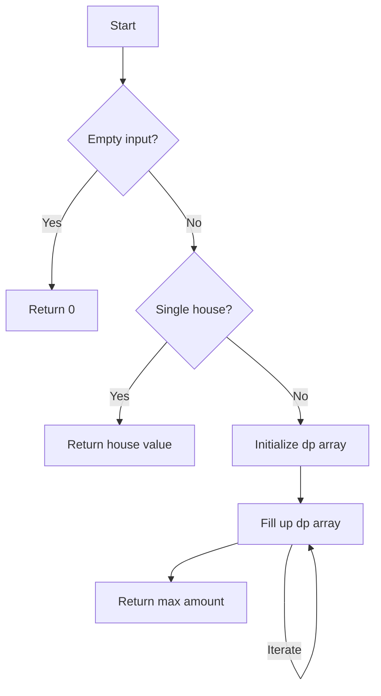

# House Robber

## Problem Understanding
The House Robber problem asks to find the maximum amount of money that can be robbed from a row of houses without robbing two adjacent houses. The key constraint is that we cannot rob two adjacent houses, which implies that we need to make a choice at each house whether to include it in the robbery or not. This problem is non-trivial because a naive approach, such as simply choosing the houses with the highest values, may not lead to the optimal solution due to the adjacency constraint.

## Approach
The algorithm strategy used to solve this problem is dynamic programming, which allows us to break down the problem into smaller sub-problems and store the solutions to these sub-problems to avoid redundant computation. The intuition behind this approach is that for each house, we can choose the maximum between including and excluding it, based on the maximum amount we can rob from the previous houses. We use a dynamic programming array `dp` to store the maximum amount we can rob from the first `i` houses. The approach handles the key constraint by considering the maximum amount we can rob from the houses two positions before when including the current house.

## Complexity Analysis
| Metric | Value | Detailed Reason |
|--------|-------|----------------|
| Time   | O(n)  | We make a single pass through the array of houses, performing a constant amount of work for each house. The loop iterates `n` times, where `n` is the number of houses. |
| Space  | O(n)  | We use a dynamic programming array `dp` to store the maximum amount we can rob from the first `i` houses. In the worst case, this array can grow up to size `n`, where `n` is the number of houses. |

## Algorithm Walkthrough
```
Input: [1, 2, 3, 1]
Step 1: Initialize dp array with base cases
  dp = [0, 0, 0, 0]
  dp[0] = 1 (rob the first house)
  dp[1] = max(1, 2) = 2 (rob the second house)
Step 2: Fill up the dp array
  dp[2] = max(dp[1], dp[0] + 3) = max(2, 1 + 3) = 4 (rob the third house)
  dp[3] = max(dp[2], dp[1] + 1) = max(4, 2 + 1) = 4 (exclude the fourth house)
Output: 4 (the maximum amount we can rob from all houses)
```
This example illustrates how the algorithm makes choices at each house based on the maximum amount we can rob from the previous houses.

## Visual Flow

This flowchart shows the main decision points in the algorithm, including handling edge cases and filling up the dynamic programming array.

## Key Insight
> **Tip:** The key to solving this problem is to recognize that the maximum amount we can rob from a house depends on the maximum amount we can rob from the houses two positions before, allowing us to use dynamic programming to avoid redundant computation.

## Edge Cases
- **Empty/null input**: If the input array is empty, the algorithm returns 0, as there are no houses to rob.
- **Single element**: If the input array contains only one house, the algorithm returns the value of that house, as we can simply rob it.
- **Two houses**: If the input array contains only two houses, the algorithm returns the maximum value between the two houses, as we can only rob one of them.

## Common Mistakes
- **Mistake 1**: Not handling the edge case of an empty input array, which can lead to an incorrect result or an error.
- **Mistake 2**: Not initializing the dynamic programming array correctly, which can lead to incorrect results or an error.

## Interview Follow-ups
> **Interview:** These are the exact follow-up questions interviewers ask:
- "What if the input is sorted?" → The algorithm still works correctly, as it only depends on the maximum amount we can rob from the previous houses.
- "Can you do it in O(1) space?" → No, the algorithm requires O(n) space to store the dynamic programming array, as we need to keep track of the maximum amount we can rob from the first `i` houses.
- "What if there are duplicates?" → The algorithm still works correctly, as it only depends on the maximum amount we can rob from the previous houses, not on the actual values of the houses.

## Python Solution

```python
# Problem: House Robber
# Language: python
# Difficulty: medium
# Time Complexity: O(n) — single pass through array using dynamic programming
# Space Complexity: O(n) — dynamic programming array stores at most n elements
# Approach: Dynamic programming — for each house, choose the maximum between including and excluding it

class Solution:
    def rob(self, nums: list[int]) -> int:
        # Edge case: empty input → return 0
        if not nums:
            return 0
        
        # Edge case: single house → return the value of that house
        if len(nums) == 1:
            return nums[0]
        
        # Initialize dynamic programming array with the base cases
        dp = [0] * len(nums)
        dp[0] = nums[0]  # The maximum amount we can rob from the first house is its value
        dp[1] = max(nums[0], nums[1])  # For the second house, choose the maximum between the first and second houses
        
        # Fill up the dynamic programming array
        for i in range(2, len(nums)):
            # For each house, choose the maximum between including and excluding it
            # We can either rob the current house and add its value to the maximum amount we can rob from the houses two positions before
            # Or we can exclude the current house and take the maximum amount we can rob from the houses one position before
            dp[i] = max(dp[i-1], dp[i-2] + nums[i])  # Choose the maximum between including and excluding the current house
        
        # The final answer is the maximum amount we can rob from all houses
        return dp[-1]
```
